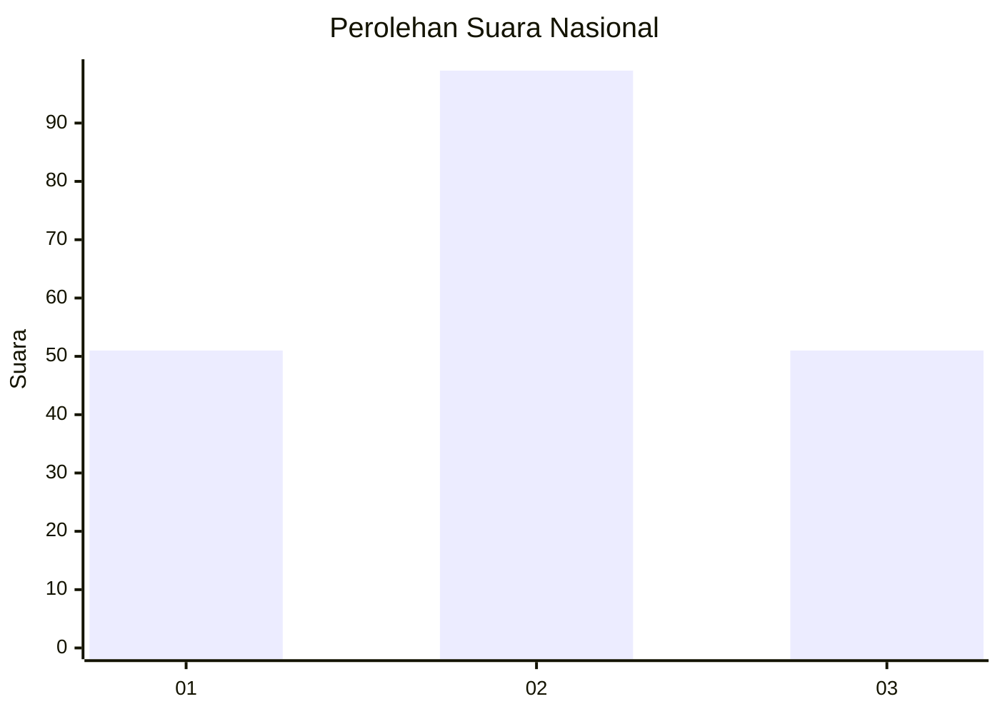
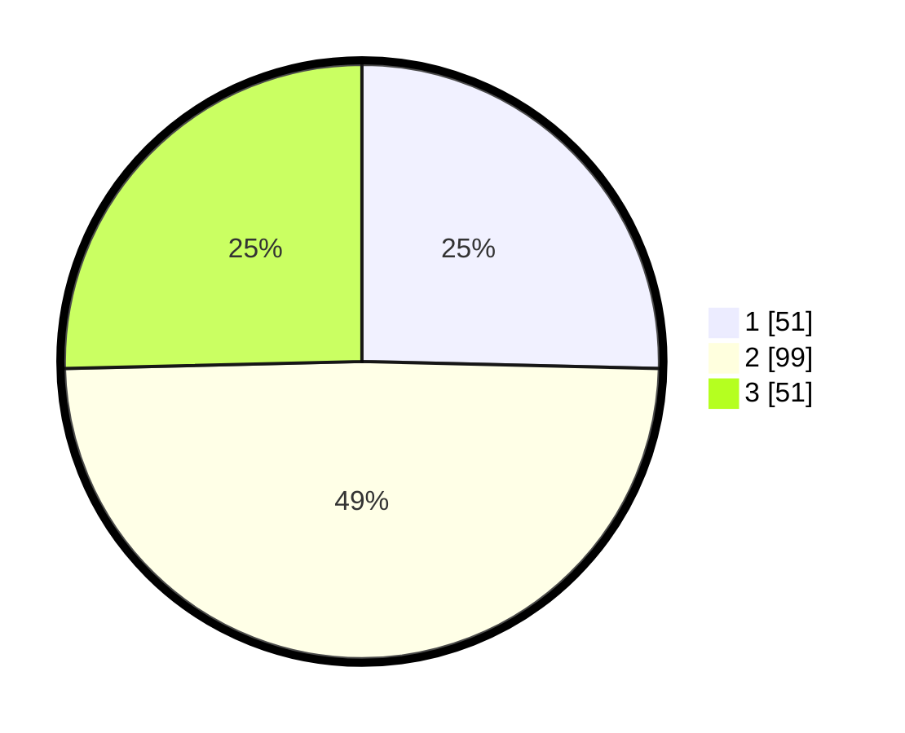

# Hasil

## Grafik

## Tabel

| No. | Nama Paslon    | Suara | Suara (raw) | Persentase |
|:--- |:-------------- | -----:| -----------:| ----------:|
| 1   | ANIES MUHAIMIN | 51    | [51][p-1]   | 25,37      |
| 2   | PRABOWO GIBRAN | 99    | [99][p-2]   | 49,25      |
| 3   | GANJAR MAHFUD  | 51    | [51][p-3]   | 25,37      |

[p-1]: https://github.com/gigit-pemilu/pemilu-2024/blob/main/pilpres/hitung-suara/sub/34-di-yogyakarta/sub/04-sleman/sub/06-mlati/sub/2001-sinduadi/sub/083-tps/sub/paslon-1.txt
[p-2]: https://github.com/gigit-pemilu/pemilu-2024/blob/main/pilpres/hitung-suara/sub/34-di-yogyakarta/sub/04-sleman/sub/06-mlati/sub/2001-sinduadi/sub/083-tps/sub/paslon-2.txt
[p-3]: https://github.com/gigit-pemilu/pemilu-2024/blob/main/pilpres/hitung-suara/sub/34-di-yogyakarta/sub/04-sleman/sub/06-mlati/sub/2001-sinduadi/sub/083-tps/sub/paslon-3.txt

## Foto C Plano

https://sirekap-obj-formc.kpu.go.id/69d0/pemilu/ppwp/34/04/06/20/01/3404062001083-20240216-145026--2d49d988-ed11-4f3c-9d5a-cf9531c8a7d2.jpg

https://sirekap-obj-formc.kpu.go.id/69d0/pemilu/ppwp/34/04/06/20/01/3404062001083-20240216-144744--16d75b84-8df3-49f3-bcf3-4a35c958a144.jpg

https://sirekap-obj-formc.kpu.go.id/69d0/pemilu/ppwp/34/04/06/20/01/3404062001083-20240216-144855--7c8b2e2a-de09-42af-b1cc-603ad8440ee5.jpg

## Metadata

| Key        | Value               |
| ---------- | ------------------- |
| Time Stamp | 2024-02-16 16:25:10 |

## DATA PEMILIH TETAP

Jumlah pemilih dalam DPT: **242**.
 * L: **115**.
 * P: **127**.

## DATA PENGGUNA HAK PILIH

Jumlah pengguna hak pilih dalam DPT: **192**.
 * L: **84**.
 * P: **108**.

Jumlah pengguna hak pilih dalam DPTb: **12**.
 * L: **7**.
 * P: **5**.

Jumlah pengguna hak pilih dalam DPK: **2**.
 * L: **2**.
 * P: **0**.

Jumlah pengguna hak pilih: **206**.
 * L: **93**.
 * P: **113**.

## JUMLAH SUARA SAH DAN TIDAK SAH

JUMLAH SELURUH SUARA SAH: **201**.

JUMLAH SUARA TIDAK SAH: **5**.

JUMLAH SELURUH SUARA SAH DAN SUARA TIDAK SAH: **206**.

