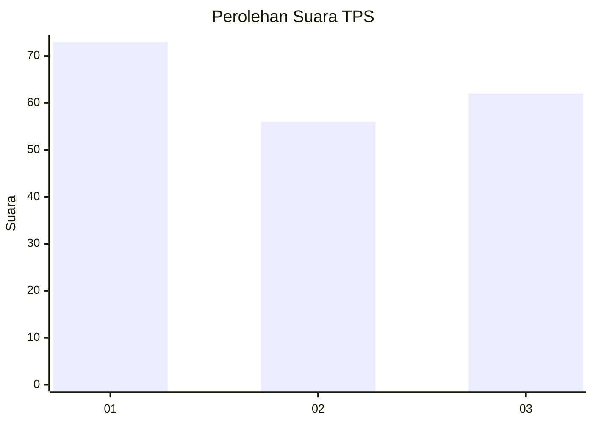
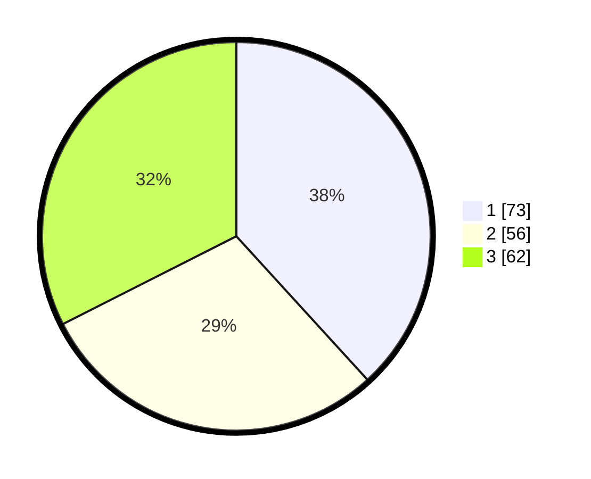

# Hasil

## Grafik

## Tabel

| No. | Nama Paslon    | Suara | Suara (raw) | Persentase |
|:--- |:-------------- | -----:| -----------:| ----------:|
| 1   | ANIES MUHAIMIN | 73    | [73][p-1]   | 38,22      |
| 2   | PRABOWO GIBRAN | 56    | [56][p-2]   | 29,32      |
| 3   | GANJAR MAHFUD  | 62    | [62][p-3]   | 32,46      |

[p-1]: https://github.com/gigit-pemilu/pemilu-2024-34-di-yogyakarta/blob/main/pilpres/hitung-suara/sub/34-di-yogyakarta/sub/04-sleman/sub/06-mlati/sub/2001-sinduadi/sub/084-tps/sub/paslon-1.txt
[p-2]: https://github.com/gigit-pemilu/pemilu-2024-34-di-yogyakarta/blob/main/pilpres/hitung-suara/sub/34-di-yogyakarta/sub/04-sleman/sub/06-mlati/sub/2001-sinduadi/sub/084-tps/sub/paslon-2.txt
[p-3]: https://github.com/gigit-pemilu/pemilu-2024-34-di-yogyakarta/blob/main/pilpres/hitung-suara/sub/34-di-yogyakarta/sub/04-sleman/sub/06-mlati/sub/2001-sinduadi/sub/084-tps/sub/paslon-3.txt

## Foto C Plano

https://sirekap-obj-formc.kpu.go.id/730a/pemilu/ppwp/34/04/06/20/01/3404062001084-20240214-204019--09644fd4-a345-4122-80ca-63b4f97ec86a.jpg

https://sirekap-obj-formc.kpu.go.id/730a/pemilu/ppwp/34/04/06/20/01/3404062001084-20240214-204023--4ce1bdcd-15ee-4235-a7c0-100d0f4198df.jpg

https://sirekap-obj-formc.kpu.go.id/730a/pemilu/ppwp/34/04/06/20/01/3404062001084-20240214-204026--e3b830b9-7329-4574-81d9-d709a0004786.jpg

## Metadata

| Key        | Value               |
| ---------- | ------------------- |
| Time Stamp | 2024-02-14 21:46:01 |

## DATA PEMILIH TETAP

Jumlah pemilih dalam DPT: **239**.
 * L: **114**.
 * P: **125**.

## DATA PENGGUNA HAK PILIH

Jumlah pengguna hak pilih dalam DPT: **175**.
 * L: **81**.
 * P: **94**.

Jumlah pengguna hak pilih dalam DPTb: **17**.
 * L: **6**.
 * P: **11**.

Jumlah pengguna hak pilih dalam DPK: **1**.
 * L: **1**.
 * P: **0**.

Jumlah pengguna hak pilih: **193**.
 * L: **88**.
 * P: **105**.

## JUMLAH SUARA SAH DAN TIDAK SAH

JUMLAH SELURUH SUARA SAH: **191**.

JUMLAH SUARA TIDAK SAH: **2**.

JUMLAH SELURUH SUARA SAH DAN SUARA TIDAK SAH: **193**.

