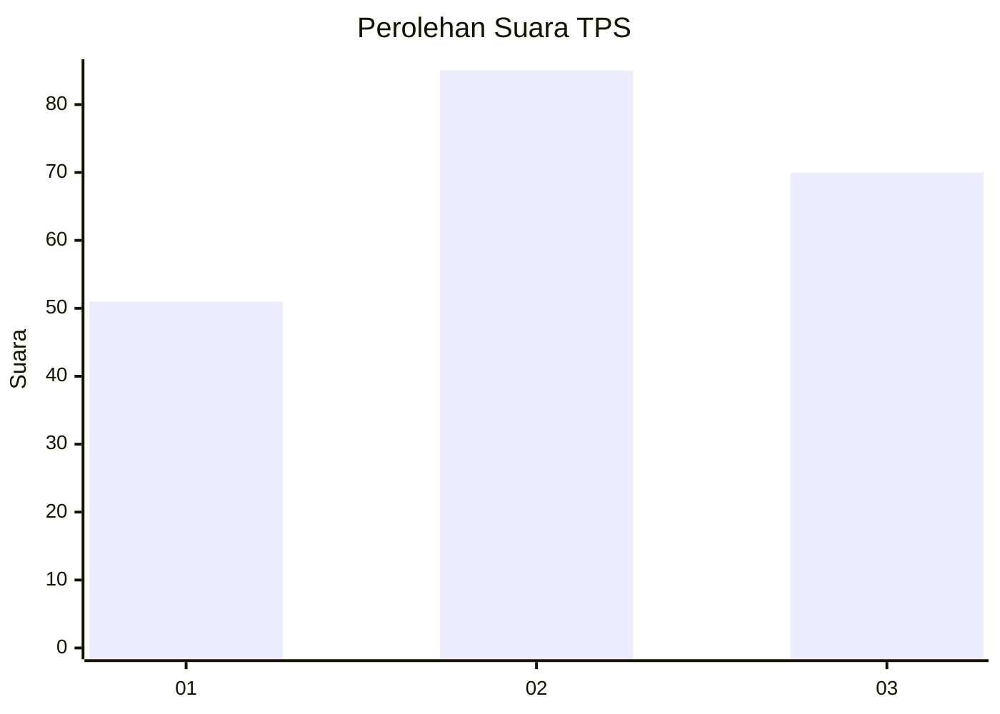
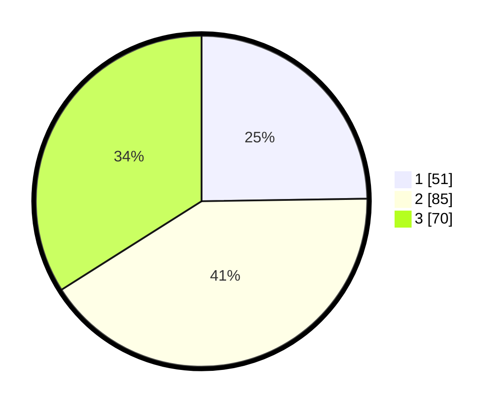

# Hasil

## Grafik

## Tabel

| No. | Nama Paslon    | Suara | Suara (raw) | Persentase |
|:--- |:-------------- | -----:| -----------:| ----------:|
| 1   | ANIES MUHAIMIN | 51    | [51][p-1]   | 24,76      |
| 2   | PRABOWO GIBRAN | 85    | [85][p-2]   | 41,26      |
| 3   | GANJAR MAHFUD  | 70    | [70][p-3]   | 33,98      |

[p-1]: https://github.com/gigit-pemilu/pemilu-2024-34-di-yogyakarta/blob/main/pilpres/hitung-suara/sub/34-di-yogyakarta/sub/04-sleman/sub/06-mlati/sub/2001-sinduadi/sub/085-tps/sub/paslon-1.txt
[p-2]: https://github.com/gigit-pemilu/pemilu-2024-34-di-yogyakarta/blob/main/pilpres/hitung-suara/sub/34-di-yogyakarta/sub/04-sleman/sub/06-mlati/sub/2001-sinduadi/sub/085-tps/sub/paslon-2.txt
[p-3]: https://github.com/gigit-pemilu/pemilu-2024-34-di-yogyakarta/blob/main/pilpres/hitung-suara/sub/34-di-yogyakarta/sub/04-sleman/sub/06-mlati/sub/2001-sinduadi/sub/085-tps/sub/paslon-3.txt

## Foto C Plano

https://sirekap-obj-formc.kpu.go.id/2a0b/pemilu/ppwp/34/04/06/20/01/3404062001085-20240214-192244--cc7dc970-0767-40e7-a6b8-b6851b927806.jpg

https://sirekap-obj-formc.kpu.go.id/2a0b/pemilu/ppwp/34/04/06/20/01/3404062001085-20240214-192252--7ee1503c-8e6c-4649-b96f-733a3b91b8f7.jpg

https://sirekap-obj-formc.kpu.go.id/2a0b/pemilu/ppwp/34/04/06/20/01/3404062001085-20240214-192316--4fb0ba55-b2e9-461f-92f0-420f57fbeb5c.jpg

## Metadata

| Key        | Value               |
| ---------- | ------------------- |
| Time Stamp | 2024-02-14 21:46:01 |

## DATA PEMILIH TETAP

Jumlah pemilih dalam DPT: **228**.
 * L: **103**.
 * P: **125**.

## DATA PENGGUNA HAK PILIH

Jumlah pengguna hak pilih dalam DPT: **190**.
 * L: **84**.
 * P: **106**.

Jumlah pengguna hak pilih dalam DPTb: **17**.
 * L: **10**.
 * P: **7**.

Jumlah pengguna hak pilih dalam DPK: **2**.
 * L: **2**.
 * P: **0**.

Jumlah pengguna hak pilih: **209**.
 * L: **96**.
 * P: **113**.

## JUMLAH SUARA SAH DAN TIDAK SAH

JUMLAH SELURUH SUARA SAH: **206**.

JUMLAH SUARA TIDAK SAH: **3**.

JUMLAH SELURUH SUARA SAH DAN SUARA TIDAK SAH: **209**.

