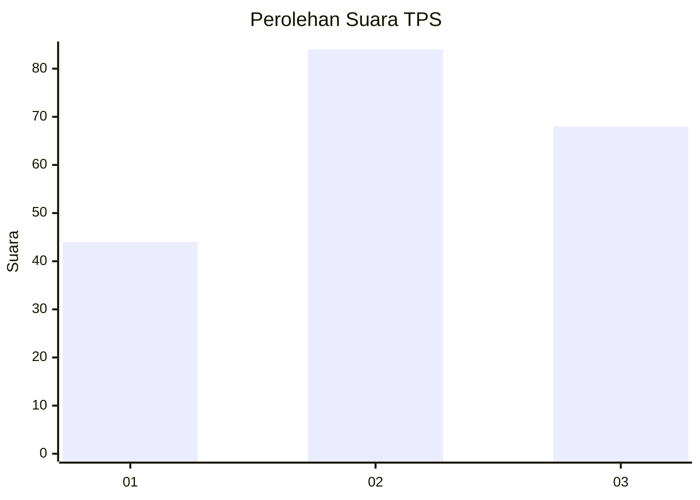
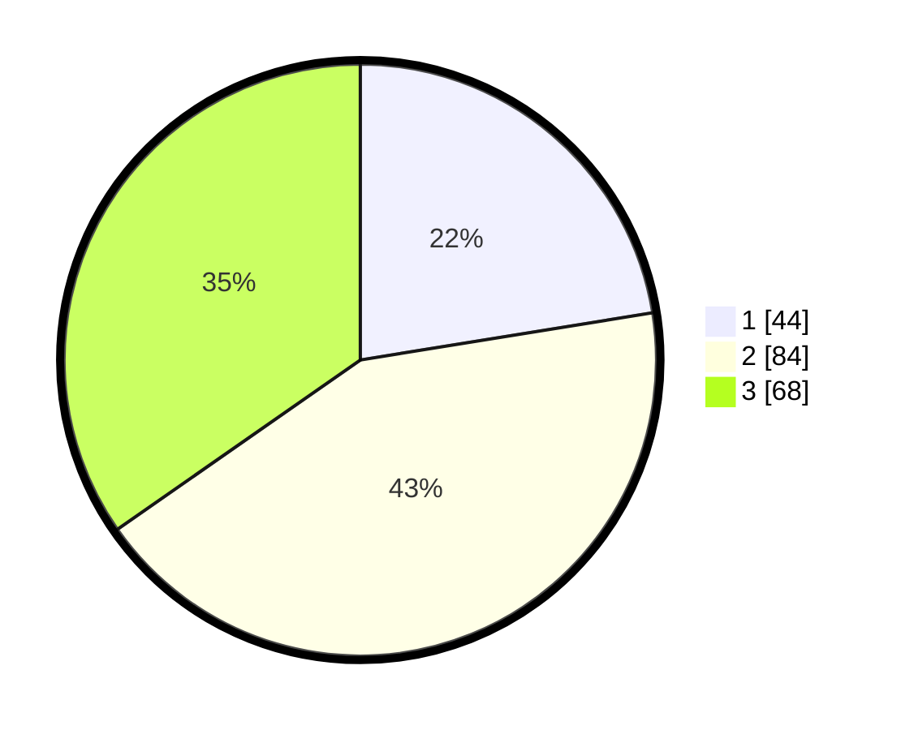

# Hasil

## Grafik

## Tabel

| No. | Nama Paslon    | Suara | Suara (raw) | Persentase |
|:--- |:-------------- | -----:| -----------:| ----------:|
| 1   | ANIES MUHAIMIN | 44    | [44][p-1]   | 22,45      |
| 2   | PRABOWO GIBRAN | 84    | [84][p-2]   | 42,86      |
| 3   | GANJAR MAHFUD  | 68    | [68][p-3]   | 34,69      |

[p-1]: https://github.com/gigit-pemilu/pemilu-2024-34-di-yogyakarta/blob/main/pilpres/hitung-suara/sub/34-di-yogyakarta/sub/04-sleman/sub/06-mlati/sub/2001-sinduadi/sub/086-tps/sub/paslon-1.txt
[p-2]: https://github.com/gigit-pemilu/pemilu-2024-34-di-yogyakarta/blob/main/pilpres/hitung-suara/sub/34-di-yogyakarta/sub/04-sleman/sub/06-mlati/sub/2001-sinduadi/sub/086-tps/sub/paslon-2.txt
[p-3]: https://github.com/gigit-pemilu/pemilu-2024-34-di-yogyakarta/blob/main/pilpres/hitung-suara/sub/34-di-yogyakarta/sub/04-sleman/sub/06-mlati/sub/2001-sinduadi/sub/086-tps/sub/paslon-3.txt

## Foto C Plano

https://sirekap-obj-formc.kpu.go.id/e425/pemilu/ppwp/34/04/06/20/01/3404062001086-20240214-214410--b489cf18-3c3c-4086-965e-fbb35baa16be.jpg

https://sirekap-obj-formc.kpu.go.id/e425/pemilu/ppwp/34/04/06/20/01/3404062001086-20240214-231444--364049f1-553a-4cdd-ac95-d0631fc7b93d.jpg

https://sirekap-obj-formc.kpu.go.id/e425/pemilu/ppwp/34/04/06/20/01/3404062001086-20240214-231538--8846fa40-00f9-429e-934d-3f74374df0cd.jpg

## Metadata

| Key        | Value               |
| ---------- | ------------------- |
| Time Stamp | 2024-02-15 19:30:26 |

