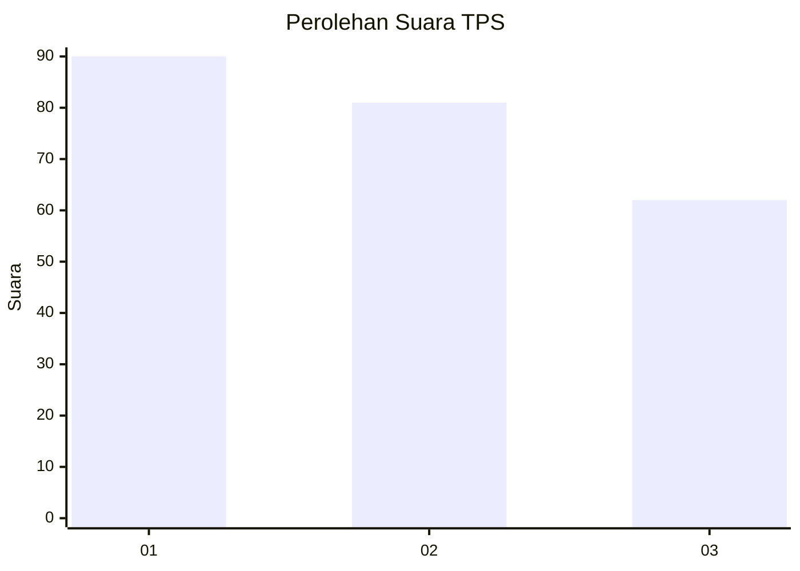
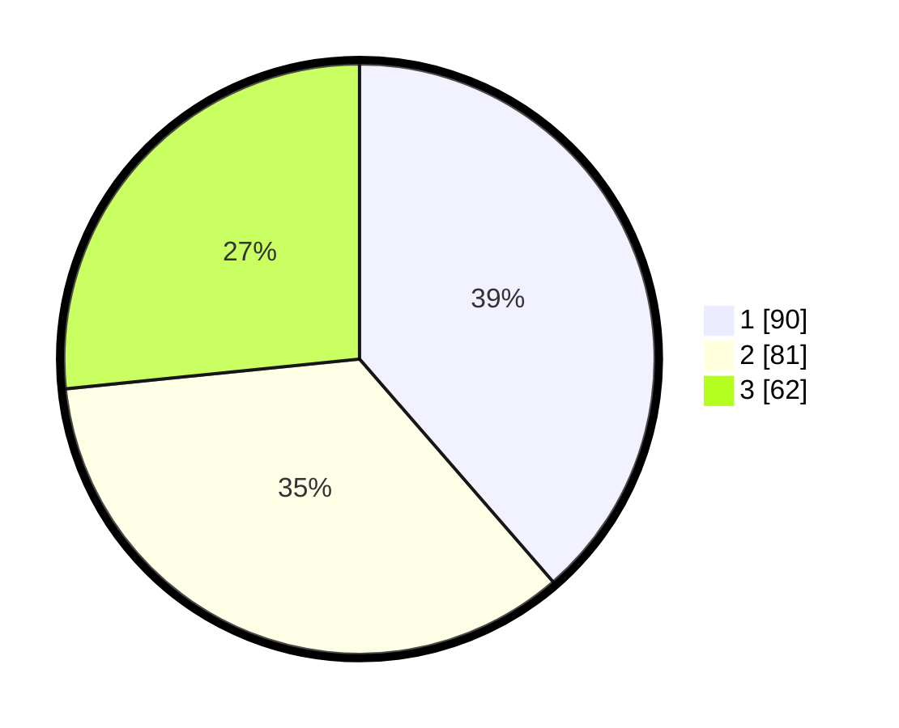

# Hasil

## Grafik

## Tabel

| No. | Nama Paslon    | Suara | Suara (raw) | Persentase |
|:--- |:-------------- | -----:| -----------:| ----------:|
| 1   | ANIES MUHAIMIN | 90    | [90][p-1]   | 38,63      |
| 2   | PRABOWO GIBRAN | 81    | [81][p-2]   | 34,76      |
| 3   | GANJAR MAHFUD  | 62    | [62][p-3]   | 26,61      |

[p-1]: https://github.com/gigit-pemilu/pemilu-2024-34-di-yogyakarta/blob/main/pilpres/hitung-suara/sub/34-di-yogyakarta/sub/04-sleman/sub/06-mlati/sub/2001-sinduadi/sub/090-tps/sub/paslon-1.txt
[p-2]: https://github.com/gigit-pemilu/pemilu-2024-34-di-yogyakarta/blob/main/pilpres/hitung-suara/sub/34-di-yogyakarta/sub/04-sleman/sub/06-mlati/sub/2001-sinduadi/sub/090-tps/sub/paslon-2.txt
[p-3]: https://github.com/gigit-pemilu/pemilu-2024-34-di-yogyakarta/blob/main/pilpres/hitung-suara/sub/34-di-yogyakarta/sub/04-sleman/sub/06-mlati/sub/2001-sinduadi/sub/090-tps/sub/paslon-3.txt

## Foto C Plano

https://sirekap-obj-formc.kpu.go.id/6da5/pemilu/ppwp/34/04/06/20/01/3404062001090-20240214-191504--29181b42-4d41-46e4-84ce-ecc4bef5050f.jpg

https://sirekap-obj-formc.kpu.go.id/6da5/pemilu/ppwp/34/04/06/20/01/3404062001090-20240214-191348--2bd771fb-e1a9-4c04-9662-ca38a4f55355.jpg

https://sirekap-obj-formc.kpu.go.id/6da5/pemilu/ppwp/34/04/06/20/01/3404062001090-20240214-191620--7f68a944-a7aa-412d-8ac6-10a819cad486.jpg

## Metadata

| Key        | Value               |
| ---------- | ------------------- |
| Time Stamp | 2024-02-15 12:00:28 |

