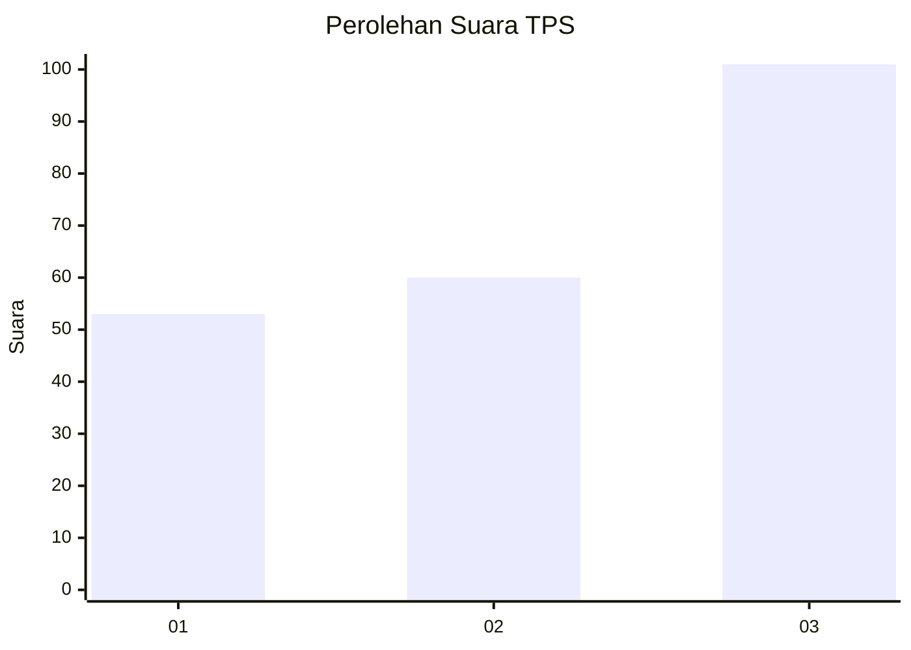
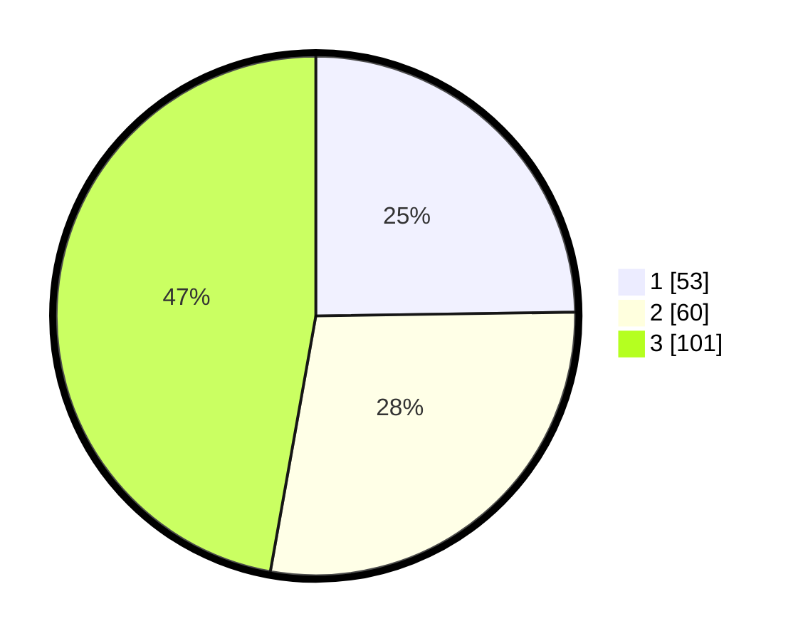

# Hasil

## Grafik

## Tabel

| No. | Nama Paslon    | Suara | Suara (raw) | Persentase |
|:--- |:-------------- | -----:| -----------:| ----------:|
| 1   | ANIES MUHAIMIN | 53    | [53][p-1]   | 24,77      |
| 2   | PRABOWO GIBRAN | 60    | [60][p-2]   | 28,04      |
| 3   | GANJAR MAHFUD  | 101   | [101][p-3]  | 47,20      |

[p-1]: https://github.com/gigit-pemilu/pemilu-2024-34-di-yogyakarta/blob/main/pilpres/hitung-suara/sub/34-di-yogyakarta/sub/04-sleman/sub/06-mlati/sub/2001-sinduadi/sub/102-tps/sub/paslon-1.txt
[p-2]: https://github.com/gigit-pemilu/pemilu-2024-34-di-yogyakarta/blob/main/pilpres/hitung-suara/sub/34-di-yogyakarta/sub/04-sleman/sub/06-mlati/sub/2001-sinduadi/sub/102-tps/sub/paslon-2.txt
[p-3]: https://github.com/gigit-pemilu/pemilu-2024-34-di-yogyakarta/blob/main/pilpres/hitung-suara/sub/34-di-yogyakarta/sub/04-sleman/sub/06-mlati/sub/2001-sinduadi/sub/102-tps/sub/paslon-3.txt

## Foto C Plano

https://sirekap-obj-formc.kpu.go.id/2a7d/pemilu/ppwp/34/04/06/20/01/3404062001102-20240215-004141--e5557757-fef9-406a-99a4-73ae78015b39.jpg

https://sirekap-obj-formc.kpu.go.id/2a7d/pemilu/ppwp/34/04/06/20/01/3404062001102-20240215-004251--053cde4b-f3f6-4767-a825-71bfc617a6ff.jpg

https://sirekap-obj-formc.kpu.go.id/2a7d/pemilu/ppwp/34/04/06/20/01/3404062001102-20240214-193132--b6bf691c-3116-4ade-b880-ecfdcf6642df.jpg

## Metadata

| Key        | Value               |
| ---------- | ------------------- |
| Time Stamp | 2024-02-15 12:00:28 |

