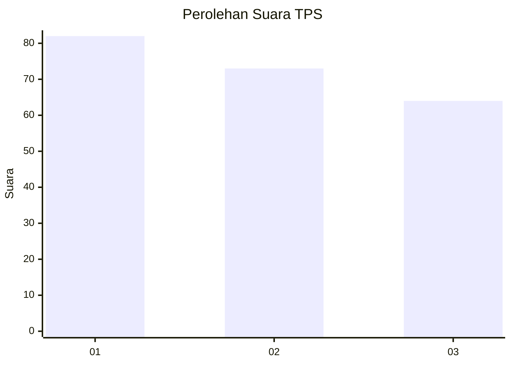
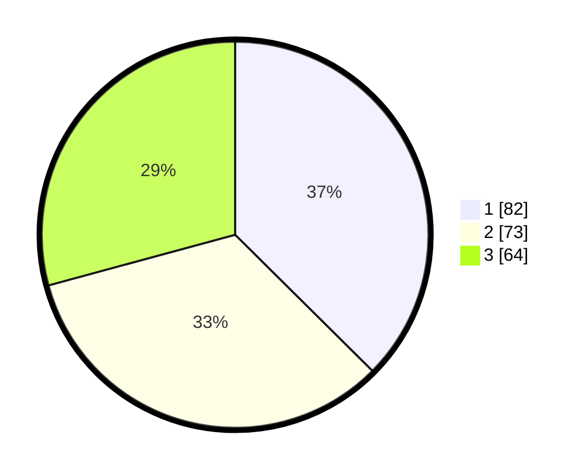

# Hasil

## Grafik

## Tabel

| No. | Nama Paslon    | Suara | Suara (raw) | Persentase |
|:--- |:-------------- | -----:| -----------:| ----------:|
| 1   | ANIES MUHAIMIN | 82    | [82][p-1]   | 37,44      |
| 2   | PRABOWO GIBRAN | 73    | [73][p-2]   | 33,33      |
| 3   | GANJAR MAHFUD  | 64    | [64][p-3]   | 29,22      |

[p-1]: https://github.com/gigit-pemilu/pemilu-2024-34-di-yogyakarta/blob/main/pilpres/hitung-suara/sub/34-di-yogyakarta/sub/04-sleman/sub/06-mlati/sub/2001-sinduadi/sub/103-tps/sub/paslon-1.txt
[p-2]: https://github.com/gigit-pemilu/pemilu-2024-34-di-yogyakarta/blob/main/pilpres/hitung-suara/sub/34-di-yogyakarta/sub/04-sleman/sub/06-mlati/sub/2001-sinduadi/sub/103-tps/sub/paslon-2.txt
[p-3]: https://github.com/gigit-pemilu/pemilu-2024-34-di-yogyakarta/blob/main/pilpres/hitung-suara/sub/34-di-yogyakarta/sub/04-sleman/sub/06-mlati/sub/2001-sinduadi/sub/103-tps/sub/paslon-3.txt

## Foto C Plano

https://sirekap-obj-formc.kpu.go.id/9497/pemilu/ppwp/34/04/06/20/01/3404062001103-20240214-205136--25cee4b3-e6cc-43ab-b0d5-4ea6fcdce7a3.jpg

https://sirekap-obj-formc.kpu.go.id/9497/pemilu/ppwp/34/04/06/20/01/3404062001103-20240214-205417--56ab2af5-2599-4778-ac38-03f538435173.jpg

https://sirekap-obj-formc.kpu.go.id/9497/pemilu/ppwp/34/04/06/20/01/3404062001103-20240214-205524--8026eaf3-ce7d-4f2f-9d1e-55ba1d012f2f.jpg

## Metadata

| Key        | Value               |
| ---------- | ------------------- |
| Time Stamp | 2024-02-15 15:00:29 |

