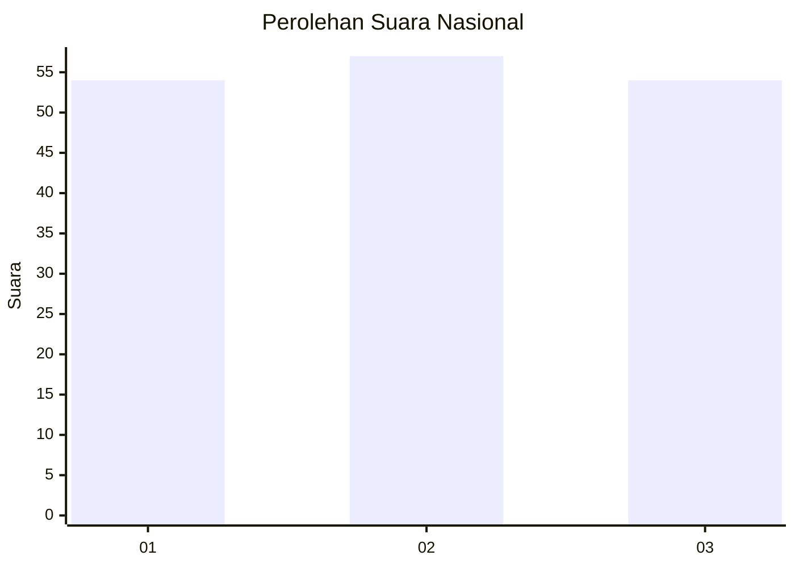
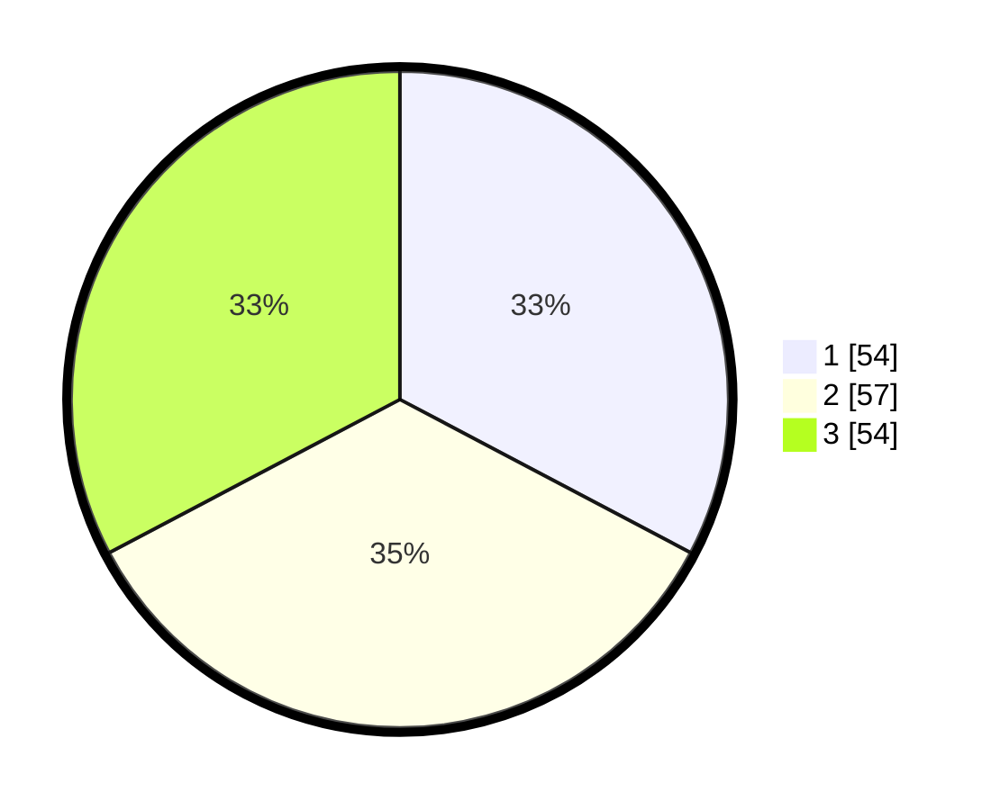

# Hasil

## Grafik

## Tabel

| No. | Nama Paslon    | Suara | Suara (raw) | Persentase |
|:--- |:-------------- | -----:| -----------:| ----------:|
| 1   | ANIES MUHAIMIN | 54    | [54][p-1]   | 32,73      |
| 2   | PRABOWO GIBRAN | 57    | [57][p-2]   | 34,55      |
| 3   | GANJAR MAHFUD  | 54    | [54][p-3]   | 32,73      |

[p-1]: https://github.com/gigit-pemilu/pemilu-2024/blob/main/pilpres/hitung-suara/sub/34-di-yogyakarta/sub/04-sleman/sub/06-mlati/sub/2001-sinduadi/sub/106-tps/sub/paslon-1.txt
[p-2]: https://github.com/gigit-pemilu/pemilu-2024/blob/main/pilpres/hitung-suara/sub/34-di-yogyakarta/sub/04-sleman/sub/06-mlati/sub/2001-sinduadi/sub/106-tps/sub/paslon-2.txt
[p-3]: https://github.com/gigit-pemilu/pemilu-2024/blob/main/pilpres/hitung-suara/sub/34-di-yogyakarta/sub/04-sleman/sub/06-mlati/sub/2001-sinduadi/sub/106-tps/sub/paslon-3.txt

## Foto C Plano

https://sirekap-obj-formc.kpu.go.id/e4aa/pemilu/ppwp/34/04/06/20/01/3404062001106-20240214-155508--68593f02-bff3-4ec9-9897-956196ea69f9.jpg

https://sirekap-obj-formc.kpu.go.id/e4aa/pemilu/ppwp/34/04/06/20/01/3404062001106-20240214-203531--5afeb401-abf4-47a7-9609-33c073cdc50a.jpg

https://sirekap-obj-formc.kpu.go.id/e4aa/pemilu/ppwp/34/04/06/20/01/3404062001106-20240214-155618--81ad8ca8-d9d5-4a2c-8c60-6a6bea51e27f.jpg

## Metadata

| Key        | Value               |
| ---------- | ------------------- |
| Time Stamp | 2024-02-15 15:00:29 |

