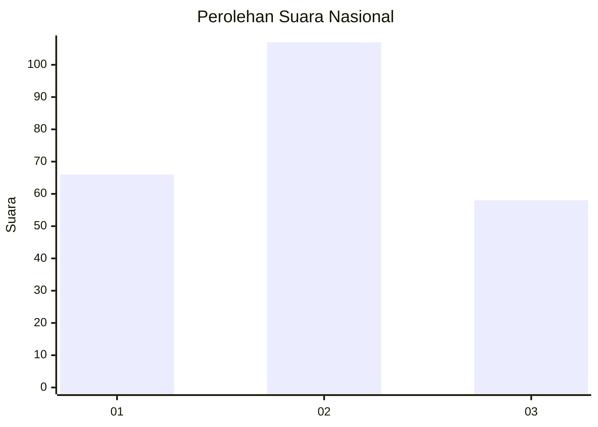
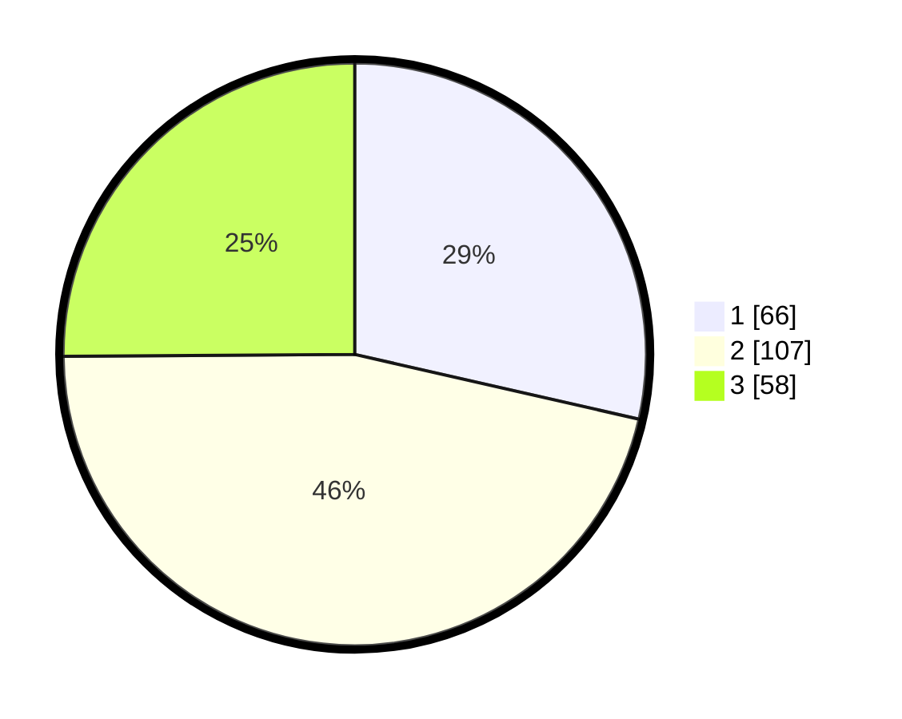

# Hasil

## Grafik

## Tabel

| No. | Nama Paslon    | Suara | Suara (raw) | Persentase |
|:--- |:-------------- | -----:| -----------:| ----------:|
| 1   | ANIES MUHAIMIN | 66    | [66][p-1]   | 28,57      |
| 2   | PRABOWO GIBRAN | 107   | [107][p-2]  | 46,32      |
| 3   | GANJAR MAHFUD  | 58    | [58][p-3]   | 25,11      |

[p-1]: https://github.com/gigit-pemilu/pemilu-2024/blob/main/pilpres/hitung-suara/sub/34-di-yogyakarta/sub/04-sleman/sub/06-mlati/sub/2001-sinduadi/sub/107-tps/sub/paslon-1.txt
[p-2]: https://github.com/gigit-pemilu/pemilu-2024/blob/main/pilpres/hitung-suara/sub/34-di-yogyakarta/sub/04-sleman/sub/06-mlati/sub/2001-sinduadi/sub/107-tps/sub/paslon-2.txt
[p-3]: https://github.com/gigit-pemilu/pemilu-2024/blob/main/pilpres/hitung-suara/sub/34-di-yogyakarta/sub/04-sleman/sub/06-mlati/sub/2001-sinduadi/sub/107-tps/sub/paslon-3.txt

## Foto C Plano

https://sirekap-obj-formc.kpu.go.id/cbd8/pemilu/ppwp/34/04/06/20/01/3404062001107-20240214-192510--5108dbf2-b8c9-4657-94a8-300d3dd68605.jpg

https://sirekap-obj-formc.kpu.go.id/cbd8/pemilu/ppwp/34/04/06/20/01/3404062001107-20240214-190223--1740afc5-5e4f-45bb-a72c-5d5eea05d615.jpg

https://sirekap-obj-formc.kpu.go.id/cbd8/pemilu/ppwp/34/04/06/20/01/3404062001107-20240214-190329--1cd8bb86-62b9-4269-8538-8a896625b926.jpg

## Metadata

| Key        | Value               |
| ---------- | ------------------- |
| Time Stamp | 2024-02-14 21:46:01 |

## DATA PEMILIH TETAP

Jumlah pemilih dalam DPT: **227**.
 * L: **109**.
 * P: **118**.

## DATA PENGGUNA HAK PILIH

Jumlah pengguna hak pilih dalam DPT: **268**.
 * L: **134**.
 * P: **134**.

Jumlah pengguna hak pilih dalam DPTb: **11**.
 * L: **6**.
 * P: **5**.

Jumlah pengguna hak pilih dalam DPK: **2**.
 * L: **0**.
 * P: **2**.

Jumlah pengguna hak pilih: **281**.
 * L: **140**.
 * P: **141**.

## JUMLAH SUARA SAH DAN TIDAK SAH

JUMLAH SELURUH SUARA SAH: **231**.

JUMLAH SUARA TIDAK SAH: **6**.

JUMLAH SELURUH SUARA SAH DAN SUARA TIDAK SAH: **237**.

