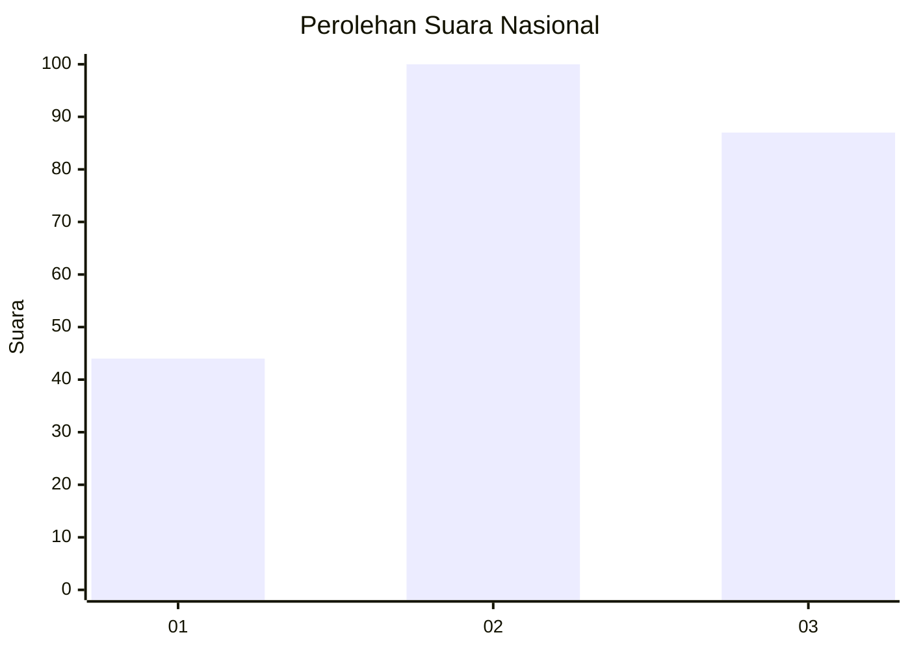
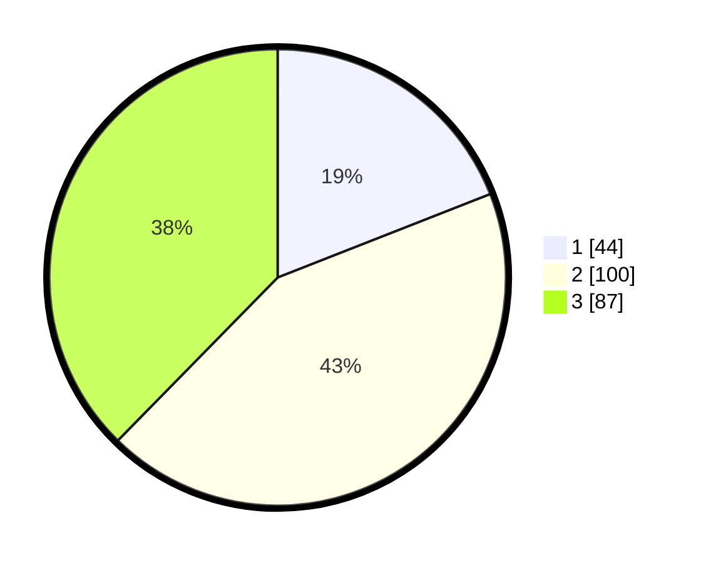

# Hasil

## Grafik

## Tabel

| No. | Nama Paslon    | Suara | Suara (raw) | Persentase |
|:--- |:-------------- | -----:| -----------:| ----------:|
| 1   | ANIES MUHAIMIN | 44    | [44][p-1]   | 19,05      |
| 2   | PRABOWO GIBRAN | 100   | [100][p-2]  | 43,29      |
| 3   | GANJAR MAHFUD  | 87    | [87][p-3]   | 37,66      |

[p-1]: https://github.com/gigit-pemilu/pemilu-2024/blob/main/pilpres/hitung-suara/sub/34-di-yogyakarta/sub/04-sleman/sub/06-mlati/sub/2002-sendangadi/sub/003-tps/sub/paslon-1.txt
[p-2]: https://github.com/gigit-pemilu/pemilu-2024/blob/main/pilpres/hitung-suara/sub/34-di-yogyakarta/sub/04-sleman/sub/06-mlati/sub/2002-sendangadi/sub/003-tps/sub/paslon-2.txt
[p-3]: https://github.com/gigit-pemilu/pemilu-2024/blob/main/pilpres/hitung-suara/sub/34-di-yogyakarta/sub/04-sleman/sub/06-mlati/sub/2002-sendangadi/sub/003-tps/sub/paslon-3.txt

## Foto C Plano

https://sirekap-obj-formc.kpu.go.id/1376/pemilu/ppwp/34/04/06/20/02/3404062002003-20240214-225903--cabff581-fdf5-4178-afbf-f6cfbc56d7b0.jpg

https://sirekap-obj-formc.kpu.go.id/1376/pemilu/ppwp/34/04/06/20/02/3404062002003-20240214-225909--6314b762-94c3-48fa-8505-c286529c5444.jpg

https://sirekap-obj-formc.kpu.go.id/1376/pemilu/ppwp/34/04/06/20/02/3404062002003-20240214-225915--d0da803e-5b4d-4f9a-92a1-d2ad0ea3ae9a.jpg

## Metadata

| Key        | Value               |
| ---------- | ------------------- |
| Time Stamp | 2024-02-15 18:30:25 |

