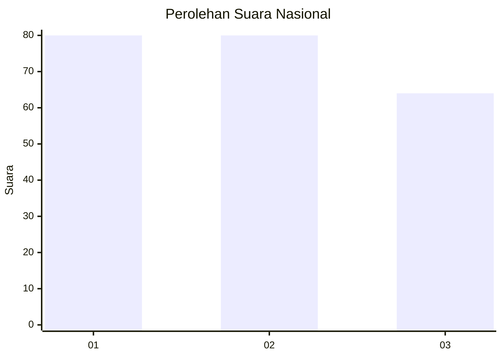
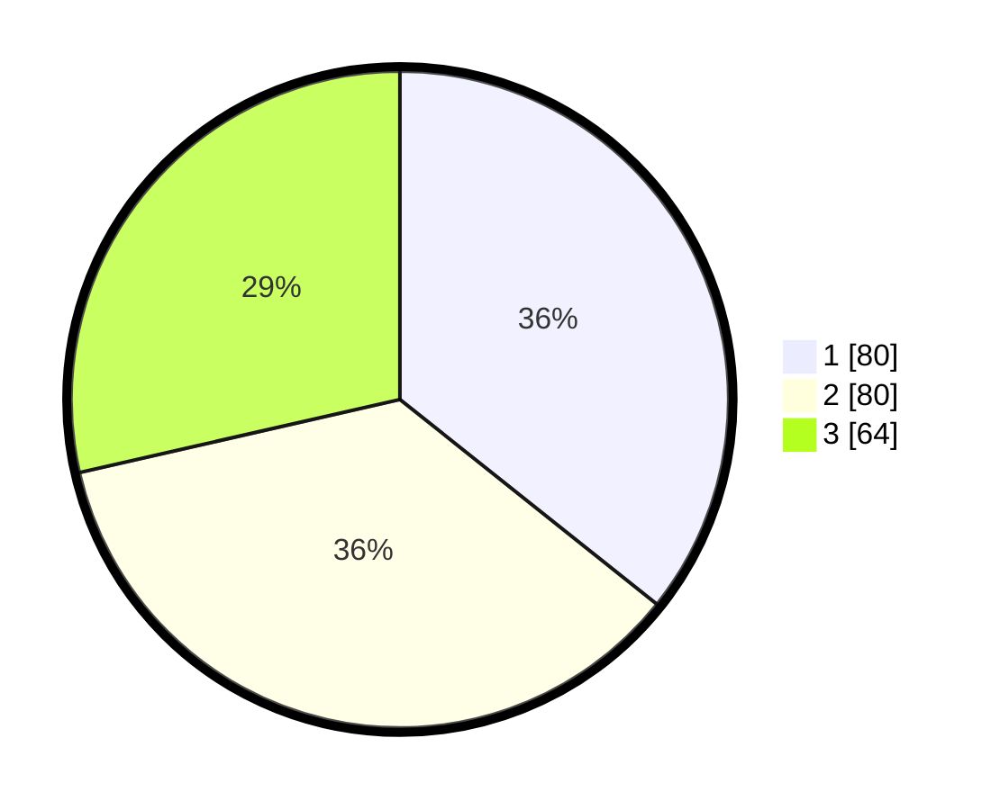

# Hasil

## Grafik

## Tabel

| No. | Nama Paslon    | Suara | Suara (raw) | Persentase |
|:--- |:-------------- | -----:| -----------:| ----------:|
| 1   | ANIES MUHAIMIN | 80    | [80][p-1]   | 35,71      |
| 2   | PRABOWO GIBRAN | 80    | [80][p-2]   | 35,71      |
| 3   | GANJAR MAHFUD  | 64    | [64][p-3]   | 28,57      |

[p-1]: https://github.com/gigit-pemilu/pemilu-2024/blob/main/pilpres/hitung-suara/sub/34-di-yogyakarta/sub/04-sleman/sub/06-mlati/sub/2002-sendangadi/sub/006-tps/sub/paslon-1.txt
[p-2]: https://github.com/gigit-pemilu/pemilu-2024/blob/main/pilpres/hitung-suara/sub/34-di-yogyakarta/sub/04-sleman/sub/06-mlati/sub/2002-sendangadi/sub/006-tps/sub/paslon-2.txt
[p-3]: https://github.com/gigit-pemilu/pemilu-2024/blob/main/pilpres/hitung-suara/sub/34-di-yogyakarta/sub/04-sleman/sub/06-mlati/sub/2002-sendangadi/sub/006-tps/sub/paslon-3.txt

## Foto C Plano

https://sirekap-obj-formc.kpu.go.id/3de4/pemilu/ppwp/34/04/06/20/02/3404062002006-20240215-005141--b2d00833-7c8e-49e9-84c8-d1c3608d808e.jpg

https://sirekap-obj-formc.kpu.go.id/3de4/pemilu/ppwp/34/04/06/20/02/3404062002006-20240215-005311--e9dc687c-80b8-4375-b32b-0247dea1a1e3.jpg

https://sirekap-obj-formc.kpu.go.id/3de4/pemilu/ppwp/34/04/06/20/02/3404062002006-20240215-005437--1ce63918-7b1b-4d8e-8c6d-0ab7891abd42.jpg

## Metadata

| Key        | Value               |
| ---------- | ------------------- |
| Time Stamp | 2024-02-16 21:01:00 |

