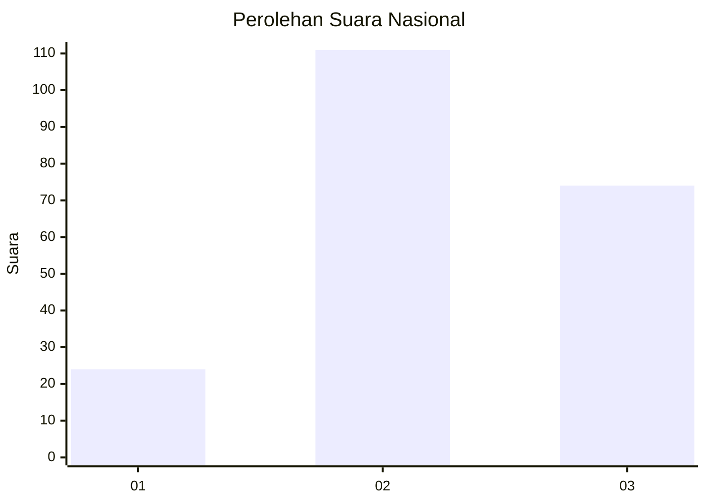
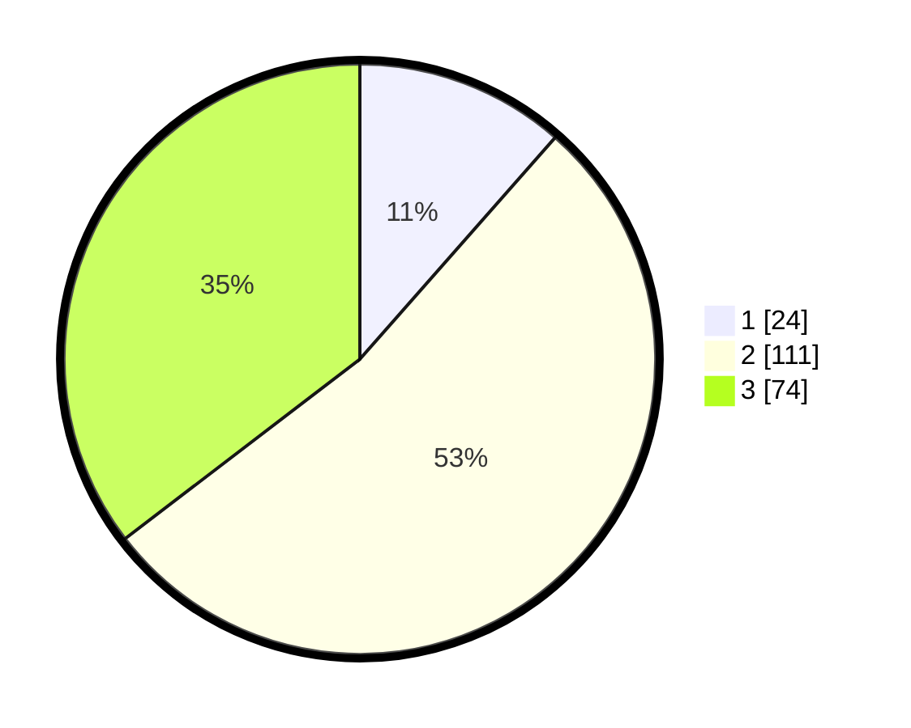

# Hasil

## Grafik

## Tabel

| No. | Nama Paslon    | Suara | Suara (raw) | Persentase |
|:--- |:-------------- | -----:| -----------:| ----------:|
| 1   | ANIES MUHAIMIN | 24    | [24][p-1]   | 11,48      |
| 2   | PRABOWO GIBRAN | 111   | [111][p-2]  | 53,11      |
| 3   | GANJAR MAHFUD  | 74    | [74][p-3]   | 35,41      |

[p-1]: https://github.com/gigit-pemilu/pemilu-2024/blob/main/pilpres/hitung-suara/sub/34-di-yogyakarta/sub/04-sleman/sub/06-mlati/sub/2002-sendangadi/sub/009-tps/sub/paslon-1.txt
[p-2]: https://github.com/gigit-pemilu/pemilu-2024/blob/main/pilpres/hitung-suara/sub/34-di-yogyakarta/sub/04-sleman/sub/06-mlati/sub/2002-sendangadi/sub/009-tps/sub/paslon-2.txt
[p-3]: https://github.com/gigit-pemilu/pemilu-2024/blob/main/pilpres/hitung-suara/sub/34-di-yogyakarta/sub/04-sleman/sub/06-mlati/sub/2002-sendangadi/sub/009-tps/sub/paslon-3.txt

## Foto C Plano

https://sirekap-obj-formc.kpu.go.id/11d1/pemilu/ppwp/34/04/06/20/02/3404062002009-20240215-002935--144a949c-888f-4684-8b39-2f9ccb0935e5.jpg

https://sirekap-obj-formc.kpu.go.id/11d1/pemilu/ppwp/34/04/06/20/02/3404062002009-20240215-003338--2b3c8070-644b-4938-a465-223af30362ab.jpg

https://sirekap-obj-formc.kpu.go.id/11d1/pemilu/ppwp/34/04/06/20/02/3404062002009-20240215-003459--a28fc2e6-7df4-462b-bc8e-090aa2489a6c.jpg

## Metadata

| Key        | Value               |
| ---------- | ------------------- |
| Time Stamp | 2024-02-16 21:01:00 |

