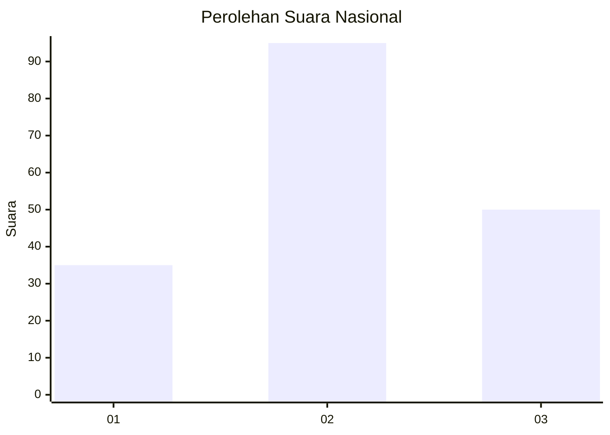
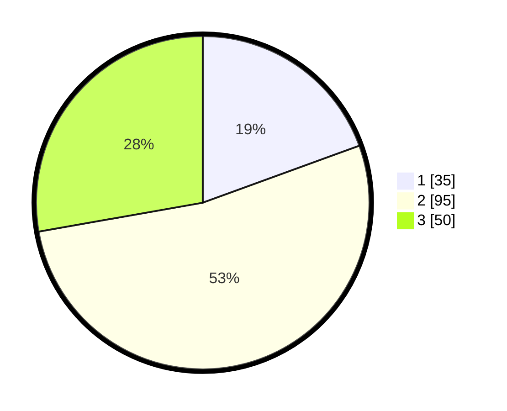

# Hasil

## Grafik

## Tabel

| No. | Nama Paslon    | Suara | Suara (raw) | Persentase |
|:--- |:-------------- | -----:| -----------:| ----------:|
| 1   | ANIES MUHAIMIN | 35    | [35][p-1]   | 19,44      |
| 2   | PRABOWO GIBRAN | 95    | [95][p-2]   | 52,78      |
| 3   | GANJAR MAHFUD  | 50    | [50][p-3]   | 27,78      |

[p-1]: https://github.com/gigit-pemilu/pemilu-2024/blob/main/pilpres/hitung-suara/sub/34-di-yogyakarta/sub/04-sleman/sub/06-mlati/sub/2002-sendangadi/sub/010-tps/sub/paslon-1.txt
[p-2]: https://github.com/gigit-pemilu/pemilu-2024/blob/main/pilpres/hitung-suara/sub/34-di-yogyakarta/sub/04-sleman/sub/06-mlati/sub/2002-sendangadi/sub/010-tps/sub/paslon-2.txt
[p-3]: https://github.com/gigit-pemilu/pemilu-2024/blob/main/pilpres/hitung-suara/sub/34-di-yogyakarta/sub/04-sleman/sub/06-mlati/sub/2002-sendangadi/sub/010-tps/sub/paslon-3.txt

## Foto C Plano

https://sirekap-obj-formc.kpu.go.id/be5c/pemilu/ppwp/34/04/06/20/02/3404062002010-20240215-003748--1ddf520a-7a60-4648-970b-5685717be868.jpg

https://sirekap-obj-formc.kpu.go.id/be5c/pemilu/ppwp/34/04/06/20/02/3404062002010-20240215-003754--ee7476bd-f71e-4e9a-8e85-bb6346f6302c.jpg

https://sirekap-obj-formc.kpu.go.id/be5c/pemilu/ppwp/34/04/06/20/02/3404062002010-20240215-003759--30749f63-5e2b-44c1-a783-4e62d52c2f4a.jpg

## Metadata

| Key        | Value               |
| ---------- | ------------------- |
| Time Stamp | 2024-02-16 21:01:00 |

