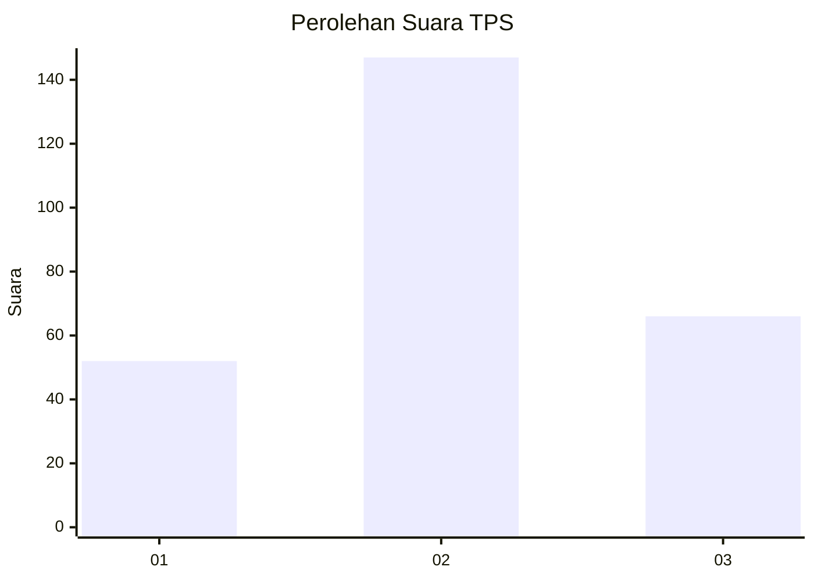
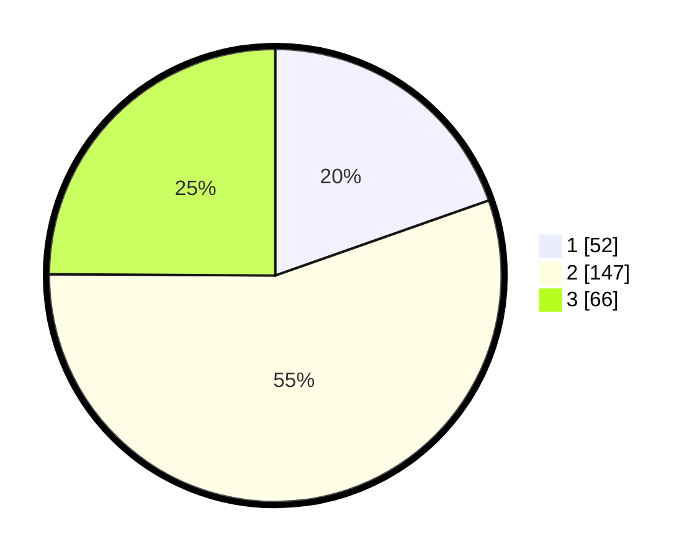

# Hasil

## Grafik

## Tabel

| No. | Nama Paslon    | Suara | Suara (raw) | Persentase |
|:--- |:-------------- | -----:| -----------:| ----------:|
| 1   | ANIES MUHAIMIN | 52    | [52][p-1]   | 19,62      |
| 2   | PRABOWO GIBRAN | 147   | [147][p-2]  | 55,47      |
| 3   | GANJAR MAHFUD  | 66    | [66][p-3]   | 24,91      |

[p-1]: https://github.com/gigit-pemilu/pemilu-2024-34-di-yogyakarta/blob/main/pilpres/hitung-suara/sub/34-di-yogyakarta/sub/04-sleman/sub/06-mlati/sub/2002-sendangadi/sub/012-tps/sub/paslon-1.txt
[p-2]: https://github.com/gigit-pemilu/pemilu-2024-34-di-yogyakarta/blob/main/pilpres/hitung-suara/sub/34-di-yogyakarta/sub/04-sleman/sub/06-mlati/sub/2002-sendangadi/sub/012-tps/sub/paslon-2.txt
[p-3]: https://github.com/gigit-pemilu/pemilu-2024-34-di-yogyakarta/blob/main/pilpres/hitung-suara/sub/34-di-yogyakarta/sub/04-sleman/sub/06-mlati/sub/2002-sendangadi/sub/012-tps/sub/paslon-3.txt

## Foto C Plano

https://sirekap-obj-formc.kpu.go.id/26b9/pemilu/ppwp/34/04/06/20/02/3404062002012-20240214-213507--b8850c9e-f7ee-4016-9d68-2cebdfc98960.jpg

https://sirekap-obj-formc.kpu.go.id/26b9/pemilu/ppwp/34/04/06/20/02/3404062002012-20240214-213515--2b552fb5-d97c-475c-8664-ecdc2e2001cc.jpg

https://sirekap-obj-formc.kpu.go.id/26b9/pemilu/ppwp/34/04/06/20/02/3404062002012-20240214-213524--61483e33-9bc1-4e48-92a9-b256102fb85b.jpg

## Metadata

| Key        | Value               |
| ---------- | ------------------- |
| Time Stamp | 2024-02-15 15:00:29 |

