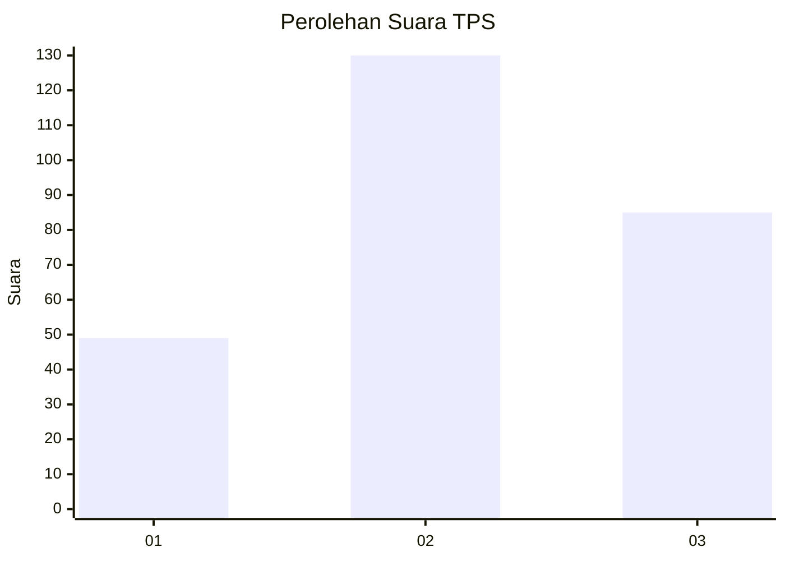
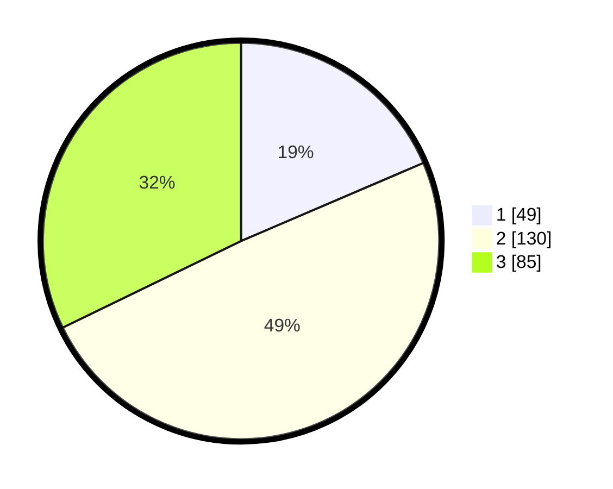

# Hasil

## Grafik

## Tabel

| No. | Nama Paslon    | Suara | Suara (raw) | Persentase |
|:--- |:-------------- | -----:| -----------:| ----------:|
| 1   | ANIES MUHAIMIN | 49    | [49][p-1]   | 18,56      |
| 2   | PRABOWO GIBRAN | 130   | [130][p-2]  | 49,24      |
| 3   | GANJAR MAHFUD  | 85    | [85][p-3]   | 32,20      |

[p-1]: https://github.com/gigit-pemilu/pemilu-2024-34-di-yogyakarta/blob/main/pilpres/hitung-suara/sub/34-di-yogyakarta/sub/04-sleman/sub/06-mlati/sub/2002-sendangadi/sub/014-tps/sub/paslon-1.txt
[p-2]: https://github.com/gigit-pemilu/pemilu-2024-34-di-yogyakarta/blob/main/pilpres/hitung-suara/sub/34-di-yogyakarta/sub/04-sleman/sub/06-mlati/sub/2002-sendangadi/sub/014-tps/sub/paslon-2.txt
[p-3]: https://github.com/gigit-pemilu/pemilu-2024-34-di-yogyakarta/blob/main/pilpres/hitung-suara/sub/34-di-yogyakarta/sub/04-sleman/sub/06-mlati/sub/2002-sendangadi/sub/014-tps/sub/paslon-3.txt

## Foto C Plano

https://sirekap-obj-formc.kpu.go.id/070b/pemilu/ppwp/34/04/06/20/02/3404062002014-20240215-033054--306afa6c-b9d4-4868-bee6-2b47c7b76936.jpg

https://sirekap-obj-formc.kpu.go.id/070b/pemilu/ppwp/34/04/06/20/02/3404062002014-20240215-033101--60b4a8cc-a21b-4439-8e1d-a54258221e8f.jpg

https://sirekap-obj-formc.kpu.go.id/070b/pemilu/ppwp/34/04/06/20/02/3404062002014-20240215-033108--e8c4623f-64dc-4caa-adc0-db13fad28a01.jpg

## Metadata

| Key        | Value               |
| ---------- | ------------------- |
| Time Stamp | 2024-02-15 15:00:29 |

