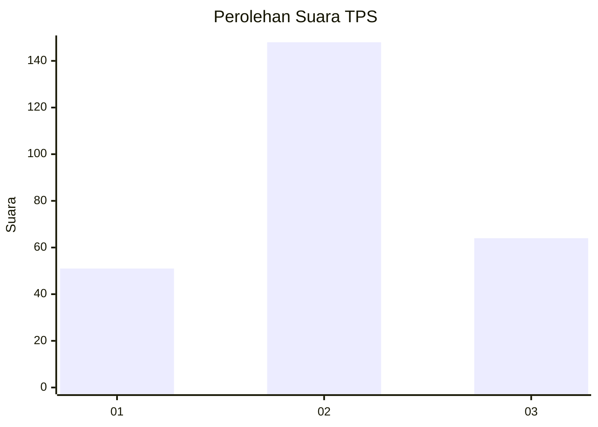
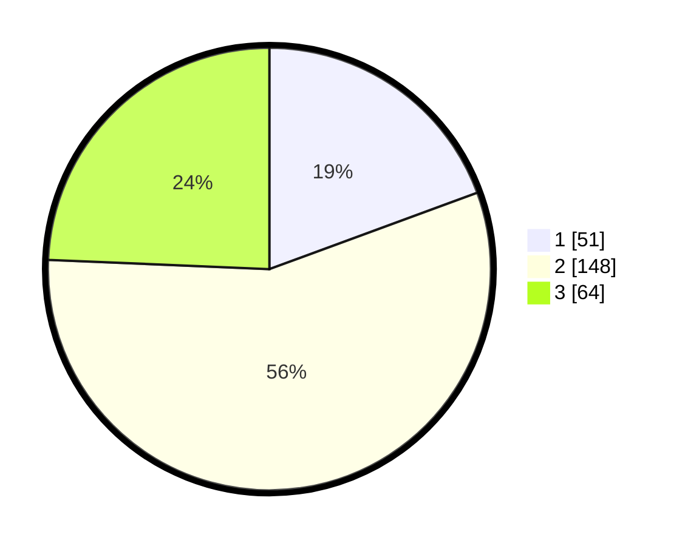

# Hasil

## Grafik

## Tabel

| No. | Nama Paslon    | Suara | Suara (raw) | Persentase |
|:--- |:-------------- | -----:| -----------:| ----------:|
| 1   | ANIES MUHAIMIN | 51    | [51][p-1]   | 19,39      |
| 2   | PRABOWO GIBRAN | 148   | [148][p-2]  | 56,27      |
| 3   | GANJAR MAHFUD  | 64    | [64][p-3]   | 24,33      |

[p-1]: https://github.com/gigit-pemilu/pemilu-2024-34-di-yogyakarta/blob/main/pilpres/hitung-suara/sub/34-di-yogyakarta/sub/04-sleman/sub/06-mlati/sub/2002-sendangadi/sub/023-tps/sub/paslon-1.txt
[p-2]: https://github.com/gigit-pemilu/pemilu-2024-34-di-yogyakarta/blob/main/pilpres/hitung-suara/sub/34-di-yogyakarta/sub/04-sleman/sub/06-mlati/sub/2002-sendangadi/sub/023-tps/sub/paslon-2.txt
[p-3]: https://github.com/gigit-pemilu/pemilu-2024-34-di-yogyakarta/blob/main/pilpres/hitung-suara/sub/34-di-yogyakarta/sub/04-sleman/sub/06-mlati/sub/2002-sendangadi/sub/023-tps/sub/paslon-3.txt

## Foto C Plano

https://sirekap-obj-formc.kpu.go.id/254d/pemilu/ppwp/34/04/06/20/02/3404062002023-20240216-070443--edd003a1-0e04-41a3-a262-92dcad101750.jpg

https://sirekap-obj-formc.kpu.go.id/254d/pemilu/ppwp/34/04/06/20/02/3404062002023-20240216-070445--54afba23-4e41-47dc-89dd-7743a8188ec8.jpg

https://sirekap-obj-formc.kpu.go.id/254d/pemilu/ppwp/34/04/06/20/02/3404062002023-20240216-070444--f3628d5b-6949-4816-8b31-c0baaedca719.jpg

## Metadata

| Key        | Value               |
| ---------- | ------------------- |
| Time Stamp | 2024-02-16 13:30:32 |

## DATA PEMILIH TETAP

Jumlah pemilih dalam DPT: **288**.
 * L: **140**.
 * P: **148**.

## DATA PENGGUNA HAK PILIH

Jumlah pengguna hak pilih dalam DPT: **256**.
 * L: **128**.
 * P: **128**.

Jumlah pengguna hak pilih dalam DPTb: **12**.
 * L: **3**.
 * P: **9**.

Jumlah pengguna hak pilih dalam DPK: **4**.
 * L: **2**.
 * P: **2**.

Jumlah pengguna hak pilih: **272**.
 * L: **133**.
 * P: **139**.

## JUMLAH SUARA SAH DAN TIDAK SAH

JUMLAH SELURUH SUARA SAH: **263**.

JUMLAH SUARA TIDAK SAH: **9**.

JUMLAH SELURUH SUARA SAH DAN SUARA TIDAK SAH: **272**.

