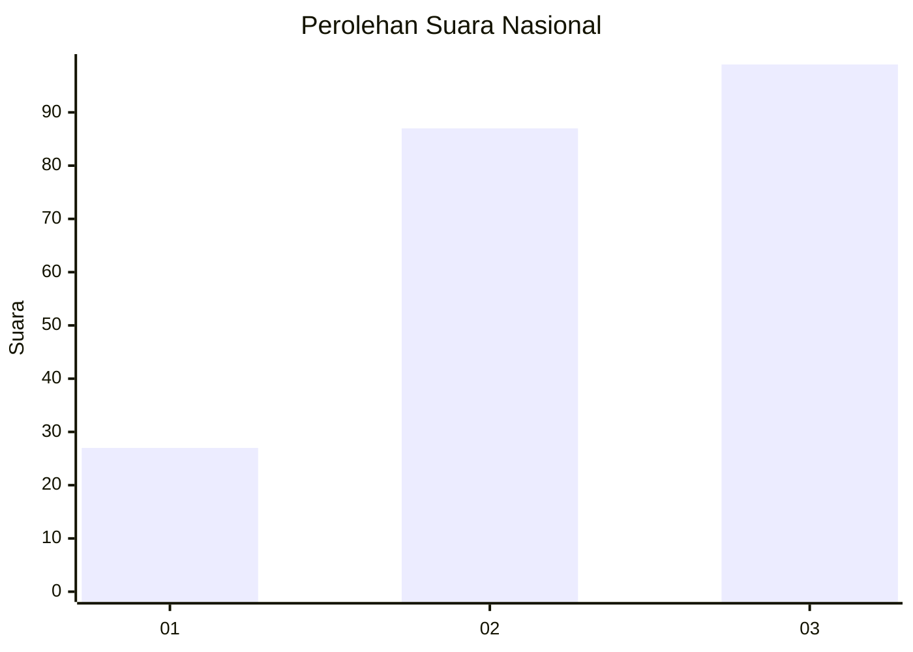
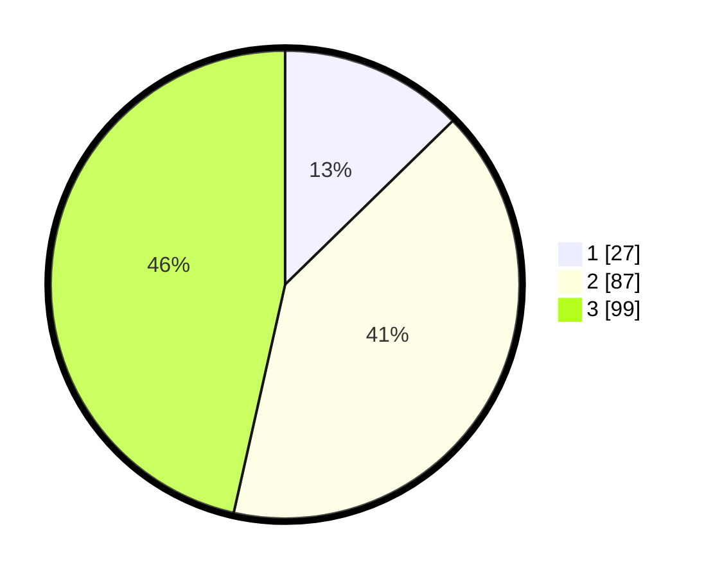

# Hasil

## Grafik

## Tabel

| No. | Nama Paslon    | Suara | Suara (raw) | Persentase |
|:--- |:-------------- | -----:| -----------:| ----------:|
| 1   | ANIES MUHAIMIN | 27    | [27][p-1]   | 12,68      |
| 2   | PRABOWO GIBRAN | 87    | [87][p-2]   | 40,85      |
| 3   | GANJAR MAHFUD  | 99    | [99][p-3]   | 46,48      |

[p-1]: https://github.com/gigit-pemilu/pemilu-2024/blob/main/pilpres/hitung-suara/sub/34-di-yogyakarta/sub/04-sleman/sub/06-mlati/sub/2002-sendangadi/sub/029-tps/sub/paslon-1.txt
[p-2]: https://github.com/gigit-pemilu/pemilu-2024/blob/main/pilpres/hitung-suara/sub/34-di-yogyakarta/sub/04-sleman/sub/06-mlati/sub/2002-sendangadi/sub/029-tps/sub/paslon-2.txt
[p-3]: https://github.com/gigit-pemilu/pemilu-2024/blob/main/pilpres/hitung-suara/sub/34-di-yogyakarta/sub/04-sleman/sub/06-mlati/sub/2002-sendangadi/sub/029-tps/sub/paslon-3.txt

## Foto C Plano

https://sirekap-obj-formc.kpu.go.id/bdcf/pemilu/ppwp/34/04/06/20/02/3404062002029-20240214-195503--884db281-2367-4a28-92d6-8a150dfe5b6b.jpg

https://sirekap-obj-formc.kpu.go.id/bdcf/pemilu/ppwp/34/04/06/20/02/3404062002029-20240214-195753--e12b10a8-4f71-4fd8-aa9b-674d5826875e.jpg

https://sirekap-obj-formc.kpu.go.id/bdcf/pemilu/ppwp/34/04/06/20/02/3404062002029-20240214-200117--d5989972-4b84-4fb0-8ac7-8939828dea27.jpg

## Metadata

| Key        | Value               |
| ---------- | ------------------- |
| Time Stamp | 2024-02-15 15:00:29 |

