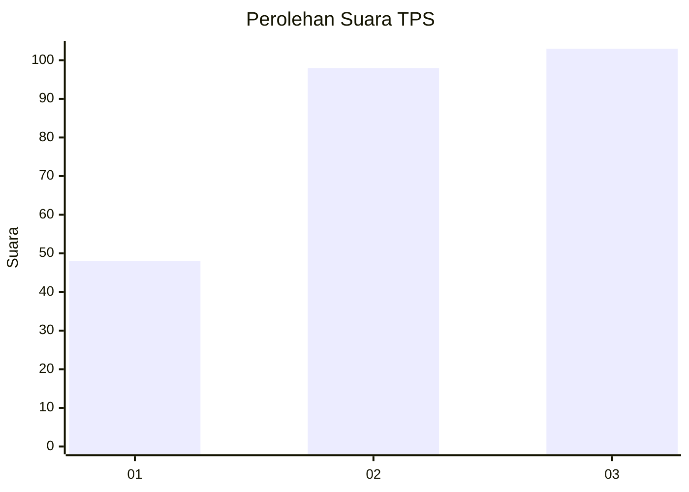
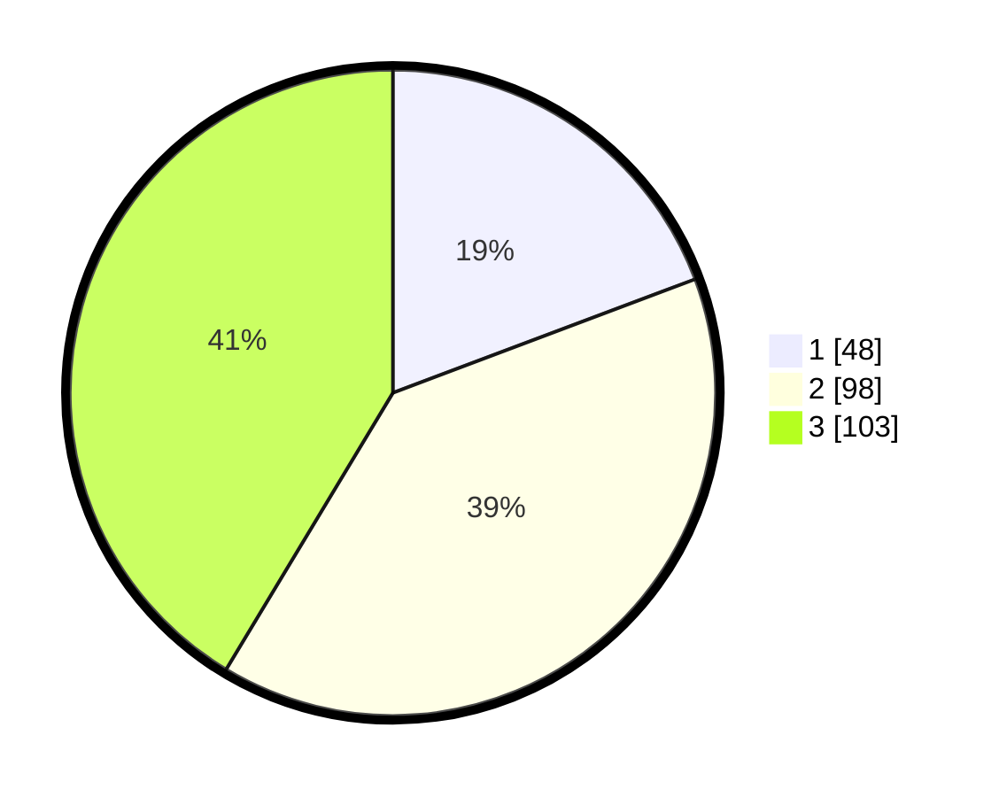

# Hasil

## Grafik

## Tabel

| No. | Nama Paslon    | Suara | Suara (raw) | Persentase |
|:--- |:-------------- | -----:| -----------:| ----------:|
| 1   | ANIES MUHAIMIN | 48    | [48][p-1]   | 19,28      |
| 2   | PRABOWO GIBRAN | 98    | [98][p-2]   | 39,36      |
| 3   | GANJAR MAHFUD  | 103   | [103][p-3]  | 41,37      |

[p-1]: https://github.com/gigit-pemilu/pemilu-2024-34-di-yogyakarta/blob/main/pilpres/hitung-suara/sub/34-di-yogyakarta/sub/04-sleman/sub/06-mlati/sub/2002-sendangadi/sub/031-tps/sub/paslon-1.txt
[p-2]: https://github.com/gigit-pemilu/pemilu-2024-34-di-yogyakarta/blob/main/pilpres/hitung-suara/sub/34-di-yogyakarta/sub/04-sleman/sub/06-mlati/sub/2002-sendangadi/sub/031-tps/sub/paslon-2.txt
[p-3]: https://github.com/gigit-pemilu/pemilu-2024-34-di-yogyakarta/blob/main/pilpres/hitung-suara/sub/34-di-yogyakarta/sub/04-sleman/sub/06-mlati/sub/2002-sendangadi/sub/031-tps/sub/paslon-3.txt

## Foto C Plano

https://sirekap-obj-formc.kpu.go.id/e4ef/pemilu/ppwp/34/04/06/20/02/3404062002031-20240214-221411--b053d23d-8dad-45fd-ab92-a6fac57b1fe5.jpg

https://sirekap-obj-formc.kpu.go.id/e4ef/pemilu/ppwp/34/04/06/20/02/3404062002031-20240214-220919--b6ce8377-fdb8-455e-a6f4-fd1c39d5ef92.jpg

https://sirekap-obj-formc.kpu.go.id/e4ef/pemilu/ppwp/34/04/06/20/02/3404062002031-20240214-221819--c723f190-32aa-412f-8739-a8e2414b96da.jpg

## Metadata

| Key        | Value               |
| ---------- | ------------------- |
| Time Stamp | 2024-02-15 21:01:18 |

