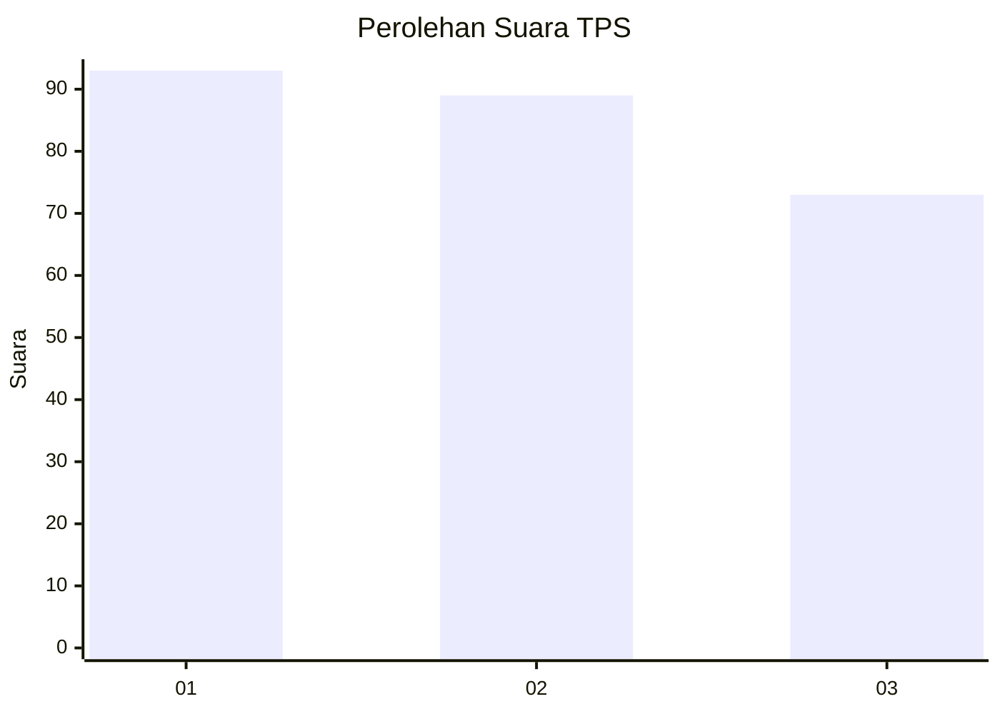
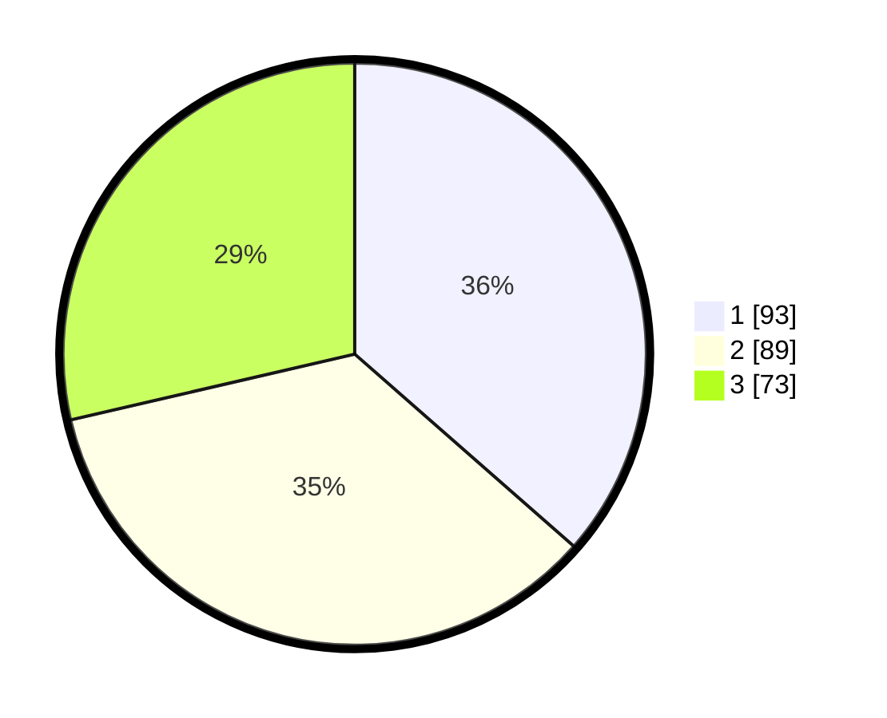

# Hasil

## Grafik

## Tabel

| No. | Nama Paslon    | Suara | Suara (raw) | Persentase |
|:--- |:-------------- | -----:| -----------:| ----------:|
| 1   | ANIES MUHAIMIN | 93    | [93][p-1]   | 36,47      |
| 2   | PRABOWO GIBRAN | 89    | [89][p-2]   | 34,90      |
| 3   | GANJAR MAHFUD  | 73    | [73][p-3]   | 28,63      |

[p-1]: https://github.com/gigit-pemilu/pemilu-2024-34-di-yogyakarta/blob/main/pilpres/hitung-suara/sub/34-di-yogyakarta/sub/04-sleman/sub/06-mlati/sub/2002-sendangadi/sub/032-tps/sub/paslon-1.txt
[p-2]: https://github.com/gigit-pemilu/pemilu-2024-34-di-yogyakarta/blob/main/pilpres/hitung-suara/sub/34-di-yogyakarta/sub/04-sleman/sub/06-mlati/sub/2002-sendangadi/sub/032-tps/sub/paslon-2.txt
[p-3]: https://github.com/gigit-pemilu/pemilu-2024-34-di-yogyakarta/blob/main/pilpres/hitung-suara/sub/34-di-yogyakarta/sub/04-sleman/sub/06-mlati/sub/2002-sendangadi/sub/032-tps/sub/paslon-3.txt

## Foto C Plano

https://sirekap-obj-formc.kpu.go.id/445c/pemilu/ppwp/34/04/06/20/02/3404062002032-20240214-191237--9aabd747-6f84-4dae-9f01-55baa1a7cc2a.jpg

https://sirekap-obj-formc.kpu.go.id/445c/pemilu/ppwp/34/04/06/20/02/3404062002032-20240214-210221--4773ad27-c8a1-4965-b223-992bd7e2d0b8.jpg

https://sirekap-obj-formc.kpu.go.id/445c/pemilu/ppwp/34/04/06/20/02/3404062002032-20240214-191459--74e49fa3-e8f5-48aa-bd6d-3ed86f150b6e.jpg

## Metadata

| Key        | Value               |
| ---------- | ------------------- |
| Time Stamp | 2024-02-15 00:41:44 |

## DATA PEMILIH TETAP

Jumlah pemilih dalam DPT: **293**.
 * L: **139**.
 * P: **154**.

## DATA PENGGUNA HAK PILIH

Jumlah pengguna hak pilih dalam DPT: **243**.
 * L: **113**.
 * P: **130**.

Jumlah pengguna hak pilih dalam DPTb: **14**.
 * L: **6**.
 * P: **8**.

Jumlah pengguna hak pilih dalam DPK: **5**.
 * L: **3**.
 * P: **2**.

Jumlah pengguna hak pilih: **262**.
 * L: **122**.
 * P: **140**.

## JUMLAH SUARA SAH DAN TIDAK SAH

JUMLAH SELURUH SUARA SAH: **255**.

JUMLAH SUARA TIDAK SAH: **7**.

JUMLAH SELURUH SUARA SAH DAN SUARA TIDAK SAH: **262**.

