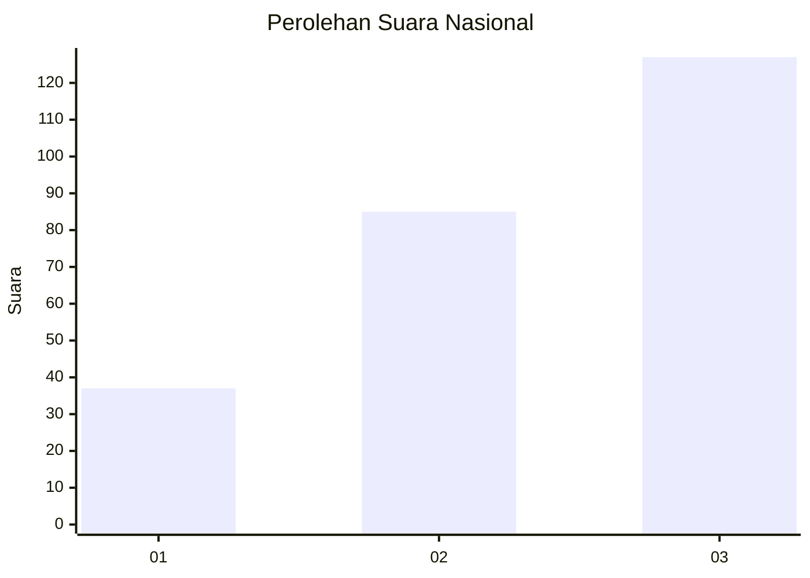
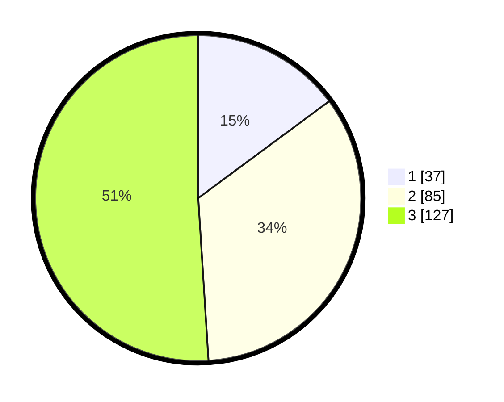

# Hasil

## Grafik

## Tabel

| No. | Nama Paslon    | Suara | Suara (raw) | Persentase |
|:--- |:-------------- | -----:| -----------:| ----------:|
| 1   | ANIES MUHAIMIN | 37    | [37][p-1]   | 14,86      |
| 2   | PRABOWO GIBRAN | 85    | [85][p-2]   | 34,14      |
| 3   | GANJAR MAHFUD  | 127   | [127][p-3]  | 51,00      |

[p-1]: https://github.com/gigit-pemilu/pemilu-2024/blob/main/pilpres/hitung-suara/sub/34-di-yogyakarta/sub/04-sleman/sub/06-mlati/sub/2002-sendangadi/sub/034-tps/sub/paslon-1.txt
[p-2]: https://github.com/gigit-pemilu/pemilu-2024/blob/main/pilpres/hitung-suara/sub/34-di-yogyakarta/sub/04-sleman/sub/06-mlati/sub/2002-sendangadi/sub/034-tps/sub/paslon-2.txt
[p-3]: https://github.com/gigit-pemilu/pemilu-2024/blob/main/pilpres/hitung-suara/sub/34-di-yogyakarta/sub/04-sleman/sub/06-mlati/sub/2002-sendangadi/sub/034-tps/sub/paslon-3.txt

## Foto C Plano

https://sirekap-obj-formc.kpu.go.id/285a/pemilu/ppwp/34/04/06/20/02/3404062002034-20240215-021806--f715838b-8da0-44d7-b365-0abfd85876e9.jpg

https://sirekap-obj-formc.kpu.go.id/285a/pemilu/ppwp/34/04/06/20/02/3404062002034-20240215-022336--7ac1d2c1-b43c-4395-abfa-47c7a30e8752.jpg

https://sirekap-obj-formc.kpu.go.id/285a/pemilu/ppwp/34/04/06/20/02/3404062002034-20240215-022034--e80f6d08-eb98-4eec-a074-b2c3b92eb5d4.jpg

## Metadata

| Key        | Value               |
| ---------- | ------------------- |
| Time Stamp | 2024-02-15 15:00:29 |

