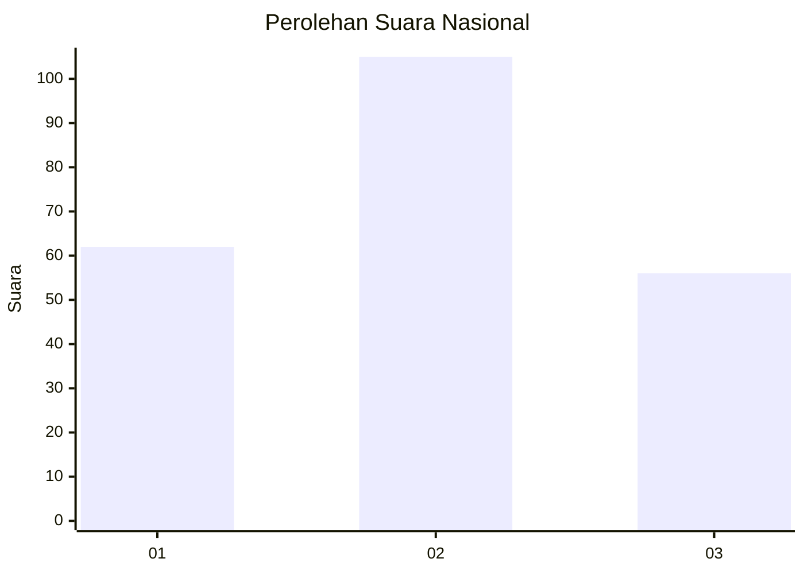
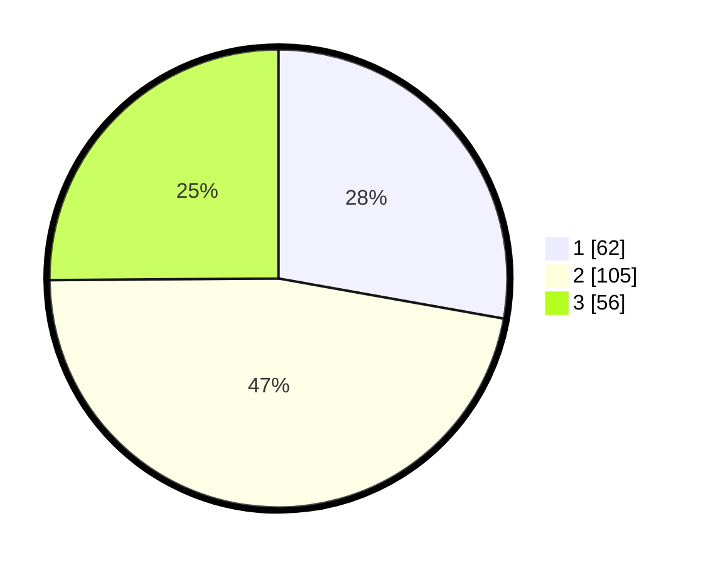

# Hasil

## Grafik

## Tabel

| No. | Nama Paslon    | Suara | Suara (raw) | Persentase |
|:--- |:-------------- | -----:| -----------:| ----------:|
| 1   | ANIES MUHAIMIN | 62    | [62][p-1]   | 27,80      |
| 2   | PRABOWO GIBRAN | 105   | [105][p-2]  | 47,09      |
| 3   | GANJAR MAHFUD  | 56    | [56][p-3]   | 25,11      |

[p-1]: https://github.com/gigit-pemilu/pemilu-2024/blob/main/pilpres/hitung-suara/sub/34-di-yogyakarta/sub/04-sleman/sub/06-mlati/sub/2002-sendangadi/sub/039-tps/sub/paslon-1.txt
[p-2]: https://github.com/gigit-pemilu/pemilu-2024/blob/main/pilpres/hitung-suara/sub/34-di-yogyakarta/sub/04-sleman/sub/06-mlati/sub/2002-sendangadi/sub/039-tps/sub/paslon-2.txt
[p-3]: https://github.com/gigit-pemilu/pemilu-2024/blob/main/pilpres/hitung-suara/sub/34-di-yogyakarta/sub/04-sleman/sub/06-mlati/sub/2002-sendangadi/sub/039-tps/sub/paslon-3.txt

## Foto C Plano

https://sirekap-obj-formc.kpu.go.id/a681/pemilu/ppwp/34/04/06/20/02/3404062002039-20240215-002020--12f3ec1e-13c4-4427-a34e-45e0573f828f.jpg

https://sirekap-obj-formc.kpu.go.id/a681/pemilu/ppwp/34/04/06/20/02/3404062002039-20240215-002335--bf2b48fc-6280-4c3d-bd1e-4d1596604766.jpg

https://sirekap-obj-formc.kpu.go.id/a681/pemilu/ppwp/34/04/06/20/02/3404062002039-20240215-002436--da2f1389-39e7-4995-997d-a8a916da1f78.jpg

## Metadata

| Key        | Value               |
| ---------- | ------------------- |
| Time Stamp | 2024-02-15 15:00:29 |

