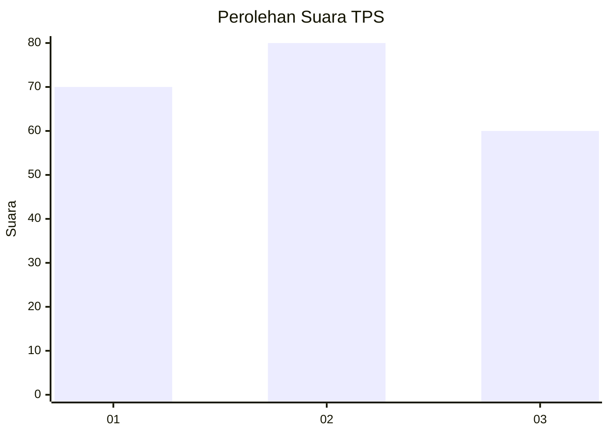
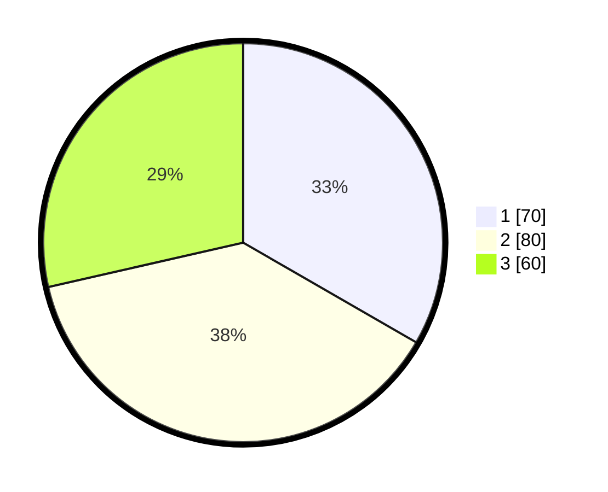

# Hasil

## Grafik

## Tabel

| No. | Nama Paslon    | Suara | Suara (raw) | Persentase |
|:--- |:-------------- | -----:| -----------:| ----------:|
| 1   | ANIES MUHAIMIN | 70    | [70][p-1]   | 33,33      |
| 2   | PRABOWO GIBRAN | 80    | [80][p-2]   | 38,10      |
| 3   | GANJAR MAHFUD  | 60    | [60][p-3]   | 28,57      |

[p-1]: https://github.com/gigit-pemilu/pemilu-2024-34-di-yogyakarta/blob/main/pilpres/hitung-suara/sub/34-di-yogyakarta/sub/04-sleman/sub/06-mlati/sub/2002-sendangadi/sub/040-tps/sub/paslon-1.txt
[p-2]: https://github.com/gigit-pemilu/pemilu-2024-34-di-yogyakarta/blob/main/pilpres/hitung-suara/sub/34-di-yogyakarta/sub/04-sleman/sub/06-mlati/sub/2002-sendangadi/sub/040-tps/sub/paslon-2.txt
[p-3]: https://github.com/gigit-pemilu/pemilu-2024-34-di-yogyakarta/blob/main/pilpres/hitung-suara/sub/34-di-yogyakarta/sub/04-sleman/sub/06-mlati/sub/2002-sendangadi/sub/040-tps/sub/paslon-3.txt

## Foto C Plano

https://sirekap-obj-formc.kpu.go.id/1725/pemilu/ppwp/34/04/06/20/02/3404062002040-20240215-010558--79d485ad-6e24-4620-a981-79cbddd44c23.jpg

https://sirekap-obj-formc.kpu.go.id/1725/pemilu/ppwp/34/04/06/20/02/3404062002040-20240215-010642--fc515dde-6396-4d6e-9732-42aa66f6f0ff.jpg

https://sirekap-obj-formc.kpu.go.id/1725/pemilu/ppwp/34/04/06/20/02/3404062002040-20240215-010725--6cf405a8-e31b-4740-9bfd-d5693a737e07.jpg

## Metadata

| Key        | Value               |
| ---------- | ------------------- |
| Time Stamp | 2024-02-15 15:00:29 |

