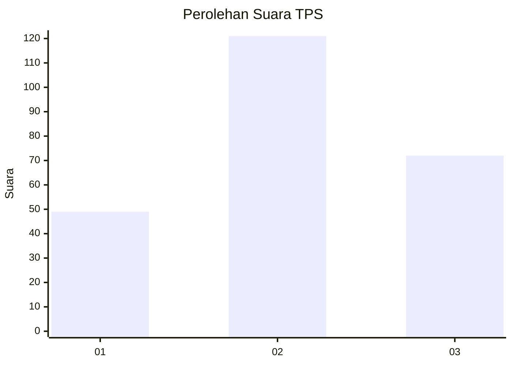
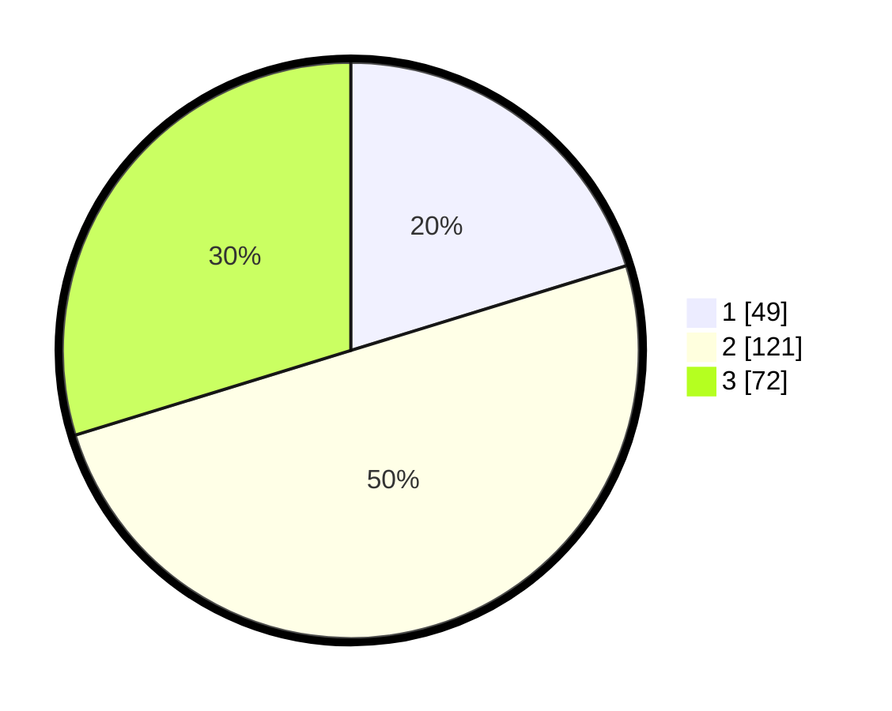

# Hasil

## Grafik

## Tabel

| No. | Nama Paslon    | Suara | Suara (raw) | Persentase |
|:--- |:-------------- | -----:| -----------:| ----------:|
| 1   | ANIES MUHAIMIN | 49    | [49][p-1]   | 20,25      |
| 2   | PRABOWO GIBRAN | 121   | [121][p-2]  | 50,00      |
| 3   | GANJAR MAHFUD  | 72    | [72][p-3]   | 29,75      |

[p-1]: https://github.com/gigit-pemilu/pemilu-2024-34-di-yogyakarta/blob/main/pilpres/hitung-suara/sub/34-di-yogyakarta/sub/04-sleman/sub/06-mlati/sub/2002-sendangadi/sub/050-tps/sub/paslon-1.txt
[p-2]: https://github.com/gigit-pemilu/pemilu-2024-34-di-yogyakarta/blob/main/pilpres/hitung-suara/sub/34-di-yogyakarta/sub/04-sleman/sub/06-mlati/sub/2002-sendangadi/sub/050-tps/sub/paslon-2.txt
[p-3]: https://github.com/gigit-pemilu/pemilu-2024-34-di-yogyakarta/blob/main/pilpres/hitung-suara/sub/34-di-yogyakarta/sub/04-sleman/sub/06-mlati/sub/2002-sendangadi/sub/050-tps/sub/paslon-3.txt

## Foto C Plano

https://sirekap-obj-formc.kpu.go.id/fe57/pemilu/ppwp/34/04/06/20/02/3404062002050-20240214-224421--d6c976f3-a0ce-4a47-8d23-c95a68105d60.jpg

https://sirekap-obj-formc.kpu.go.id/fe57/pemilu/ppwp/34/04/06/20/02/3404062002050-20240214-224604--0159cde2-9652-491f-af58-bdc10d4313ac.jpg

https://sirekap-obj-formc.kpu.go.id/fe57/pemilu/ppwp/34/04/06/20/02/3404062002050-20240214-224723--8d1bbec2-5007-4336-8528-5f4628e4b957.jpg

## Metadata

| Key        | Value               |
| ---------- | ------------------- |
| Time Stamp | 2024-02-15 18:00:26 |

