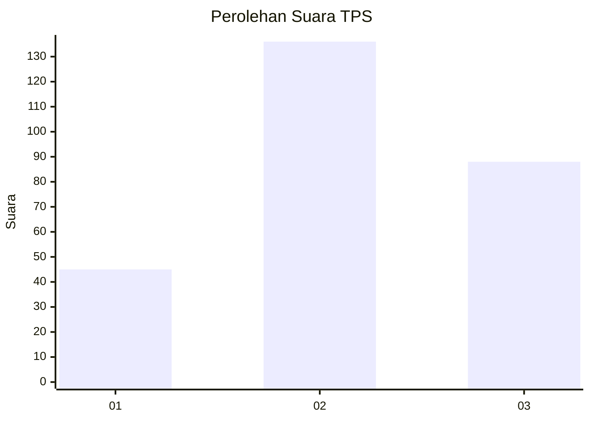
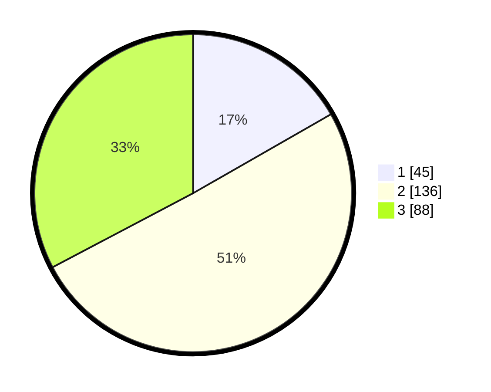

# Hasil

## Grafik

## Tabel

| No. | Nama Paslon    | Suara | Suara (raw) | Persentase |
|:--- |:-------------- | -----:| -----------:| ----------:|
| 1   | ANIES MUHAIMIN | 45    | [45][p-1]   | 16,73      |
| 2   | PRABOWO GIBRAN | 136   | [136][p-2]  | 50,56      |
| 3   | GANJAR MAHFUD  | 88    | [88][p-3]   | 32,71      |

[p-1]: https://github.com/gigit-pemilu/pemilu-2024-34-di-yogyakarta/blob/main/pilpres/hitung-suara/sub/34-di-yogyakarta/sub/04-sleman/sub/06-mlati/sub/2002-sendangadi/sub/053-tps/sub/paslon-1.txt
[p-2]: https://github.com/gigit-pemilu/pemilu-2024-34-di-yogyakarta/blob/main/pilpres/hitung-suara/sub/34-di-yogyakarta/sub/04-sleman/sub/06-mlati/sub/2002-sendangadi/sub/053-tps/sub/paslon-2.txt
[p-3]: https://github.com/gigit-pemilu/pemilu-2024-34-di-yogyakarta/blob/main/pilpres/hitung-suara/sub/34-di-yogyakarta/sub/04-sleman/sub/06-mlati/sub/2002-sendangadi/sub/053-tps/sub/paslon-3.txt

## Foto C Plano

https://sirekap-obj-formc.kpu.go.id/861d/pemilu/ppwp/34/04/06/20/02/3404062002053-20240215-042224--b56bc452-6cd2-4c98-9bd6-a7cb5682676c.jpg

https://sirekap-obj-formc.kpu.go.id/861d/pemilu/ppwp/34/04/06/20/02/3404062002053-20240215-042308--0b6d5788-fef9-4240-98a9-e0700b826a3a.jpg

https://sirekap-obj-formc.kpu.go.id/861d/pemilu/ppwp/34/04/06/20/02/3404062002053-20240215-044849--5bfdff50-b3a2-41c3-8925-9c58d7206026.jpg

## Metadata

| Key        | Value               |
| ---------- | ------------------- |
| Time Stamp | 2024-02-15 21:01:18 |

