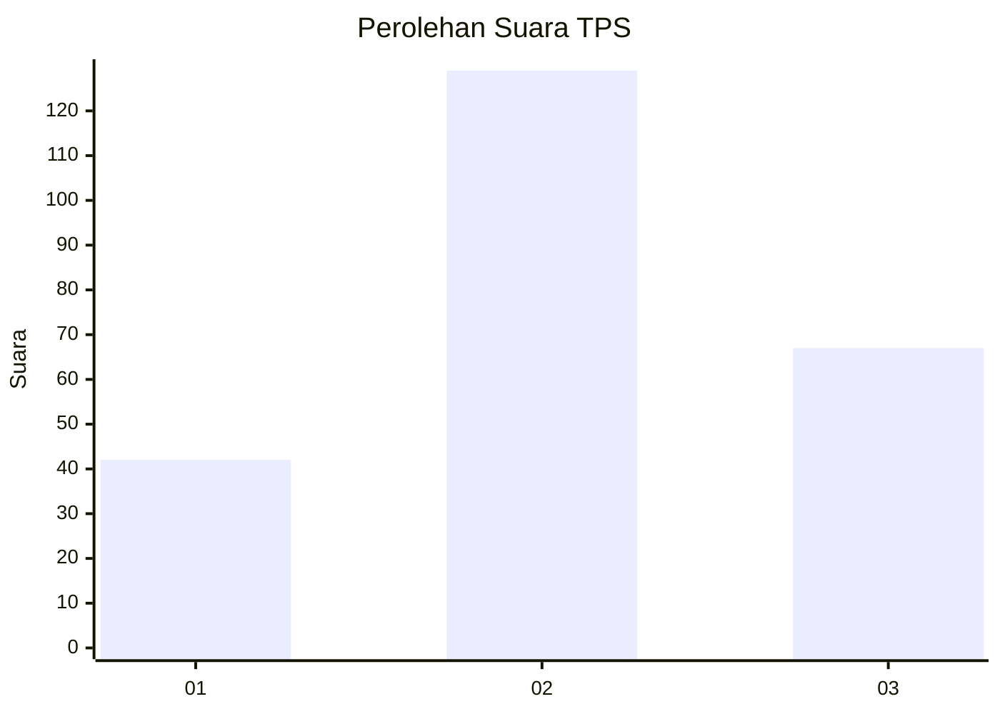
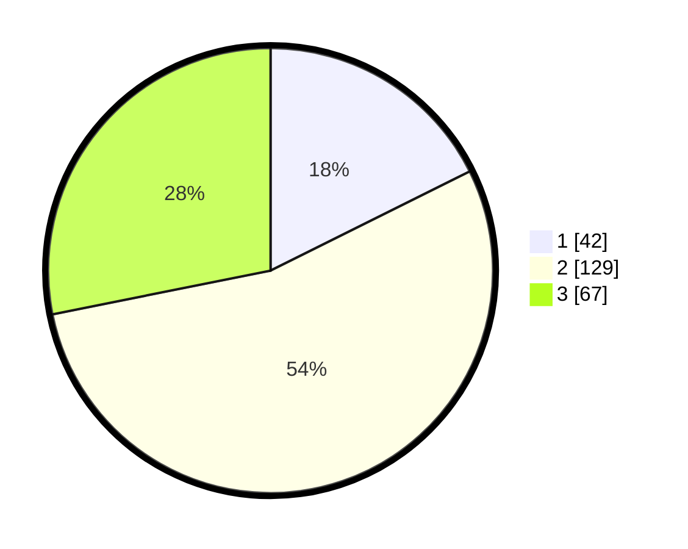

# Hasil

## Grafik

## Tabel

| No. | Nama Paslon    | Suara | Suara (raw) | Persentase |
|:--- |:-------------- | -----:| -----------:| ----------:|
| 1   | ANIES MUHAIMIN | 42    | [42][p-1]   | 17,65      |
| 2   | PRABOWO GIBRAN | 129   | [129][p-2]  | 54,20      |
| 3   | GANJAR MAHFUD  | 67    | [67][p-3]   | 28,15      |

[p-1]: https://github.com/gigit-pemilu/pemilu-2024-34-di-yogyakarta/blob/main/pilpres/hitung-suara/sub/34-di-yogyakarta/sub/04-sleman/sub/06-mlati/sub/2003-tlogoadi/sub/003-tps/sub/paslon-1.txt
[p-2]: https://github.com/gigit-pemilu/pemilu-2024-34-di-yogyakarta/blob/main/pilpres/hitung-suara/sub/34-di-yogyakarta/sub/04-sleman/sub/06-mlati/sub/2003-tlogoadi/sub/003-tps/sub/paslon-2.txt
[p-3]: https://github.com/gigit-pemilu/pemilu-2024-34-di-yogyakarta/blob/main/pilpres/hitung-suara/sub/34-di-yogyakarta/sub/04-sleman/sub/06-mlati/sub/2003-tlogoadi/sub/003-tps/sub/paslon-3.txt

## Foto C Plano

https://sirekap-obj-formc.kpu.go.id/73b6/pemilu/ppwp/34/04/06/20/03/3404062003003-20240216-172705--cbd17645-e462-4206-bb51-201633711e4f.jpg

https://sirekap-obj-formc.kpu.go.id/73b6/pemilu/ppwp/34/04/06/20/03/3404062003003-20240216-172725--97106443-e61d-4326-9a30-d1c60ac29c84.jpg

https://sirekap-obj-formc.kpu.go.id/73b6/pemilu/ppwp/34/04/06/20/03/3404062003003-20240216-172746--5016a1d7-3f85-4d2a-92c6-e95cd2bc2b6c.jpg

## Metadata

| Key        | Value               |
| ---------- | ------------------- |
| Time Stamp | 2024-02-19 06:16:00 |

