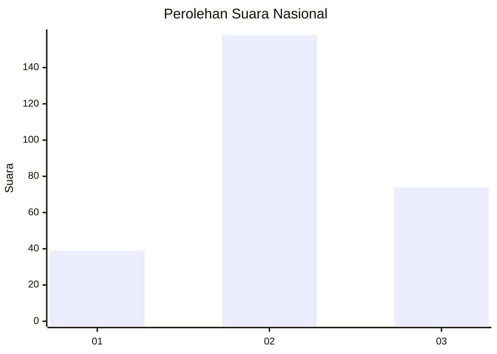
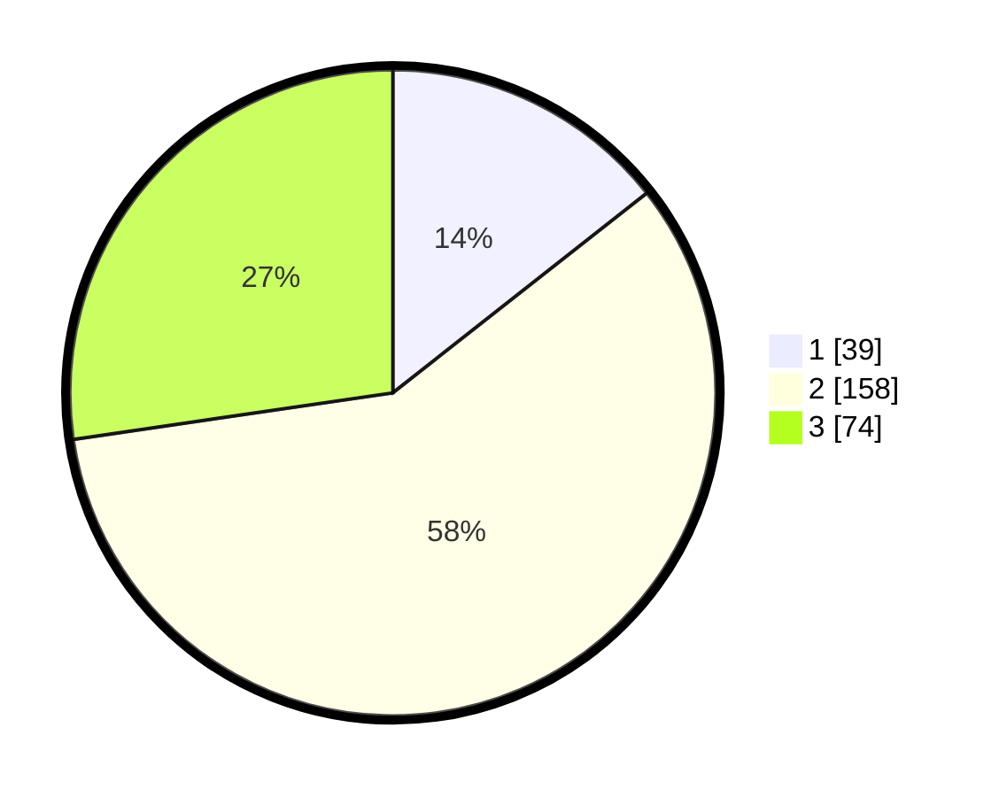

# Hasil

## Grafik

## Tabel

| No. | Nama Paslon    | Suara | Suara (raw) | Persentase |
|:--- |:-------------- | -----:| -----------:| ----------:|
| 1   | ANIES MUHAIMIN | 39    | [39][p-1]   | 14,39      |
| 2   | PRABOWO GIBRAN | 158   | [158][p-2]  | 58,30      |
| 3   | GANJAR MAHFUD  | 74    | [74][p-3]   | 27,31      |

[p-1]: https://github.com/gigit-pemilu/pemilu-2024/blob/main/pilpres/hitung-suara/sub/34-di-yogyakarta/sub/04-sleman/sub/06-mlati/sub/2003-tlogoadi/sub/004-tps/sub/paslon-1.txt
[p-2]: https://github.com/gigit-pemilu/pemilu-2024/blob/main/pilpres/hitung-suara/sub/34-di-yogyakarta/sub/04-sleman/sub/06-mlati/sub/2003-tlogoadi/sub/004-tps/sub/paslon-2.txt
[p-3]: https://github.com/gigit-pemilu/pemilu-2024/blob/main/pilpres/hitung-suara/sub/34-di-yogyakarta/sub/04-sleman/sub/06-mlati/sub/2003-tlogoadi/sub/004-tps/sub/paslon-3.txt

## Foto C Plano

https://sirekap-obj-formc.kpu.go.id/33a7/pemilu/ppwp/34/04/06/20/03/3404062003004-20240216-202126--cd70cbd1-2774-4405-826d-29e9bdd9128e.jpg

https://sirekap-obj-formc.kpu.go.id/33a7/pemilu/ppwp/34/04/06/20/03/3404062003004-20240216-202205--a483267d-143b-48a4-a7db-5a9eaa678950.jpg

https://sirekap-obj-formc.kpu.go.id/33a7/pemilu/ppwp/34/04/06/20/03/3404062003004-20240216-202234--c54a176e-b647-4557-8589-2c30bbf4a1fd.jpg

## Metadata

| Key        | Value               |
| ---------- | ------------------- |
| Time Stamp | 2024-02-17 10:00:02 |

## DATA PEMILIH TETAP

Jumlah pemilih dalam DPT: **287**.
 * L: **745**.
 * P: **736**.

## DATA PENGGUNA HAK PILIH

Jumlah pengguna hak pilih dalam DPT: **257**.
 * L: **726**.
 * P: **725**.

Jumlah pengguna hak pilih dalam DPTb: **19**.
 * L: **6**.
 * P: **13**.

Jumlah pengguna hak pilih dalam DPK: **8**.
 * L: **5**.
 * P: **3**.

Jumlah pengguna hak pilih: **278**.
 * L: **137**.
 * P: **147**.

## JUMLAH SUARA SAH DAN TIDAK SAH

JUMLAH SELURUH SUARA SAH: **271**.

JUMLAH SUARA TIDAK SAH: **7**.

JUMLAH SELURUH SUARA SAH DAN SUARA TIDAK SAH: **278**.

