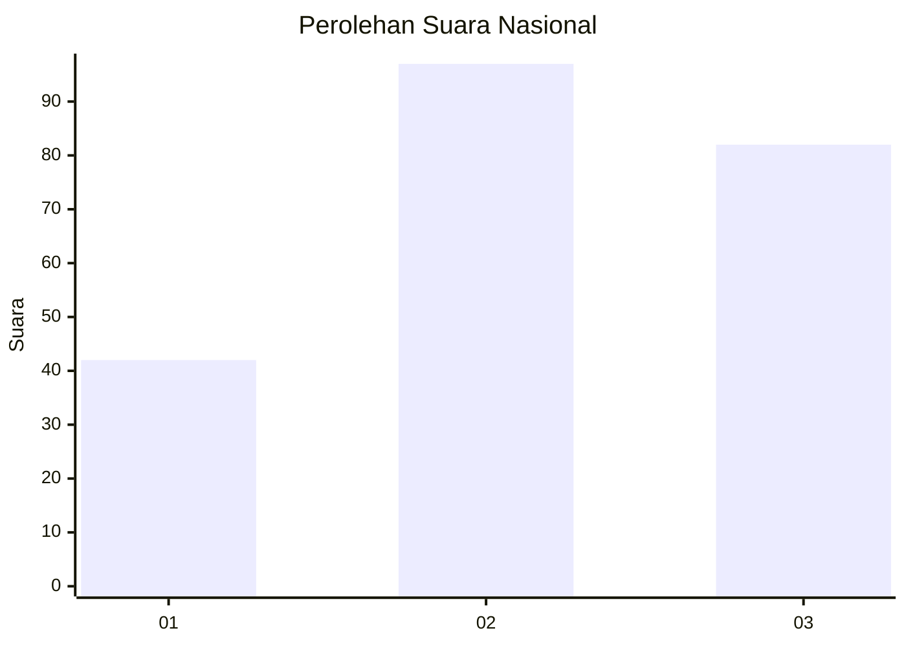
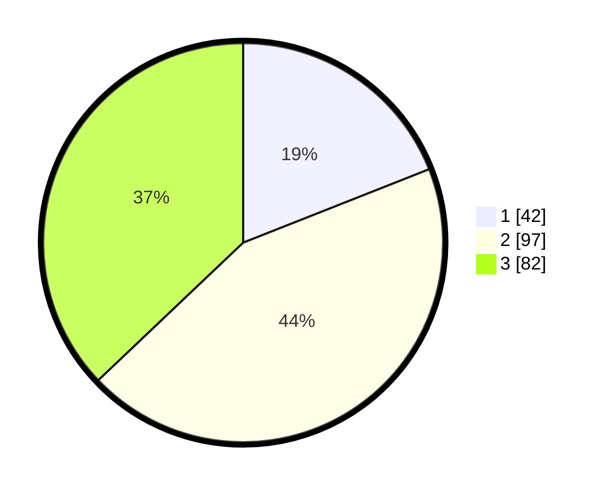

# Hasil

## Grafik

## Tabel

| No. | Nama Paslon    | Suara | Suara (raw) | Persentase |
|:--- |:-------------- | -----:| -----------:| ----------:|
| 1   | ANIES MUHAIMIN | 42    | [42][p-1]   | 19,00      |
| 2   | PRABOWO GIBRAN | 97    | [97][p-2]   | 43,89      |
| 3   | GANJAR MAHFUD  | 82    | [82][p-3]   | 37,10      |

[p-1]: https://github.com/gigit-pemilu/pemilu-2024/blob/main/pilpres/hitung-suara/sub/34-di-yogyakarta/sub/04-sleman/sub/06-mlati/sub/2003-tlogoadi/sub/006-tps/sub/paslon-1.txt
[p-2]: https://github.com/gigit-pemilu/pemilu-2024/blob/main/pilpres/hitung-suara/sub/34-di-yogyakarta/sub/04-sleman/sub/06-mlati/sub/2003-tlogoadi/sub/006-tps/sub/paslon-2.txt
[p-3]: https://github.com/gigit-pemilu/pemilu-2024/blob/main/pilpres/hitung-suara/sub/34-di-yogyakarta/sub/04-sleman/sub/06-mlati/sub/2003-tlogoadi/sub/006-tps/sub/paslon-3.txt

## Foto C Plano

https://sirekap-obj-formc.kpu.go.id/5765/pemilu/ppwp/34/04/06/20/03/3404062003006-20240214-192556--aa1d4e2b-869e-4b43-8729-d94ba8307098.jpg

https://sirekap-obj-formc.kpu.go.id/5765/pemilu/ppwp/34/04/06/20/03/3404062003006-20240214-192601--bce175f3-1685-4b55-a442-31997cf865c2.jpg

https://sirekap-obj-formc.kpu.go.id/5765/pemilu/ppwp/34/04/06/20/03/3404062003006-20240214-192618--6424eb09-68ad-4094-834f-8c73d4301073.jpg

## Metadata

| Key        | Value               |
| ---------- | ------------------- |
| Time Stamp | 2024-02-15 15:00:29 |

