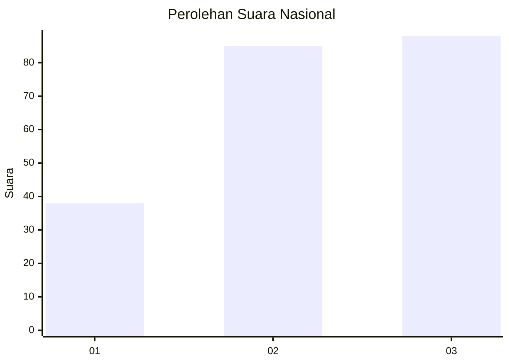
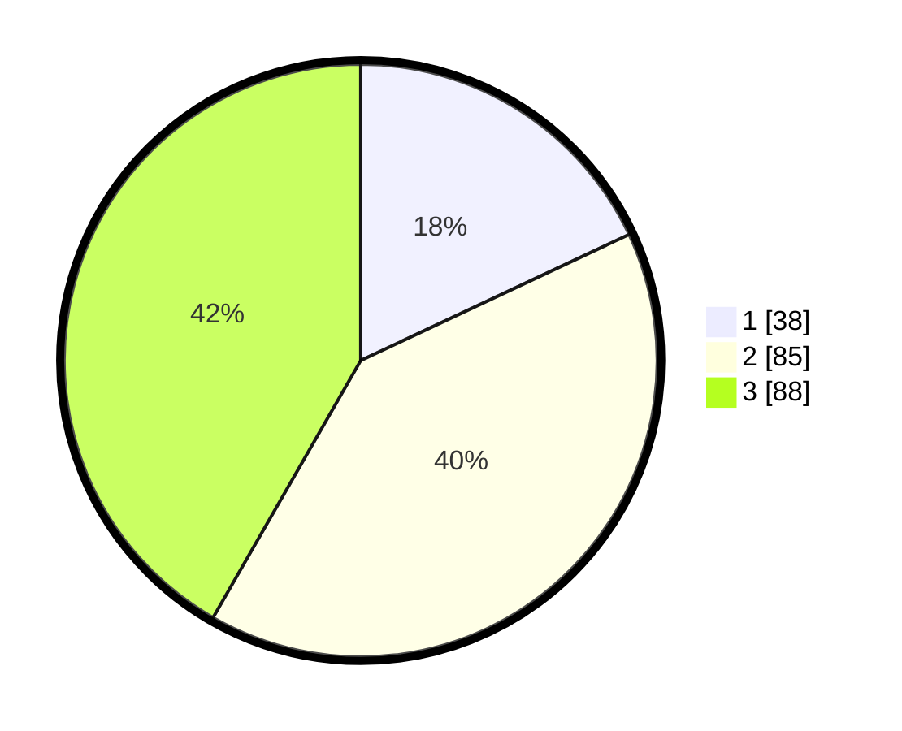

# Hasil

## Grafik

## Tabel

| No. | Nama Paslon    | Suara | Suara (raw) | Persentase |
|:--- |:-------------- | -----:| -----------:| ----------:|
| 1   | ANIES MUHAIMIN | 38    | [38][p-1]   | 18,01      |
| 2   | PRABOWO GIBRAN | 85    | [85][p-2]   | 40,28      |
| 3   | GANJAR MAHFUD  | 88    | [88][p-3]   | 41,71      |

[p-1]: https://github.com/gigit-pemilu/pemilu-2024/blob/main/pilpres/hitung-suara/sub/34-di-yogyakarta/sub/04-sleman/sub/06-mlati/sub/2003-tlogoadi/sub/025-tps/sub/paslon-1.txt
[p-2]: https://github.com/gigit-pemilu/pemilu-2024/blob/main/pilpres/hitung-suara/sub/34-di-yogyakarta/sub/04-sleman/sub/06-mlati/sub/2003-tlogoadi/sub/025-tps/sub/paslon-2.txt
[p-3]: https://github.com/gigit-pemilu/pemilu-2024/blob/main/pilpres/hitung-suara/sub/34-di-yogyakarta/sub/04-sleman/sub/06-mlati/sub/2003-tlogoadi/sub/025-tps/sub/paslon-3.txt

## Foto C Plano

https://sirekap-obj-formc.kpu.go.id/6810/pemilu/ppwp/34/04/06/20/03/3404062003025-20240214-232344--eba6e8df-05e9-4f11-a403-bfc2dffe54ab.jpg

https://sirekap-obj-formc.kpu.go.id/6810/pemilu/ppwp/34/04/06/20/03/3404062003025-20240214-232424--915a737b-3a8f-4a74-9b78-75102e0c5194.jpg

https://sirekap-obj-formc.kpu.go.id/6810/pemilu/ppwp/34/04/06/20/03/3404062003025-20240214-232521--87155ab2-7045-4f73-8959-ce2f66d2dfae.jpg

## Metadata

| Key        | Value               |
| ---------- | ------------------- |
| Time Stamp | 2024-02-15 15:00:29 |

