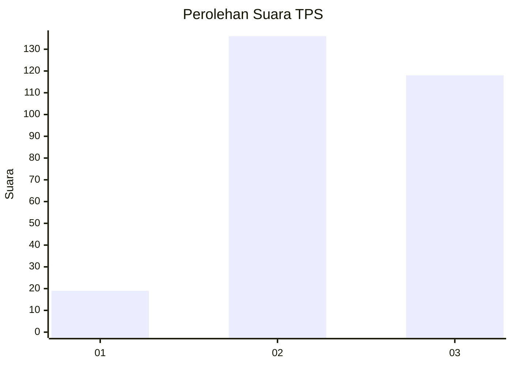
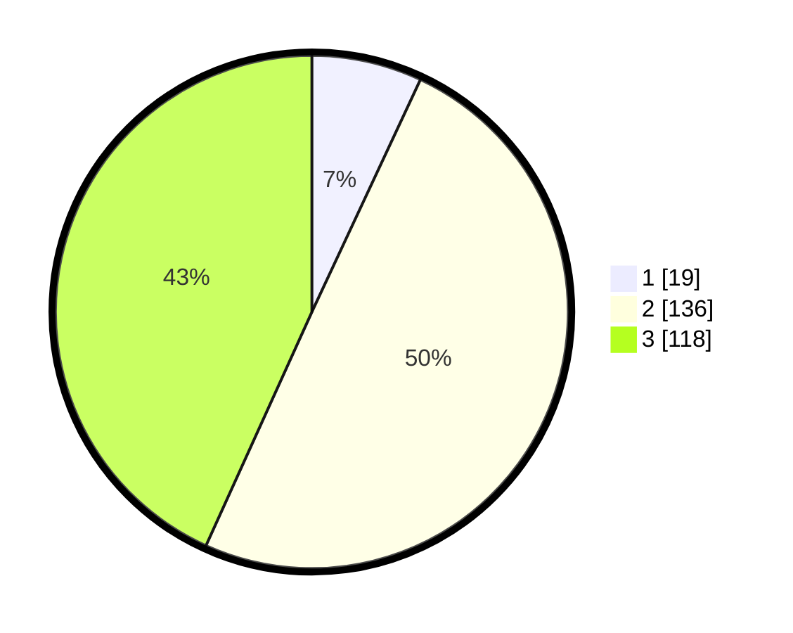

# Hasil

## Grafik

## Tabel

| No. | Nama Paslon    | Suara | Suara (raw) | Persentase |
|:--- |:-------------- | -----:| -----------:| ----------:|
| 1   | ANIES MUHAIMIN | 19    | [19][p-1]   | 6,96       |
| 2   | PRABOWO GIBRAN | 136   | [136][p-2]  | 49,82      |
| 3   | GANJAR MAHFUD  | 118   | [118][p-3]  | 43,22      |

[p-1]: https://github.com/gigit-pemilu/pemilu-2024-34-di-yogyakarta/blob/main/pilpres/hitung-suara/sub/34-di-yogyakarta/sub/04-sleman/sub/06-mlati/sub/2003-tlogoadi/sub/027-tps/sub/paslon-1.txt
[p-2]: https://github.com/gigit-pemilu/pemilu-2024-34-di-yogyakarta/blob/main/pilpres/hitung-suara/sub/34-di-yogyakarta/sub/04-sleman/sub/06-mlati/sub/2003-tlogoadi/sub/027-tps/sub/paslon-2.txt
[p-3]: https://github.com/gigit-pemilu/pemilu-2024-34-di-yogyakarta/blob/main/pilpres/hitung-suara/sub/34-di-yogyakarta/sub/04-sleman/sub/06-mlati/sub/2003-tlogoadi/sub/027-tps/sub/paslon-3.txt

## Foto C Plano

https://sirekap-obj-formc.kpu.go.id/8163/pemilu/ppwp/34/04/06/20/03/3404062003027-20240215-022131--b2d065ec-5012-40e1-be15-7c5cf041ef82.jpg

https://sirekap-obj-formc.kpu.go.id/8163/pemilu/ppwp/34/04/06/20/03/3404062003027-20240215-022201--6095424e-0760-4051-964a-40860bfced69.jpg

https://sirekap-obj-formc.kpu.go.id/8163/pemilu/ppwp/34/04/06/20/03/3404062003027-20240215-022231--d611c66e-aaaa-41a7-8add-614d78c2b431.jpg

## Metadata

| Key        | Value               |
| ---------- | ------------------- |
| Time Stamp | 2024-02-15 15:00:29 |

