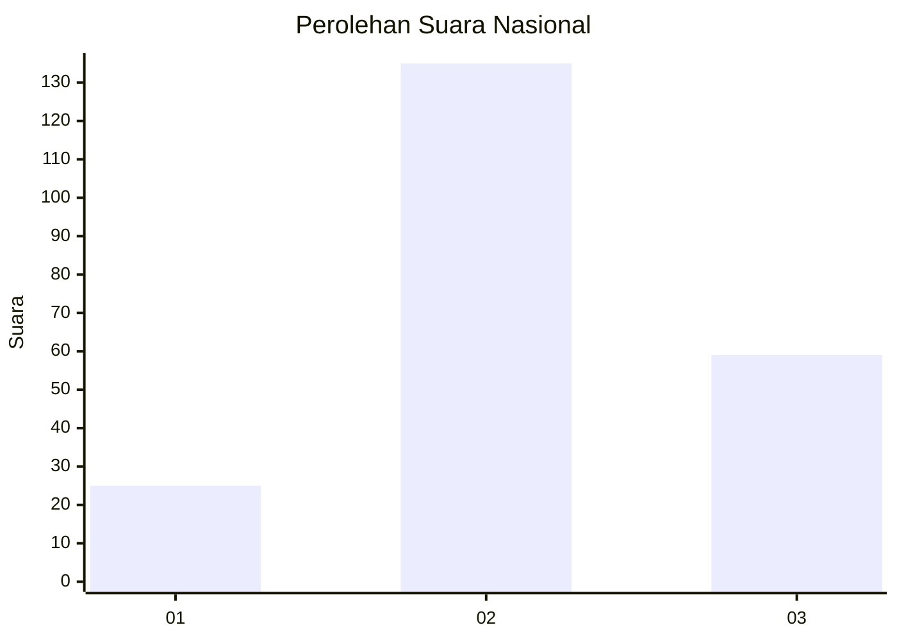
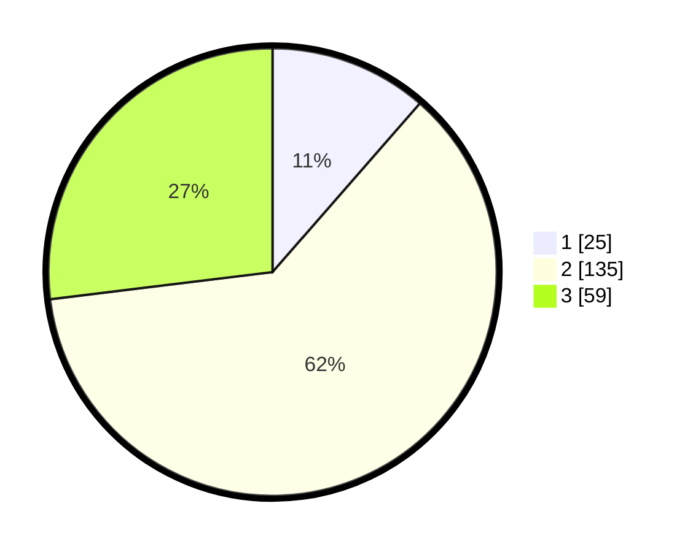

# Hasil

## Grafik

## Tabel

| No. | Nama Paslon    | Suara | Suara (raw) | Persentase |
|:--- |:-------------- | -----:| -----------:| ----------:|
| 1   | ANIES MUHAIMIN | 25    | [25][p-1]   | 11,42      |
| 2   | PRABOWO GIBRAN | 135   | [135][p-2]  | 61,64      |
| 3   | GANJAR MAHFUD  | 59    | [59][p-3]   | 26,94      |

[p-1]: https://github.com/gigit-pemilu/pemilu-2024/blob/main/pilpres/hitung-suara/sub/34-di-yogyakarta/sub/04-sleman/sub/06-mlati/sub/2003-tlogoadi/sub/032-tps/sub/paslon-1.txt
[p-2]: https://github.com/gigit-pemilu/pemilu-2024/blob/main/pilpres/hitung-suara/sub/34-di-yogyakarta/sub/04-sleman/sub/06-mlati/sub/2003-tlogoadi/sub/032-tps/sub/paslon-2.txt
[p-3]: https://github.com/gigit-pemilu/pemilu-2024/blob/main/pilpres/hitung-suara/sub/34-di-yogyakarta/sub/04-sleman/sub/06-mlati/sub/2003-tlogoadi/sub/032-tps/sub/paslon-3.txt

## Foto C Plano

https://sirekap-obj-formc.kpu.go.id/a74b/pemilu/ppwp/34/04/06/20/03/3404062003032-20240214-202146--69780b98-8c15-41e8-9e0b-2104f333fef6.jpg

https://sirekap-obj-formc.kpu.go.id/a74b/pemilu/ppwp/34/04/06/20/03/3404062003032-20240214-202152--0553cd09-01d1-4a58-9cb7-cb0394e281ab.jpg

https://sirekap-obj-formc.kpu.go.id/a74b/pemilu/ppwp/34/04/06/20/03/3404062003032-20240214-202200--9d5e51cc-973c-48a0-8332-ed62acc63c3f.jpg

## Metadata

| Key        | Value               |
| ---------- | ------------------- |
| Time Stamp | 2024-02-15 15:00:29 |

