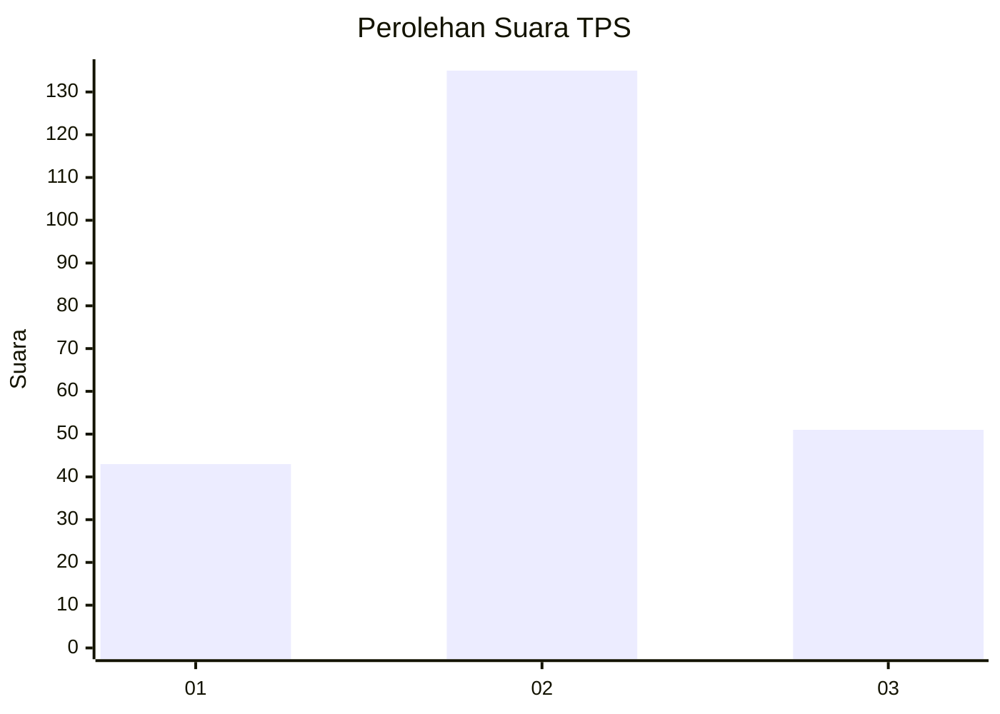
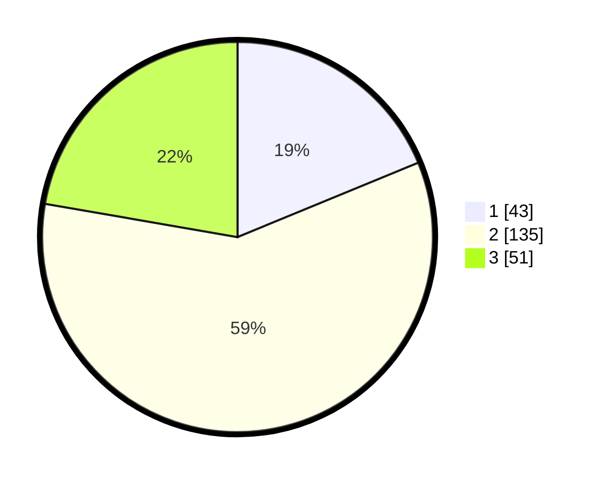

# Hasil

## Grafik

## Tabel

| No. | Nama Paslon    | Suara | Suara (raw) | Persentase |
|:--- |:-------------- | -----:| -----------:| ----------:|
| 1   | ANIES MUHAIMIN | 43    | [43][p-1]   | 18,78      |
| 2   | PRABOWO GIBRAN | 135   | [135][p-2]  | 58,95      |
| 3   | GANJAR MAHFUD  | 51    | [51][p-3]   | 22,27      |

[p-1]: https://github.com/gigit-pemilu/pemilu-2024-34-di-yogyakarta/blob/main/pilpres/hitung-suara/sub/34-di-yogyakarta/sub/04-sleman/sub/06-mlati/sub/2003-tlogoadi/sub/033-tps/sub/paslon-1.txt
[p-2]: https://github.com/gigit-pemilu/pemilu-2024-34-di-yogyakarta/blob/main/pilpres/hitung-suara/sub/34-di-yogyakarta/sub/04-sleman/sub/06-mlati/sub/2003-tlogoadi/sub/033-tps/sub/paslon-2.txt
[p-3]: https://github.com/gigit-pemilu/pemilu-2024-34-di-yogyakarta/blob/main/pilpres/hitung-suara/sub/34-di-yogyakarta/sub/04-sleman/sub/06-mlati/sub/2003-tlogoadi/sub/033-tps/sub/paslon-3.txt

## Foto C Plano

https://sirekap-obj-formc.kpu.go.id/a52d/pemilu/ppwp/34/04/06/20/03/3404062003033-20240214-185358--5cebc013-6ad2-4b63-91c6-abfc1f35ce27.jpg

https://sirekap-obj-formc.kpu.go.id/a52d/pemilu/ppwp/34/04/06/20/03/3404062003033-20240214-185654--07f6ae8c-4f5b-4e43-a0a9-1a44c6a7510a.jpg

https://sirekap-obj-formc.kpu.go.id/a52d/pemilu/ppwp/34/04/06/20/03/3404062003033-20240214-185443--373c45f1-a1c9-4f93-85f5-c37346d91c4d.jpg

## Metadata

| Key        | Value               |
| ---------- | ------------------- |
| Time Stamp | 2024-02-15 15:00:29 |

