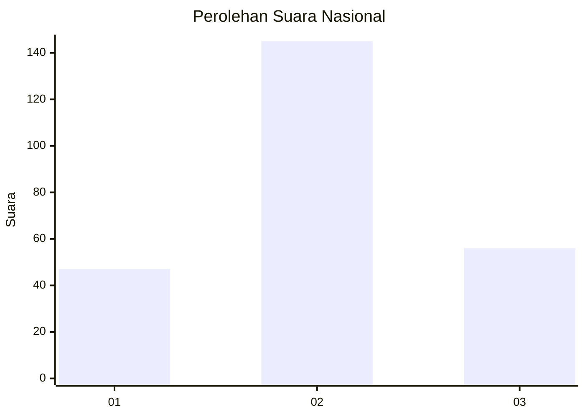
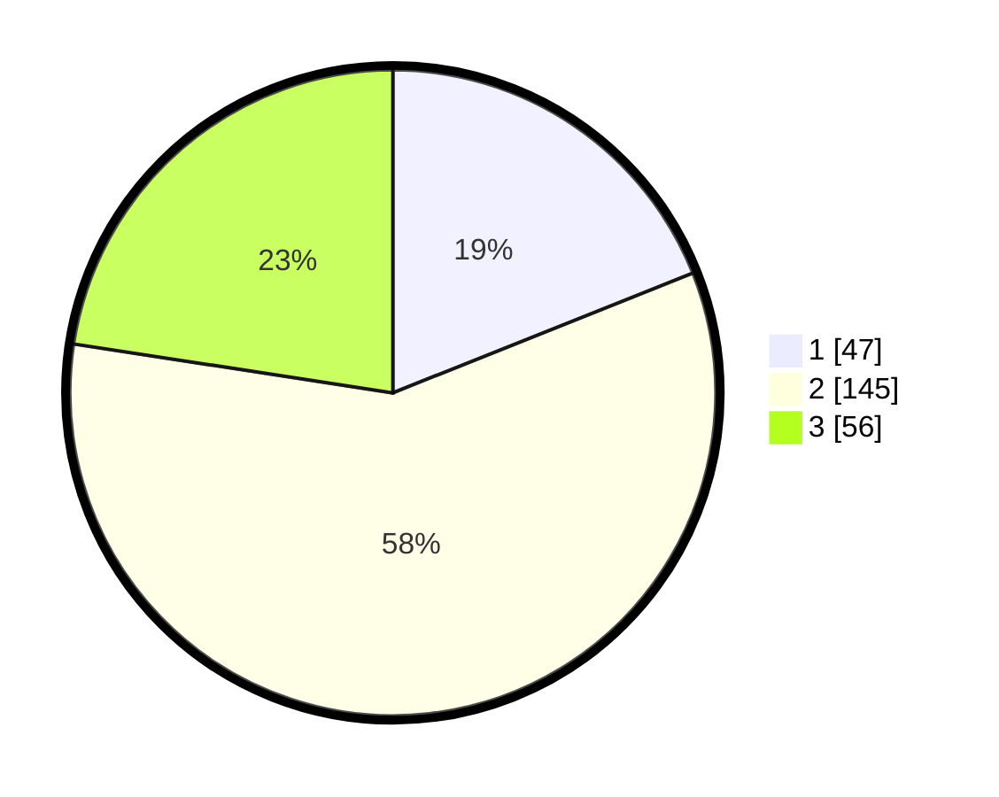

# Hasil

## Grafik

## Tabel

| No. | Nama Paslon    | Suara | Suara (raw) | Persentase |
|:--- |:-------------- | -----:| -----------:| ----------:|
| 1   | ANIES MUHAIMIN | 47    | [47][p-1]   | 18,95      |
| 2   | PRABOWO GIBRAN | 145   | [145][p-2]  | 58,47      |
| 3   | GANJAR MAHFUD  | 56    | [56][p-3]   | 22,58      |

[p-1]: https://github.com/gigit-pemilu/pemilu-2024/blob/main/pilpres/hitung-suara/sub/34-di-yogyakarta/sub/04-sleman/sub/06-mlati/sub/2003-tlogoadi/sub/036-tps/sub/paslon-1.txt
[p-2]: https://github.com/gigit-pemilu/pemilu-2024/blob/main/pilpres/hitung-suara/sub/34-di-yogyakarta/sub/04-sleman/sub/06-mlati/sub/2003-tlogoadi/sub/036-tps/sub/paslon-2.txt
[p-3]: https://github.com/gigit-pemilu/pemilu-2024/blob/main/pilpres/hitung-suara/sub/34-di-yogyakarta/sub/04-sleman/sub/06-mlati/sub/2003-tlogoadi/sub/036-tps/sub/paslon-3.txt

## Foto C Plano

https://sirekap-obj-formc.kpu.go.id/2af0/pemilu/ppwp/34/04/06/20/03/3404062003036-20240214-155848--aa1115fe-a29b-4368-b703-a0caaefa9e5b.jpg

https://sirekap-obj-formc.kpu.go.id/2af0/pemilu/ppwp/34/04/06/20/03/3404062003036-20240214-160124--a8b29e44-9159-4773-8dd2-8b01f49a956c.jpg

https://sirekap-obj-formc.kpu.go.id/2af0/pemilu/ppwp/34/04/06/20/03/3404062003036-20240214-155534--4217811a-f188-422d-95bd-f804f37d4df0.jpg

## Metadata

| Key        | Value               |
| ---------- | ------------------- |
| Time Stamp | 2024-02-15 15:00:29 |

