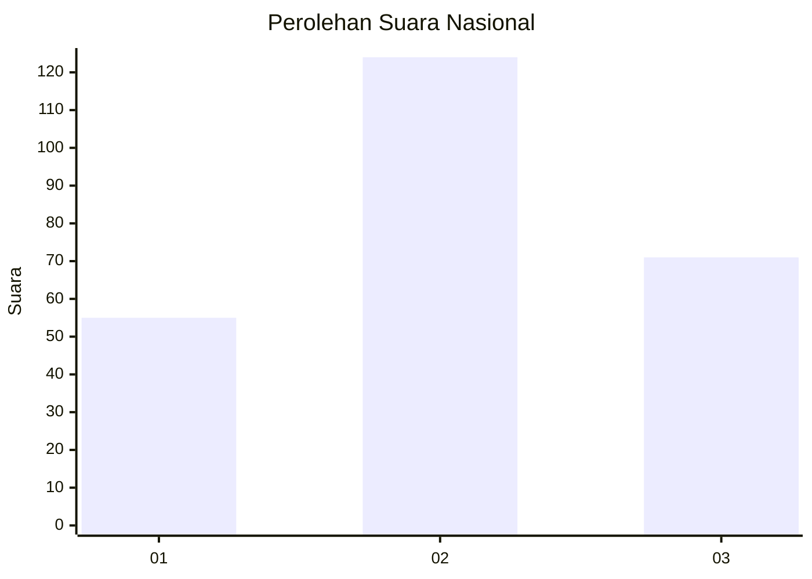
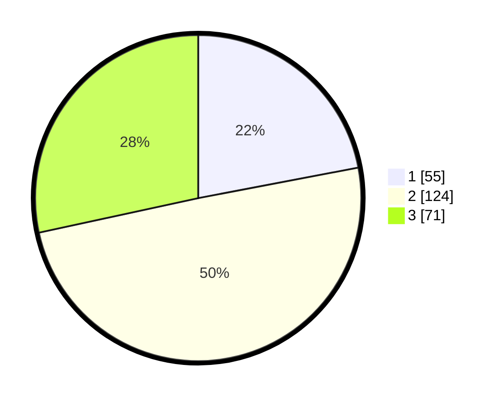

# Hasil

## Grafik

## Tabel

| No. | Nama Paslon    | Suara | Suara (raw) | Persentase |
|:--- |:-------------- | -----:| -----------:| ----------:|
| 1   | ANIES MUHAIMIN | 55    | [55][p-1]   | 22,00      |
| 2   | PRABOWO GIBRAN | 124   | [124][p-2]  | 49,60      |
| 3   | GANJAR MAHFUD  | 71    | [71][p-3]   | 28,40      |

[p-1]: https://github.com/gigit-pemilu/pemilu-2024/blob/main/pilpres/hitung-suara/sub/34-di-yogyakarta/sub/04-sleman/sub/06-mlati/sub/2004-tirtoadi/sub/005-tps/sub/paslon-1.txt
[p-2]: https://github.com/gigit-pemilu/pemilu-2024/blob/main/pilpres/hitung-suara/sub/34-di-yogyakarta/sub/04-sleman/sub/06-mlati/sub/2004-tirtoadi/sub/005-tps/sub/paslon-2.txt
[p-3]: https://github.com/gigit-pemilu/pemilu-2024/blob/main/pilpres/hitung-suara/sub/34-di-yogyakarta/sub/04-sleman/sub/06-mlati/sub/2004-tirtoadi/sub/005-tps/sub/paslon-3.txt

## Foto C Plano

https://sirekap-obj-formc.kpu.go.id/170f/pemilu/ppwp/34/04/06/20/04/3404062004005-20240214-221124--9d1d267a-c03b-42ee-aba2-a4bab96fce0d.jpg

https://sirekap-obj-formc.kpu.go.id/170f/pemilu/ppwp/34/04/06/20/04/3404062004005-20240214-231317--ecaf63b6-57de-4610-8564-feff05a67fd8.jpg

https://sirekap-obj-formc.kpu.go.id/170f/pemilu/ppwp/34/04/06/20/04/3404062004005-20240214-231425--a85a04f2-8638-4fb4-8c01-d0316a430851.jpg

## Metadata

| Key        | Value               |
| ---------- | ------------------- |
| Time Stamp | 2024-02-15 15:00:29 |

