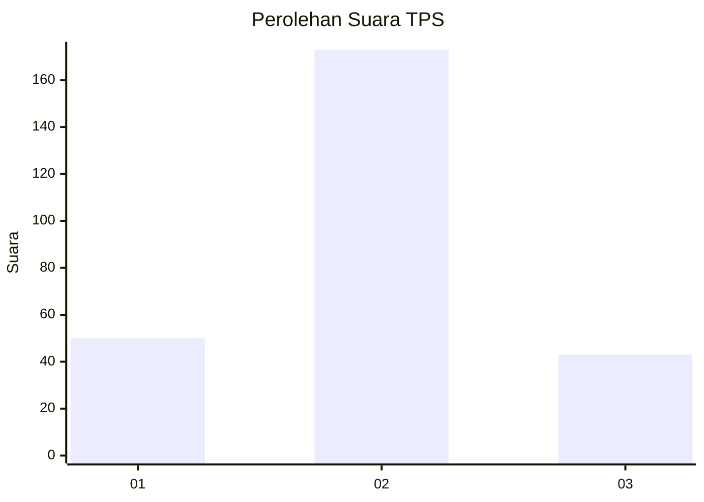
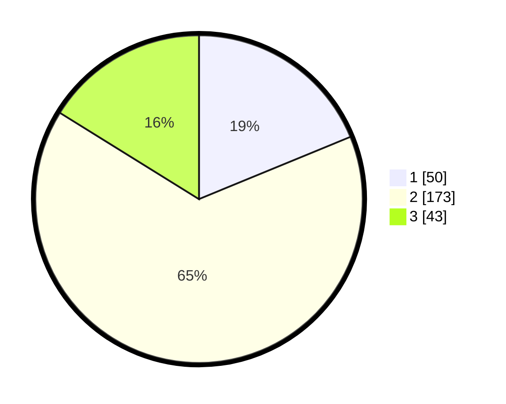

# Hasil

## Grafik

## Tabel

| No. | Nama Paslon    | Suara | Suara (raw) | Persentase |
|:--- |:-------------- | -----:| -----------:| ----------:|
| 1   | ANIES MUHAIMIN | 50    | [50][p-1]   | 18,80      |
| 2   | PRABOWO GIBRAN | 173   | [173][p-2]  | 65,04      |
| 3   | GANJAR MAHFUD  | 43    | [43][p-3]   | 16,17      |

[p-1]: https://github.com/gigit-pemilu/pemilu-2024-34-di-yogyakarta/blob/main/pilpres/hitung-suara/sub/34-di-yogyakarta/sub/04-sleman/sub/06-mlati/sub/2004-tirtoadi/sub/017-tps/sub/paslon-1.txt
[p-2]: https://github.com/gigit-pemilu/pemilu-2024-34-di-yogyakarta/blob/main/pilpres/hitung-suara/sub/34-di-yogyakarta/sub/04-sleman/sub/06-mlati/sub/2004-tirtoadi/sub/017-tps/sub/paslon-2.txt
[p-3]: https://github.com/gigit-pemilu/pemilu-2024-34-di-yogyakarta/blob/main/pilpres/hitung-suara/sub/34-di-yogyakarta/sub/04-sleman/sub/06-mlati/sub/2004-tirtoadi/sub/017-tps/sub/paslon-3.txt

## Foto C Plano

https://sirekap-obj-formc.kpu.go.id/eeea/pemilu/ppwp/34/04/06/20/04/3404062004017-20240216-035539--91a1e88f-16cd-4e51-beeb-146dbea27c95.jpg

https://sirekap-obj-formc.kpu.go.id/eeea/pemilu/ppwp/34/04/06/20/04/3404062004017-20240216-035541--3715ee94-b77e-469c-a94c-770c7e54bc37.jpg

https://sirekap-obj-formc.kpu.go.id/eeea/pemilu/ppwp/34/04/06/20/04/3404062004017-20240216-035540--baef0b06-d530-4dcc-868c-daa229bf83b3.jpg

## Metadata

| Key        | Value               |
| ---------- | ------------------- |
| Time Stamp | 2024-02-16 13:30:32 |

## DATA PEMILIH TETAP

Jumlah pemilih dalam DPT: **299**.
 * L: **145**.
 * P: **154**.

## DATA PENGGUNA HAK PILIH

Jumlah pengguna hak pilih dalam DPT: **262**.
 * L: **125**.
 * P: **137**.

Jumlah pengguna hak pilih dalam DPTb: **13**.
 * L: **11**.
 * P: **2**.

Jumlah pengguna hak pilih dalam DPK: **4**.
 * L: **1**.
 * P: **3**.

Jumlah pengguna hak pilih: **279**.
 * L: **137**.
 * P: **142**.

## JUMLAH SUARA SAH DAN TIDAK SAH

JUMLAH SELURUH SUARA SAH: **266**.

JUMLAH SUARA TIDAK SAH: **13**.

JUMLAH SELURUH SUARA SAH DAN SUARA TIDAK SAH: **279**.

