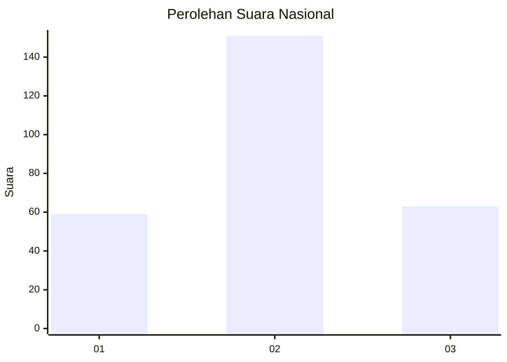
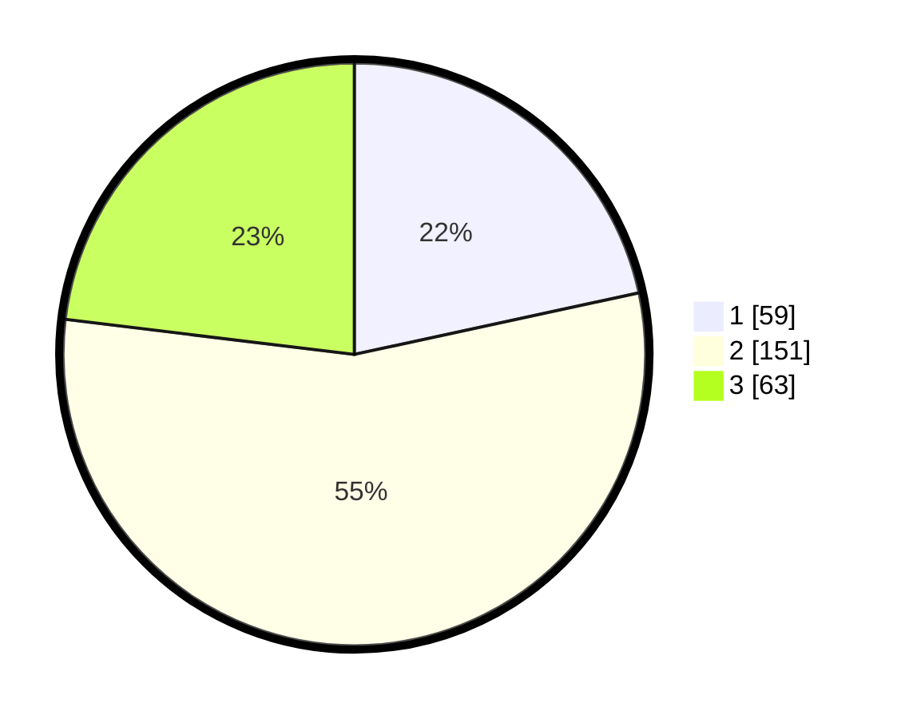

# Hasil

## Grafik

## Tabel

| No. | Nama Paslon    | Suara | Suara (raw) | Persentase |
|:--- |:-------------- | -----:| -----------:| ----------:|
| 1   | ANIES MUHAIMIN | 59    | [59][p-1]   | 21,61      |
| 2   | PRABOWO GIBRAN | 151   | [151][p-2]  | 55,31      |
| 3   | GANJAR MAHFUD  | 63    | [63][p-3]   | 23,08      |

[p-1]: https://github.com/gigit-pemilu/pemilu-2024/blob/main/pilpres/hitung-suara/sub/34-di-yogyakarta/sub/04-sleman/sub/06-mlati/sub/2004-tirtoadi/sub/021-tps/sub/paslon-1.txt
[p-2]: https://github.com/gigit-pemilu/pemilu-2024/blob/main/pilpres/hitung-suara/sub/34-di-yogyakarta/sub/04-sleman/sub/06-mlati/sub/2004-tirtoadi/sub/021-tps/sub/paslon-2.txt
[p-3]: https://github.com/gigit-pemilu/pemilu-2024/blob/main/pilpres/hitung-suara/sub/34-di-yogyakarta/sub/04-sleman/sub/06-mlati/sub/2004-tirtoadi/sub/021-tps/sub/paslon-3.txt

## Foto C Plano

https://sirekap-obj-formc.kpu.go.id/a020/pemilu/ppwp/34/04/06/20/04/3404062004021-20240214-194350--8b84e326-eeff-4c6b-bd71-04d185208110.jpg

https://sirekap-obj-formc.kpu.go.id/a020/pemilu/ppwp/34/04/06/20/04/3404062004021-20240214-194514--66fa562d-3734-49b9-979a-cb6eafb19976.jpg

https://sirekap-obj-formc.kpu.go.id/a020/pemilu/ppwp/34/04/06/20/04/3404062004021-20240214-194648--f7bd2a7f-64c8-4759-a67c-c2df98e5e589.jpg

## Metadata

| Key        | Value               |
| ---------- | ------------------- |
| Time Stamp | 2024-02-15 15:00:29 |

