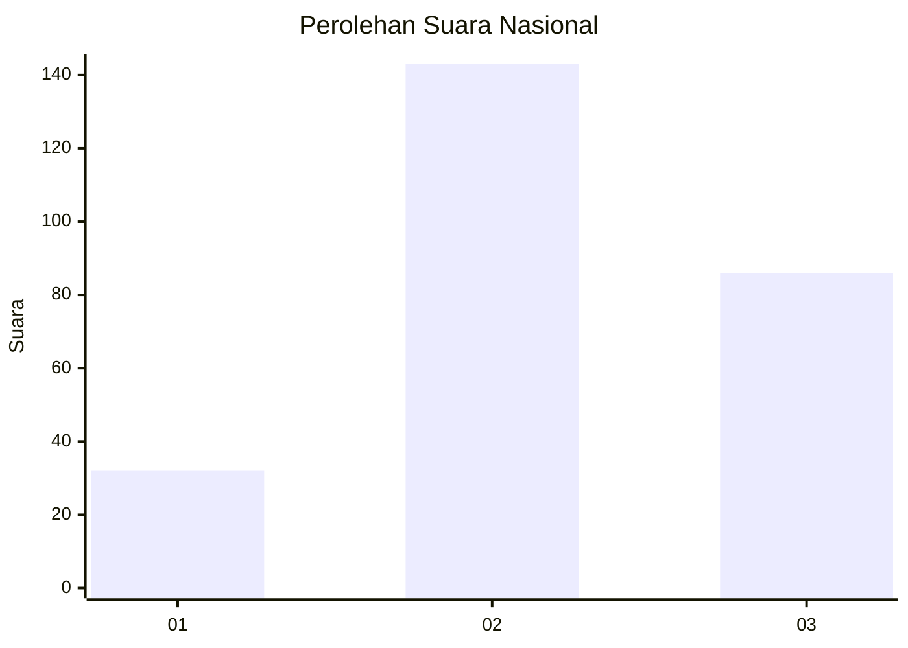
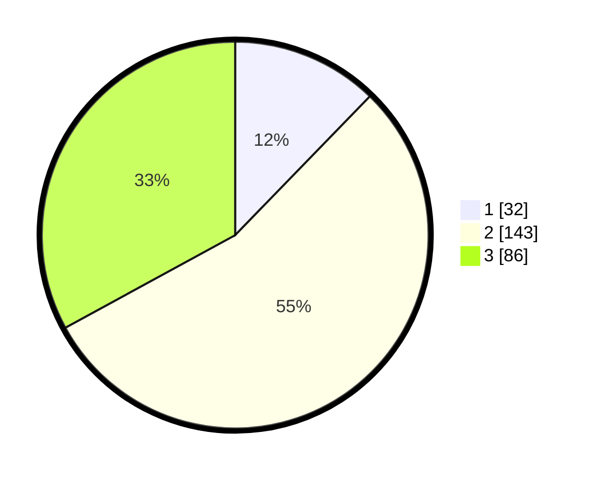

# Hasil

## Grafik

## Tabel

| No. | Nama Paslon    | Suara | Suara (raw) | Persentase |
|:--- |:-------------- | -----:| -----------:| ----------:|
| 1   | ANIES MUHAIMIN | 32    | [32][p-1]   | 12,26      |
| 2   | PRABOWO GIBRAN | 143   | [143][p-2]  | 54,79      |
| 3   | GANJAR MAHFUD  | 86    | [86][p-3]   | 32,95      |

[p-1]: https://github.com/gigit-pemilu/pemilu-2024/blob/main/pilpres/hitung-suara/sub/34-di-yogyakarta/sub/04-sleman/sub/06-mlati/sub/2004-tirtoadi/sub/022-tps/sub/paslon-1.txt
[p-2]: https://github.com/gigit-pemilu/pemilu-2024/blob/main/pilpres/hitung-suara/sub/34-di-yogyakarta/sub/04-sleman/sub/06-mlati/sub/2004-tirtoadi/sub/022-tps/sub/paslon-2.txt
[p-3]: https://github.com/gigit-pemilu/pemilu-2024/blob/main/pilpres/hitung-suara/sub/34-di-yogyakarta/sub/04-sleman/sub/06-mlati/sub/2004-tirtoadi/sub/022-tps/sub/paslon-3.txt

## Foto C Plano

https://sirekap-obj-formc.kpu.go.id/5dc0/pemilu/ppwp/34/04/06/20/04/3404062004022-20240214-194433--6eb64d8a-b772-41b3-a106-6eb957c79834.jpg

https://sirekap-obj-formc.kpu.go.id/5dc0/pemilu/ppwp/34/04/06/20/04/3404062004022-20240214-194439--02e74f19-a14a-47a0-80c0-f9f57704d518.jpg

https://sirekap-obj-formc.kpu.go.id/5dc0/pemilu/ppwp/34/04/06/20/04/3404062004022-20240214-194442--4e694078-ea54-4d75-b59c-172fa17d2dcc.jpg

## Metadata

| Key        | Value               |
| ---------- | ------------------- |
| Time Stamp | 2024-02-14 21:46:01 |

## DATA PEMILIH TETAP

Jumlah pemilih dalam DPT: **283**.
 * L: **141**.
 * P: **142**.

## DATA PENGGUNA HAK PILIH

Jumlah pengguna hak pilih dalam DPT: **257**.
 * L: **125**.
 * P: **132**.

Jumlah pengguna hak pilih dalam DPTb: **10**.
 * L: **7**.
 * P: **3**.

Jumlah pengguna hak pilih dalam DPK: **2**.
 * L: **1**.
 * P: **1**.

Jumlah pengguna hak pilih: **269**.
 * L: **133**.
 * P: **136**.

## JUMLAH SUARA SAH DAN TIDAK SAH

JUMLAH SELURUH SUARA SAH: **261**.

JUMLAH SUARA TIDAK SAH: **8**.

JUMLAH SELURUH SUARA SAH DAN SUARA TIDAK SAH: **269**.

