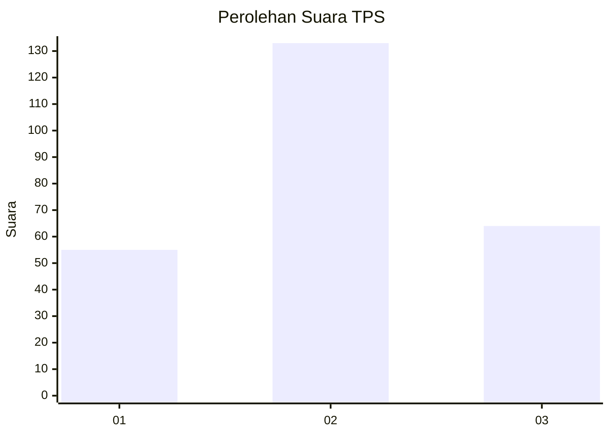
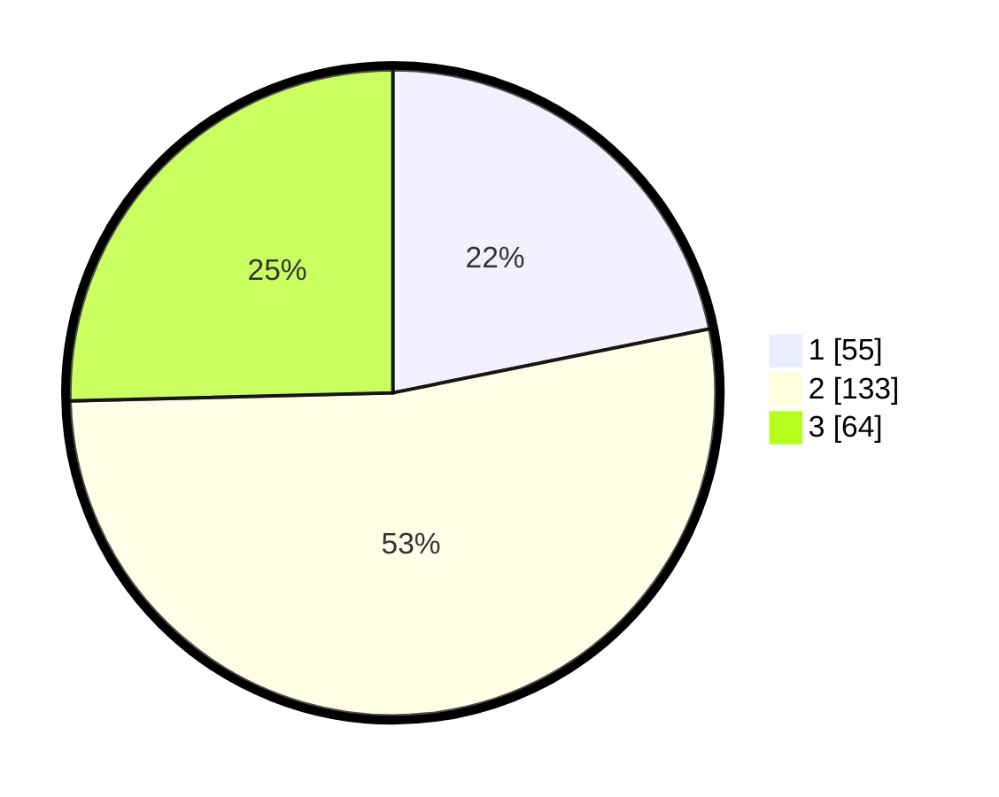

# Hasil

## Grafik

## Tabel

| No. | Nama Paslon    | Suara | Suara (raw) | Persentase |
|:--- |:-------------- | -----:| -----------:| ----------:|
| 1   | ANIES MUHAIMIN | 55    | [55][p-1]   | 21,83      |
| 2   | PRABOWO GIBRAN | 133   | [133][p-2]  | 52,78      |
| 3   | GANJAR MAHFUD  | 64    | [64][p-3]   | 25,40      |

[p-1]: https://github.com/gigit-pemilu/pemilu-2024-34-di-yogyakarta/blob/main/pilpres/hitung-suara/sub/34-di-yogyakarta/sub/04-sleman/sub/06-mlati/sub/2004-tirtoadi/sub/026-tps/sub/paslon-1.txt
[p-2]: https://github.com/gigit-pemilu/pemilu-2024-34-di-yogyakarta/blob/main/pilpres/hitung-suara/sub/34-di-yogyakarta/sub/04-sleman/sub/06-mlati/sub/2004-tirtoadi/sub/026-tps/sub/paslon-2.txt
[p-3]: https://github.com/gigit-pemilu/pemilu-2024-34-di-yogyakarta/blob/main/pilpres/hitung-suara/sub/34-di-yogyakarta/sub/04-sleman/sub/06-mlati/sub/2004-tirtoadi/sub/026-tps/sub/paslon-3.txt

## Foto C Plano

https://sirekap-obj-formc.kpu.go.id/7d7c/pemilu/ppwp/34/04/06/20/04/3404062004026-20240214-214230--7733b01b-714c-4ede-bb42-f66db797c965.jpg

https://sirekap-obj-formc.kpu.go.id/7d7c/pemilu/ppwp/34/04/06/20/04/3404062004026-20240215-080402--132561d2-d54b-4e80-a07f-9a26387c4d3c.jpg

https://sirekap-obj-formc.kpu.go.id/7d7c/pemilu/ppwp/34/04/06/20/04/3404062004026-20240214-214215--abf2076a-c523-4e91-a885-a4346a1b3499.jpg

## Metadata

| Key        | Value               |
| ---------- | ------------------- |
| Time Stamp | 2024-02-15 15:00:29 |

