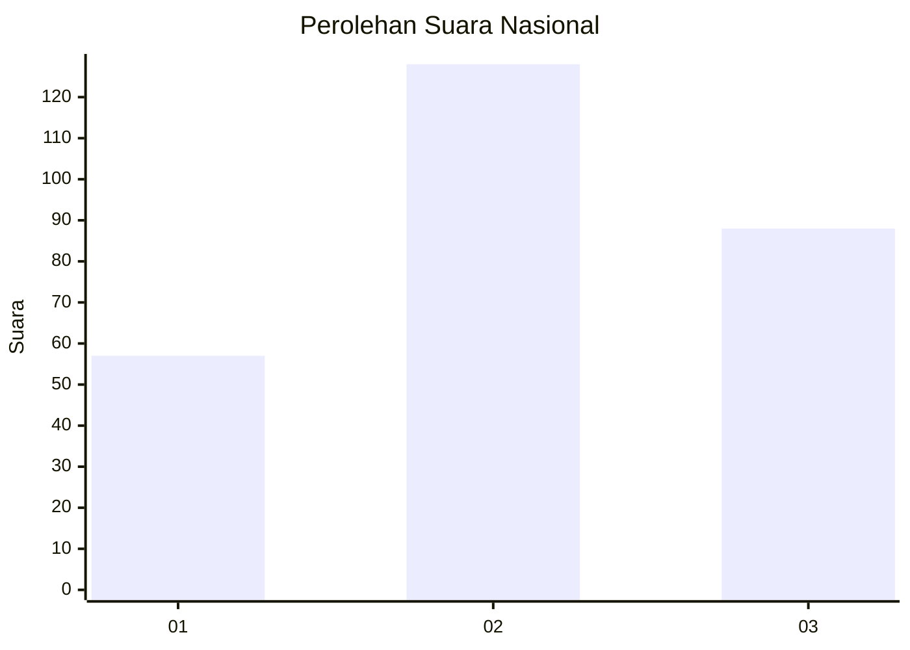
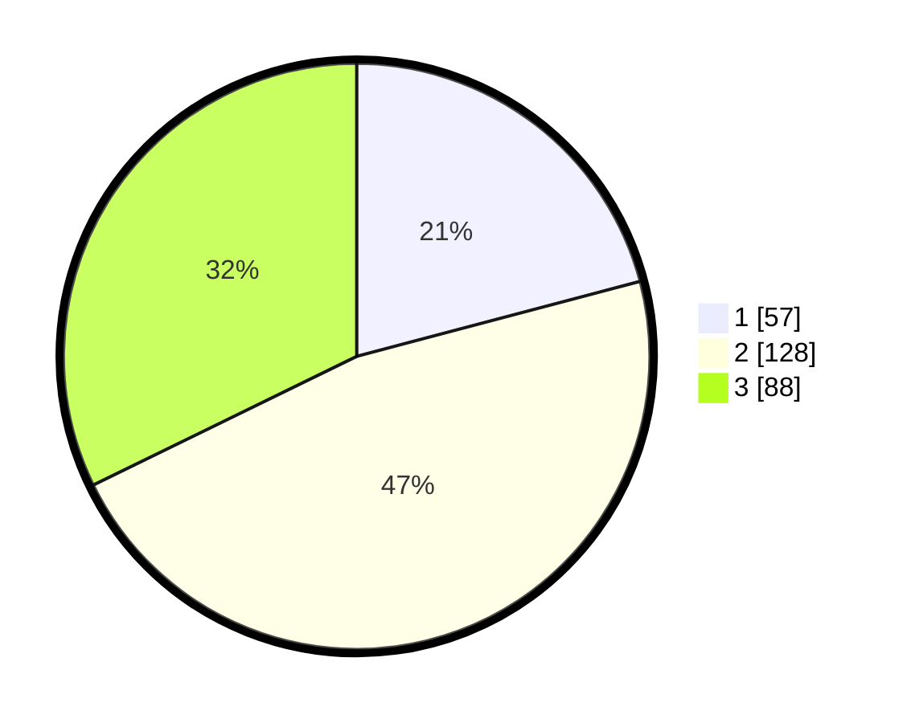

# Hasil

## Grafik

## Tabel

| No. | Nama Paslon    | Suara | Suara (raw) | Persentase |
|:--- |:-------------- | -----:| -----------:| ----------:|
| 1   | ANIES MUHAIMIN | 57    | [57][p-1]   | 20,88      |
| 2   | PRABOWO GIBRAN | 128   | [128][p-2]  | 46,89      |
| 3   | GANJAR MAHFUD  | 88    | [88][p-3]   | 32,23      |

[p-1]: https://github.com/gigit-pemilu/pemilu-2024/blob/main/pilpres/hitung-suara/sub/34-di-yogyakarta/sub/04-sleman/sub/06-mlati/sub/2004-tirtoadi/sub/027-tps/sub/paslon-1.txt
[p-2]: https://github.com/gigit-pemilu/pemilu-2024/blob/main/pilpres/hitung-suara/sub/34-di-yogyakarta/sub/04-sleman/sub/06-mlati/sub/2004-tirtoadi/sub/027-tps/sub/paslon-2.txt
[p-3]: https://github.com/gigit-pemilu/pemilu-2024/blob/main/pilpres/hitung-suara/sub/34-di-yogyakarta/sub/04-sleman/sub/06-mlati/sub/2004-tirtoadi/sub/027-tps/sub/paslon-3.txt

## Foto C Plano

https://sirekap-obj-formc.kpu.go.id/a1e7/pemilu/ppwp/34/04/06/20/04/3404062004027-20240215-082459--25a7183c-766e-4bce-8157-bbb1b966624f.jpg

https://sirekap-obj-formc.kpu.go.id/a1e7/pemilu/ppwp/34/04/06/20/04/3404062004027-20240215-082614--982d4532-96dd-4763-8f74-22e437d4450f.jpg

https://sirekap-obj-formc.kpu.go.id/a1e7/pemilu/ppwp/34/04/06/20/04/3404062004027-20240215-082717--954a97ae-39aa-464f-965c-9dc335ee2fdf.jpg

## Metadata

| Key        | Value               |
| ---------- | ------------------- |
| Time Stamp | 2024-02-15 16:00:26 |

