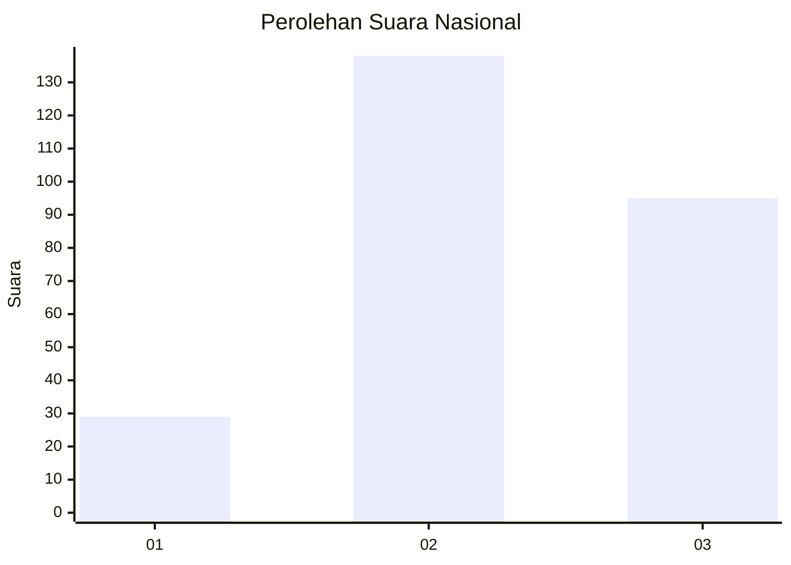
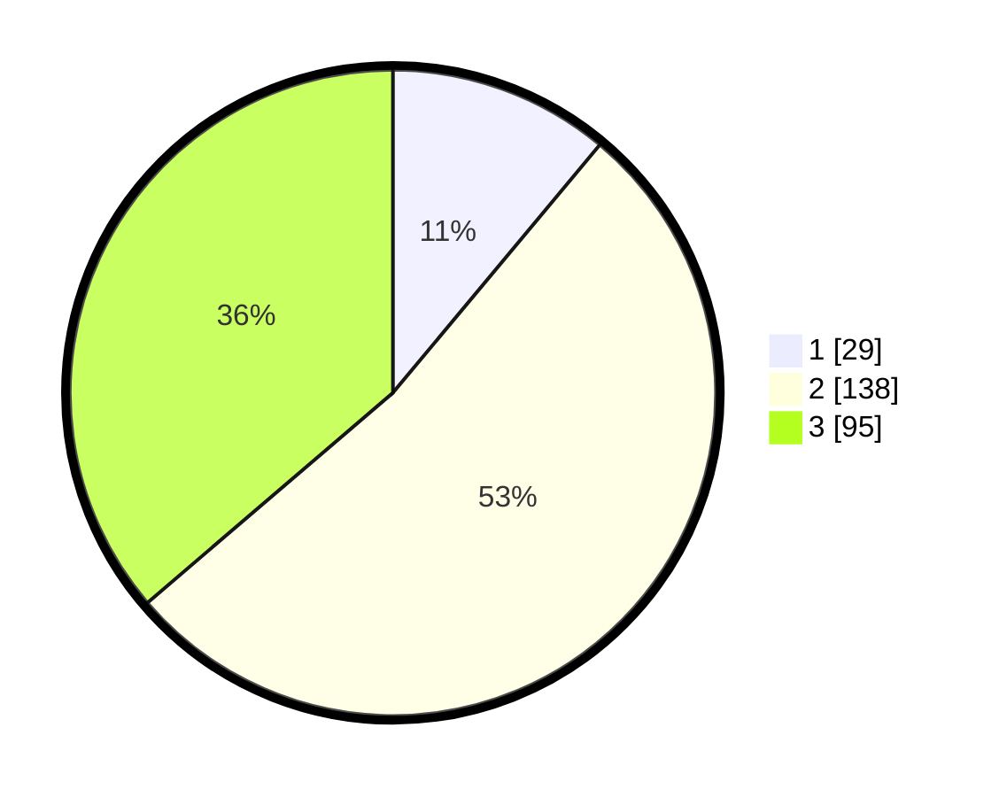

# Hasil

## Grafik

## Tabel

| No. | Nama Paslon    | Suara | Suara (raw) | Persentase |
|:--- |:-------------- | -----:| -----------:| ----------:|
| 1   | ANIES MUHAIMIN | 29    | [29][p-1]   | 11,07      |
| 2   | PRABOWO GIBRAN | 138   | [138][p-2]  | 52,67      |
| 3   | GANJAR MAHFUD  | 95    | [95][p-3]   | 36,26      |

[p-1]: https://github.com/gigit-pemilu/pemilu-2024/blob/main/pilpres/hitung-suara/sub/34-di-yogyakarta/sub/04-sleman/sub/06-mlati/sub/2005-sumberadi/sub/003-tps/sub/paslon-1.txt
[p-2]: https://github.com/gigit-pemilu/pemilu-2024/blob/main/pilpres/hitung-suara/sub/34-di-yogyakarta/sub/04-sleman/sub/06-mlati/sub/2005-sumberadi/sub/003-tps/sub/paslon-2.txt
[p-3]: https://github.com/gigit-pemilu/pemilu-2024/blob/main/pilpres/hitung-suara/sub/34-di-yogyakarta/sub/04-sleman/sub/06-mlati/sub/2005-sumberadi/sub/003-tps/sub/paslon-3.txt

## Foto C Plano

https://sirekap-obj-formc.kpu.go.id/0233/pemilu/ppwp/34/04/06/20/05/3404062005003-20240218-112247--ced58e69-b118-4844-9238-4a7461fb1cb5.jpg

https://sirekap-obj-formc.kpu.go.id/0233/pemilu/ppwp/34/04/06/20/05/3404062005003-20240218-112339--79a884db-1517-46d2-ad4e-f0a5e8b1578e.jpg

https://sirekap-obj-formc.kpu.go.id/0233/pemilu/ppwp/34/04/06/20/05/3404062005003-20240218-112428--b2217614-c0e7-4fa4-a95b-92ce05d5bed6.jpg

## Metadata

| Key        | Value               |
| ---------- | ------------------- |
| Time Stamp | 2024-02-19 06:16:00 |

