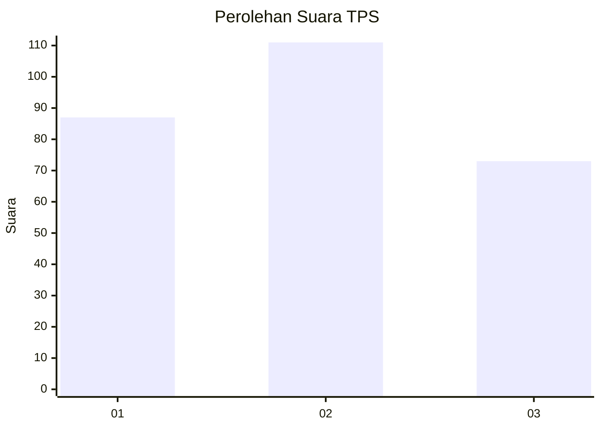
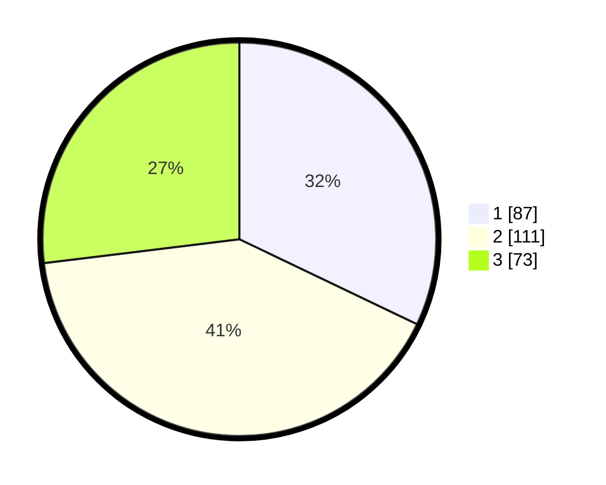

# Hasil

## Grafik

## Tabel

| No. | Nama Paslon    | Suara | Suara (raw) | Persentase |
|:--- |:-------------- | -----:| -----------:| ----------:|
| 1   | ANIES MUHAIMIN | 87    | [87][p-1]   | 32,10      |
| 2   | PRABOWO GIBRAN | 111   | [111][p-2]  | 40,96      |
| 3   | GANJAR MAHFUD  | 73    | [73][p-3]   | 26,94      |

[p-1]: https://github.com/gigit-pemilu/pemilu-2024-34-di-yogyakarta/blob/main/pilpres/hitung-suara/sub/34-di-yogyakarta/sub/04-sleman/sub/06-mlati/sub/2005-sumberadi/sub/009-tps/sub/paslon-1.txt
[p-2]: https://github.com/gigit-pemilu/pemilu-2024-34-di-yogyakarta/blob/main/pilpres/hitung-suara/sub/34-di-yogyakarta/sub/04-sleman/sub/06-mlati/sub/2005-sumberadi/sub/009-tps/sub/paslon-2.txt
[p-3]: https://github.com/gigit-pemilu/pemilu-2024-34-di-yogyakarta/blob/main/pilpres/hitung-suara/sub/34-di-yogyakarta/sub/04-sleman/sub/06-mlati/sub/2005-sumberadi/sub/009-tps/sub/paslon-3.txt

## Foto C Plano

https://sirekap-obj-formc.kpu.go.id/5bd5/pemilu/ppwp/34/04/06/20/05/3404062005009-20240214-155216--63c3ca66-efba-4318-8841-0c400f6a6905.jpg

https://sirekap-obj-formc.kpu.go.id/5bd5/pemilu/ppwp/34/04/06/20/05/3404062005009-20240214-155300--a9921fee-f139-4537-8d9d-f9406531f54f.jpg

https://sirekap-obj-formc.kpu.go.id/5bd5/pemilu/ppwp/34/04/06/20/05/3404062005009-20240214-155335--6a96248b-6026-49c5-93ef-f94748c9154c.jpg

## Metadata

| Key        | Value               |
| ---------- | ------------------- |
| Time Stamp | 2024-02-15 15:00:29 |

