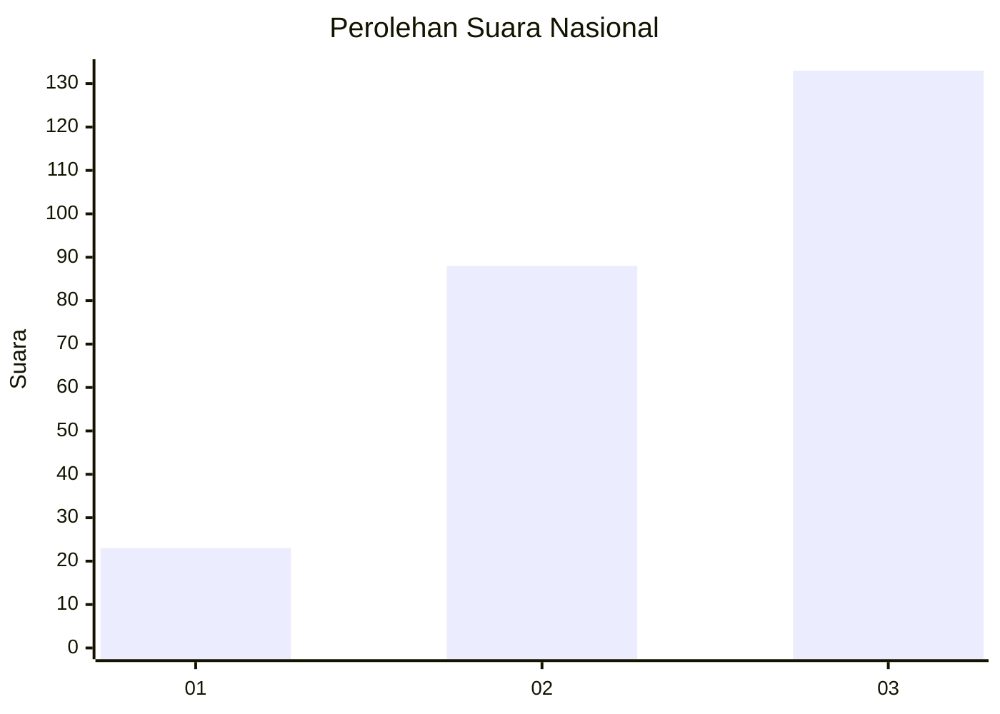
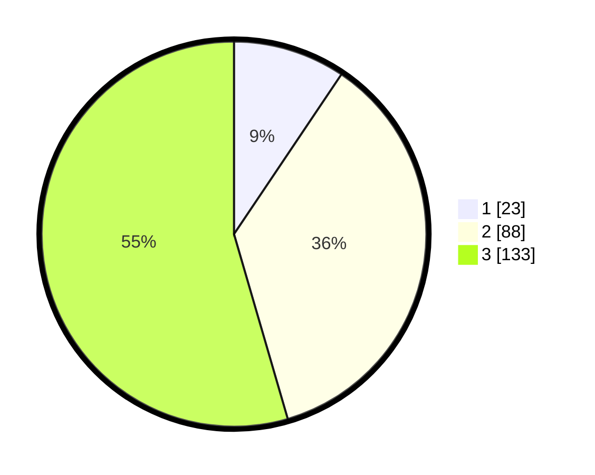

# Hasil

## Grafik

## Tabel

| No. | Nama Paslon    | Suara | Suara (raw) | Persentase |
|:--- |:-------------- | -----:| -----------:| ----------:|
| 1   | ANIES MUHAIMIN | 23    | [23][p-1]   | 9,43       |
| 2   | PRABOWO GIBRAN | 88    | [88][p-2]   | 36,07      |
| 3   | GANJAR MAHFUD  | 133   | [133][p-3]  | 54,51      |

[p-1]: https://github.com/gigit-pemilu/pemilu-2024/blob/main/pilpres/hitung-suara/sub/34-di-yogyakarta/sub/04-sleman/sub/06-mlati/sub/2005-sumberadi/sub/011-tps/sub/paslon-1.txt
[p-2]: https://github.com/gigit-pemilu/pemilu-2024/blob/main/pilpres/hitung-suara/sub/34-di-yogyakarta/sub/04-sleman/sub/06-mlati/sub/2005-sumberadi/sub/011-tps/sub/paslon-2.txt
[p-3]: https://github.com/gigit-pemilu/pemilu-2024/blob/main/pilpres/hitung-suara/sub/34-di-yogyakarta/sub/04-sleman/sub/06-mlati/sub/2005-sumberadi/sub/011-tps/sub/paslon-3.txt

## Foto C Plano

https://sirekap-obj-formc.kpu.go.id/14e8/pemilu/ppwp/34/04/06/20/05/3404062005011-20240215-042015--df5cd948-ec68-4571-b7ab-ec6696e00c00.jpg

https://sirekap-obj-formc.kpu.go.id/14e8/pemilu/ppwp/34/04/06/20/05/3404062005011-20240215-042333--eee2332d-7bab-4bd1-9988-80713220c04a.jpg

https://sirekap-obj-formc.kpu.go.id/14e8/pemilu/ppwp/34/04/06/20/05/3404062005011-20240215-042543--c13b98fb-ee56-4275-abbe-3ef85d2a27e9.jpg

## Metadata

| Key        | Value               |
| ---------- | ------------------- |
| Time Stamp | 2024-02-15 21:30:27 |

