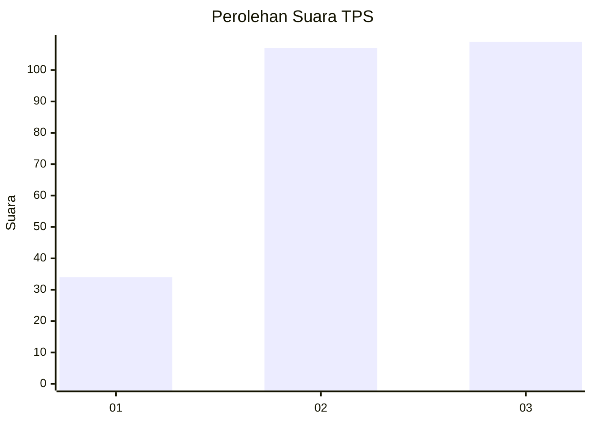
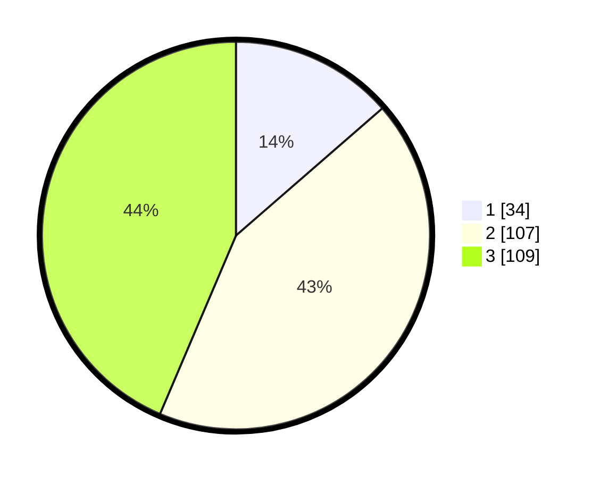

# Hasil

## Grafik

## Tabel

| No. | Nama Paslon    | Suara | Suara (raw) | Persentase |
|:--- |:-------------- | -----:| -----------:| ----------:|
| 1   | ANIES MUHAIMIN | 34    | [34][p-1]   | 13,60      |
| 2   | PRABOWO GIBRAN | 107   | [107][p-2]  | 42,80      |
| 3   | GANJAR MAHFUD  | 109   | [109][p-3]  | 43,60      |

[p-1]: https://github.com/gigit-pemilu/pemilu-2024-34-di-yogyakarta/blob/main/pilpres/hitung-suara/sub/34-di-yogyakarta/sub/04-sleman/sub/06-mlati/sub/2005-sumberadi/sub/012-tps/sub/paslon-1.txt
[p-2]: https://github.com/gigit-pemilu/pemilu-2024-34-di-yogyakarta/blob/main/pilpres/hitung-suara/sub/34-di-yogyakarta/sub/04-sleman/sub/06-mlati/sub/2005-sumberadi/sub/012-tps/sub/paslon-2.txt
[p-3]: https://github.com/gigit-pemilu/pemilu-2024-34-di-yogyakarta/blob/main/pilpres/hitung-suara/sub/34-di-yogyakarta/sub/04-sleman/sub/06-mlati/sub/2005-sumberadi/sub/012-tps/sub/paslon-3.txt

## Foto C Plano

https://sirekap-obj-formc.kpu.go.id/489b/pemilu/ppwp/34/04/06/20/05/3404062005012-20240214-155102--5f519356-5319-4523-9fd6-3d9ae40ad70c.jpg

https://sirekap-obj-formc.kpu.go.id/489b/pemilu/ppwp/34/04/06/20/05/3404062005012-20240216-145705--327edef1-5ecf-4bdc-b736-c7571c54b904.jpg

https://sirekap-obj-formc.kpu.go.id/489b/pemilu/ppwp/34/04/06/20/05/3404062005012-20240214-185101--b29a9b36-61df-45b6-91e4-392361b7c04e.jpg

## Metadata

| Key        | Value               |
| ---------- | ------------------- |
| Time Stamp | 2024-02-16 21:01:00 |

## DATA PEMILIH TETAP

Jumlah pemilih dalam DPT: **280**.
 * L: **136**.
 * P: **144**.

## DATA PENGGUNA HAK PILIH

Jumlah pengguna hak pilih dalam DPT: **231**.
 * L: **114**.
 * P: **117**.

Jumlah pengguna hak pilih dalam DPTb: **12**.
 * L: **4**.
 * P: **8**.

Jumlah pengguna hak pilih dalam DPK: **10**.
 * L: **7**.
 * P: **3**.

Jumlah pengguna hak pilih: **253**.
 * L: **125**.
 * P: **128**.

## JUMLAH SUARA SAH DAN TIDAK SAH

JUMLAH SELURUH SUARA SAH: **250**.

JUMLAH SUARA TIDAK SAH: **3**.

JUMLAH SELURUH SUARA SAH DAN SUARA TIDAK SAH: **253**.

