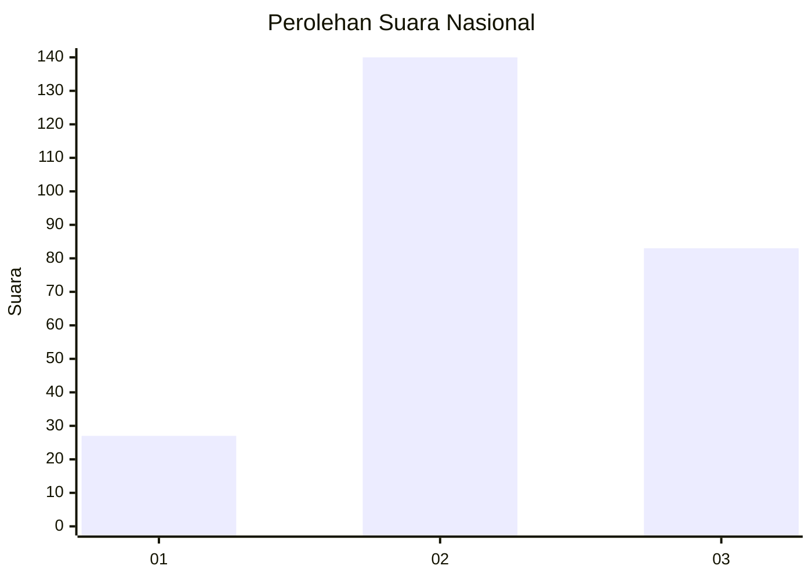
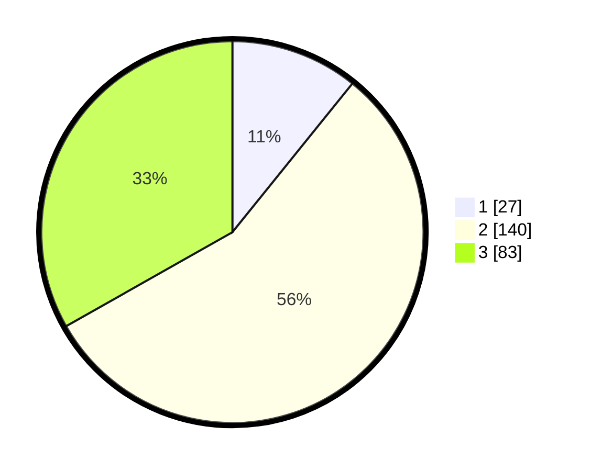

# Hasil

## Grafik

## Tabel

| No. | Nama Paslon    | Suara | Suara (raw) | Persentase |
|:--- |:-------------- | -----:| -----------:| ----------:|
| 1   | ANIES MUHAIMIN | 27    | [27][p-1]   | 10,80      |
| 2   | PRABOWO GIBRAN | 140   | [140][p-2]  | 56,00      |
| 3   | GANJAR MAHFUD  | 83    | [83][p-3]   | 33,20      |

[p-1]: https://github.com/gigit-pemilu/pemilu-2024/blob/main/pilpres/hitung-suara/sub/34-di-yogyakarta/sub/04-sleman/sub/06-mlati/sub/2005-sumberadi/sub/021-tps/sub/paslon-1.txt
[p-2]: https://github.com/gigit-pemilu/pemilu-2024/blob/main/pilpres/hitung-suara/sub/34-di-yogyakarta/sub/04-sleman/sub/06-mlati/sub/2005-sumberadi/sub/021-tps/sub/paslon-2.txt
[p-3]: https://github.com/gigit-pemilu/pemilu-2024/blob/main/pilpres/hitung-suara/sub/34-di-yogyakarta/sub/04-sleman/sub/06-mlati/sub/2005-sumberadi/sub/021-tps/sub/paslon-3.txt

## Foto C Plano

https://sirekap-obj-formc.kpu.go.id/bcea/pemilu/ppwp/34/04/06/20/05/3404062005021-20240215-113225--b4140d29-89ec-4ee2-b0cb-01a413b334f8.jpg

https://sirekap-obj-formc.kpu.go.id/bcea/pemilu/ppwp/34/04/06/20/05/3404062005021-20240215-113252--a67b0741-1601-42e3-b567-e8c2e2782ed0.jpg

https://sirekap-obj-formc.kpu.go.id/bcea/pemilu/ppwp/34/04/06/20/05/3404062005021-20240215-113259--0982616e-51b9-4790-a447-4c1f8f3ea7df.jpg

## Metadata

| Key        | Value               |
| ---------- | ------------------- |
| Time Stamp | 2024-02-15 16:00:26 |

