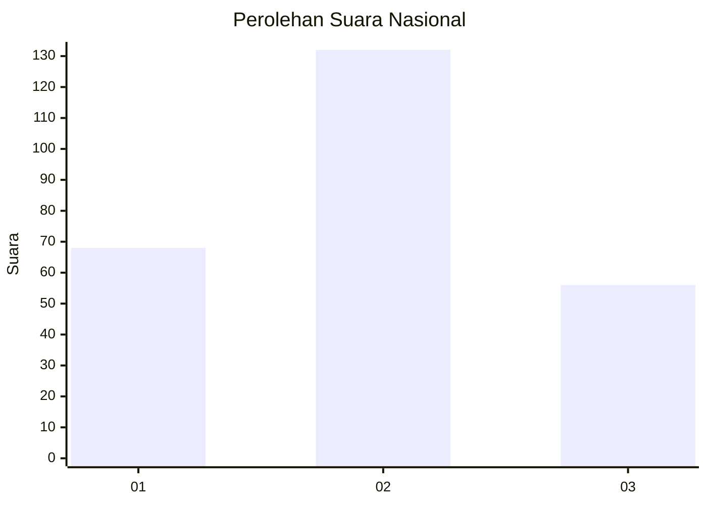
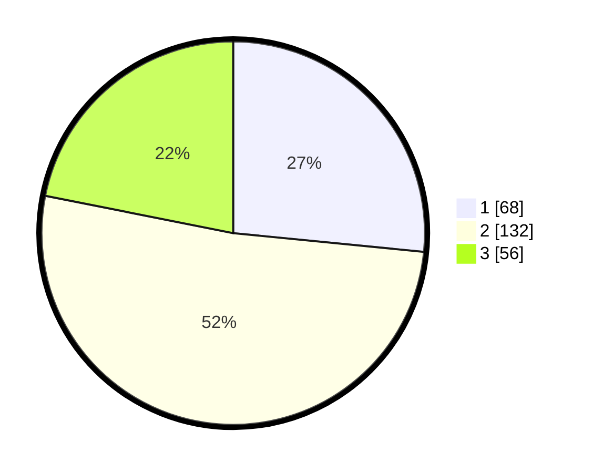

# Hasil

## Grafik

## Tabel

| No. | Nama Paslon    | Suara | Suara (raw) | Persentase |
|:--- |:-------------- | -----:| -----------:| ----------:|
| 1   | ANIES MUHAIMIN | 68    | [68][p-1]   | 26,56      |
| 2   | PRABOWO GIBRAN | 132   | [132][p-2]  | 51,56      |
| 3   | GANJAR MAHFUD  | 56    | [56][p-3]   | 21,88      |

[p-1]: https://github.com/gigit-pemilu/pemilu-2024/blob/main/pilpres/hitung-suara/sub/34-di-yogyakarta/sub/04-sleman/sub/06-mlati/sub/2005-sumberadi/sub/030-tps/sub/paslon-1.txt
[p-2]: https://github.com/gigit-pemilu/pemilu-2024/blob/main/pilpres/hitung-suara/sub/34-di-yogyakarta/sub/04-sleman/sub/06-mlati/sub/2005-sumberadi/sub/030-tps/sub/paslon-2.txt
[p-3]: https://github.com/gigit-pemilu/pemilu-2024/blob/main/pilpres/hitung-suara/sub/34-di-yogyakarta/sub/04-sleman/sub/06-mlati/sub/2005-sumberadi/sub/030-tps/sub/paslon-3.txt

## Foto C Plano

https://sirekap-obj-formc.kpu.go.id/e871/pemilu/ppwp/34/04/06/20/05/3404062005030-20240215-005010--56167a5c-b802-4caf-a71e-38bae82ab7a1.jpg

https://sirekap-obj-formc.kpu.go.id/e871/pemilu/ppwp/34/04/06/20/05/3404062005030-20240215-005126--a3684e5b-0697-4586-b921-684f9d9468d4.jpg

https://sirekap-obj-formc.kpu.go.id/e871/pemilu/ppwp/34/04/06/20/05/3404062005030-20240215-005208--1b3d56f8-6ac3-4a4b-ba3b-84d55acd4630.jpg

## Metadata

| Key        | Value               |
| ---------- | ------------------- |
| Time Stamp | 2024-02-15 15:00:29 |

