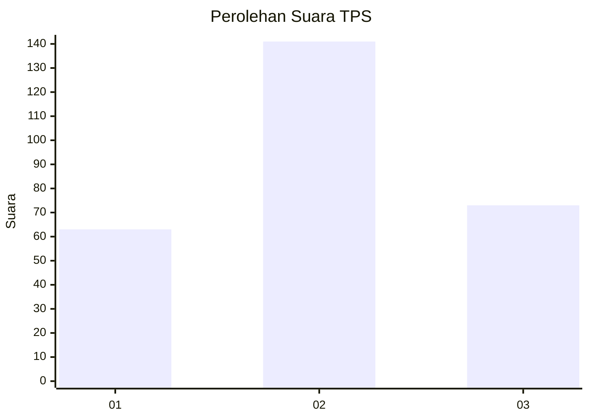
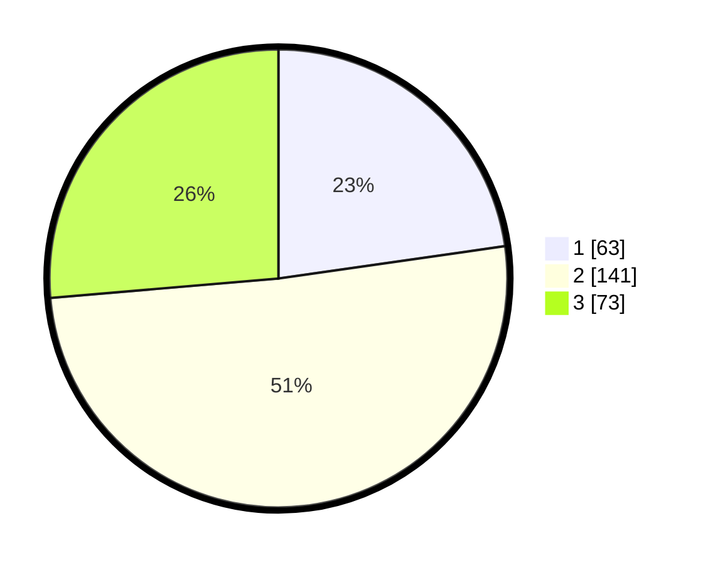

# Hasil

## Grafik

## Tabel

| No. | Nama Paslon    | Suara | Suara (raw) | Persentase |
|:--- |:-------------- | -----:| -----------:| ----------:|
| 1   | ANIES MUHAIMIN | 63    | [63][p-1]   | 22,74      |
| 2   | PRABOWO GIBRAN | 141   | [141][p-2]  | 50,90      |
| 3   | GANJAR MAHFUD  | 73    | [73][p-3]   | 26,35      |

[p-1]: https://github.com/gigit-pemilu/pemilu-2024-34-di-yogyakarta/blob/main/pilpres/hitung-suara/sub/34-di-yogyakarta/sub/04-sleman/sub/06-mlati/sub/2005-sumberadi/sub/033-tps/sub/paslon-1.txt
[p-2]: https://github.com/gigit-pemilu/pemilu-2024-34-di-yogyakarta/blob/main/pilpres/hitung-suara/sub/34-di-yogyakarta/sub/04-sleman/sub/06-mlati/sub/2005-sumberadi/sub/033-tps/sub/paslon-2.txt
[p-3]: https://github.com/gigit-pemilu/pemilu-2024-34-di-yogyakarta/blob/main/pilpres/hitung-suara/sub/34-di-yogyakarta/sub/04-sleman/sub/06-mlati/sub/2005-sumberadi/sub/033-tps/sub/paslon-3.txt

## Foto C Plano

https://sirekap-obj-formc.kpu.go.id/fb00/pemilu/ppwp/34/04/06/20/05/3404062005033-20240214-155658--8b259806-8fb0-4f74-90e9-fad8b0a7d570.jpg

https://sirekap-obj-formc.kpu.go.id/fb00/pemilu/ppwp/34/04/06/20/05/3404062005033-20240214-155752--df9f7365-b947-47dd-9dbe-c4de6b422f88.jpg

https://sirekap-obj-formc.kpu.go.id/fb00/pemilu/ppwp/34/04/06/20/05/3404062005033-20240214-155757--19346f70-26aa-42a1-816e-62d82d88432b.jpg

## Metadata

| Key        | Value               |
| ---------- | ------------------- |
| Time Stamp | 2024-02-16 21:01:00 |

