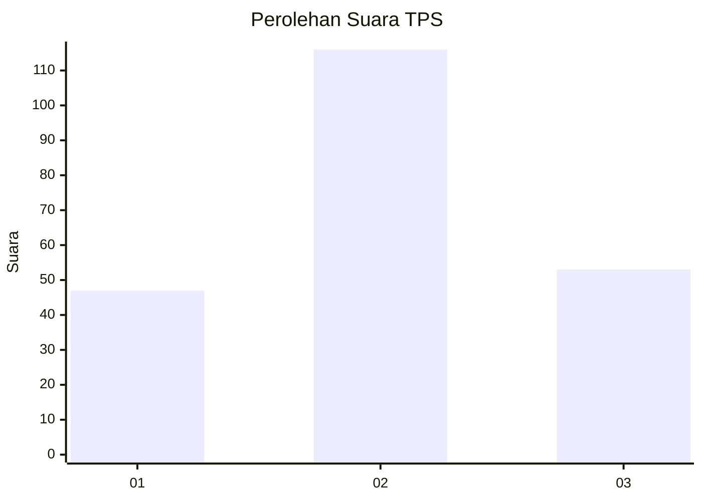
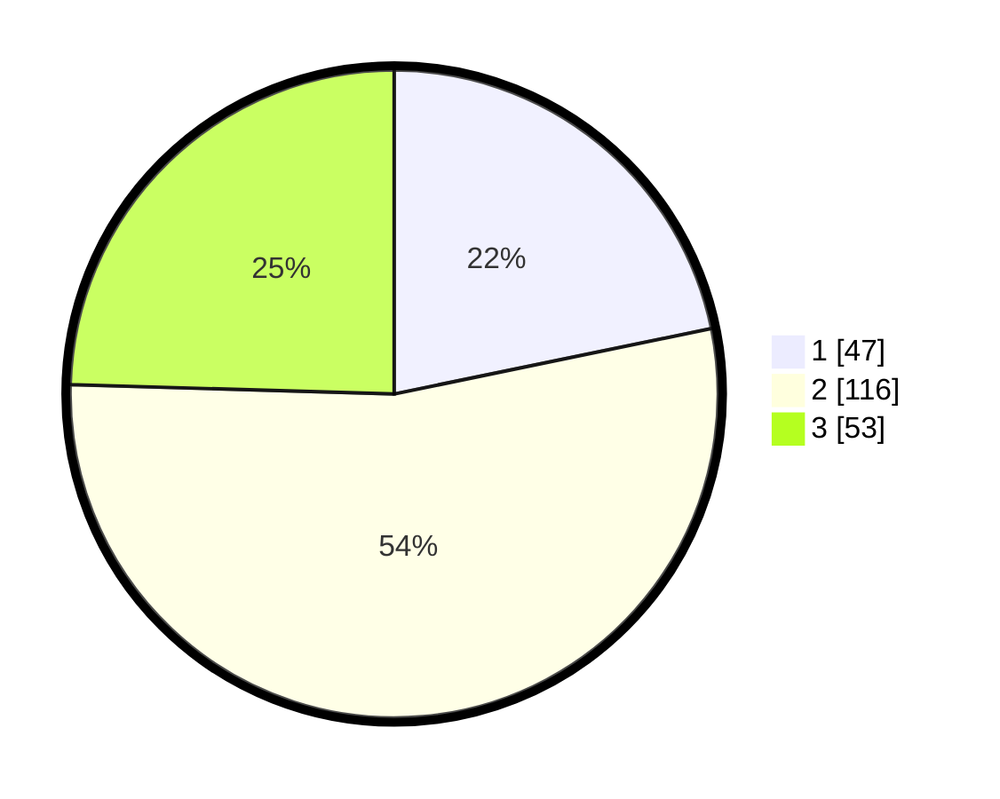

# Hasil

## Grafik

## Tabel

| No. | Nama Paslon    | Suara | Suara (raw) | Persentase |
|:--- |:-------------- | -----:| -----------:| ----------:|
| 1   | ANIES MUHAIMIN | 47    | [47][p-1]   | 21,76      |
| 2   | PRABOWO GIBRAN | 116   | [116][p-2]  | 53,70      |
| 3   | GANJAR MAHFUD  | 53    | [53][p-3]   | 24,54      |

[p-1]: https://github.com/gigit-pemilu/pemilu-2024-34-di-yogyakarta/blob/main/pilpres/hitung-suara/sub/34-di-yogyakarta/sub/04-sleman/sub/06-mlati/sub/2005-sumberadi/sub/039-tps/sub/paslon-1.txt
[p-2]: https://github.com/gigit-pemilu/pemilu-2024-34-di-yogyakarta/blob/main/pilpres/hitung-suara/sub/34-di-yogyakarta/sub/04-sleman/sub/06-mlati/sub/2005-sumberadi/sub/039-tps/sub/paslon-2.txt
[p-3]: https://github.com/gigit-pemilu/pemilu-2024-34-di-yogyakarta/blob/main/pilpres/hitung-suara/sub/34-di-yogyakarta/sub/04-sleman/sub/06-mlati/sub/2005-sumberadi/sub/039-tps/sub/paslon-3.txt

## Foto C Plano

https://sirekap-obj-formc.kpu.go.id/2bd1/pemilu/ppwp/34/04/06/20/05/3404062005039-20240214-223709--409900f1-03ec-453c-a7e5-a48b08988989.jpg

https://sirekap-obj-formc.kpu.go.id/2bd1/pemilu/ppwp/34/04/06/20/05/3404062005039-20240214-224157--a537466d-8d5f-4f0d-a6d3-75fa60a3a62a.jpg

https://sirekap-obj-formc.kpu.go.id/2bd1/pemilu/ppwp/34/04/06/20/05/3404062005039-20240214-224348--74b57545-1388-45c6-96fc-afffc2770de8.jpg

## Metadata

| Key        | Value               |
| ---------- | ------------------- |
| Time Stamp | 2024-02-15 15:00:29 |

