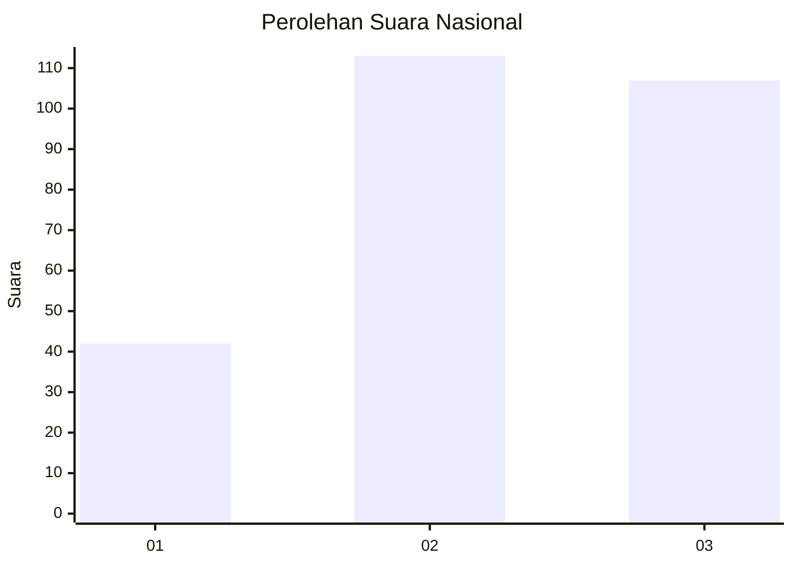
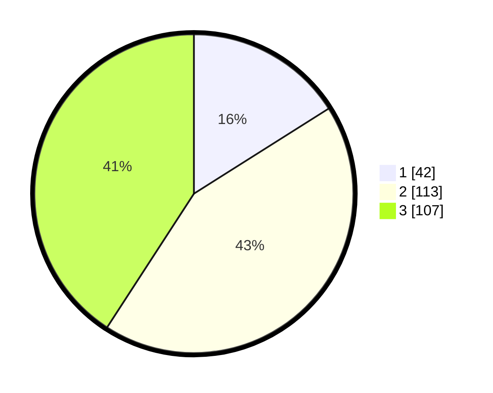

# Hasil

## Grafik

## Tabel

| No. | Nama Paslon    | Suara | Suara (raw) | Persentase |
|:--- |:-------------- | -----:| -----------:| ----------:|
| 1   | ANIES MUHAIMIN | 42    | [42][p-1]   | 16,03      |
| 2   | PRABOWO GIBRAN | 113   | [113][p-2]  | 43,13      |
| 3   | GANJAR MAHFUD  | 107   | [107][p-3]  | 40,84      |

[p-1]: https://github.com/gigit-pemilu/pemilu-2024/blob/main/pilpres/hitung-suara/sub/34-di-yogyakarta/sub/04-sleman/sub/06-mlati/sub/2005-sumberadi/sub/044-tps/sub/paslon-1.txt
[p-2]: https://github.com/gigit-pemilu/pemilu-2024/blob/main/pilpres/hitung-suara/sub/34-di-yogyakarta/sub/04-sleman/sub/06-mlati/sub/2005-sumberadi/sub/044-tps/sub/paslon-2.txt
[p-3]: https://github.com/gigit-pemilu/pemilu-2024/blob/main/pilpres/hitung-suara/sub/34-di-yogyakarta/sub/04-sleman/sub/06-mlati/sub/2005-sumberadi/sub/044-tps/sub/paslon-3.txt

## Foto C Plano

https://sirekap-obj-formc.kpu.go.id/be8f/pemilu/ppwp/34/04/06/20/05/3404062005044-20240215-072036--789ee8da-220f-4abd-9c0a-46fa0259a454.jpg

https://sirekap-obj-formc.kpu.go.id/be8f/pemilu/ppwp/34/04/06/20/05/3404062005044-20240215-072234--68837a0a-2594-4938-a851-26ac0325d8a4.jpg

https://sirekap-obj-formc.kpu.go.id/be8f/pemilu/ppwp/34/04/06/20/05/3404062005044-20240215-072354--1b5c746a-b761-4818-bc6b-b1ff5c1f1063.jpg

## Metadata

| Key        | Value               |
| ---------- | ------------------- |
| Time Stamp | 2024-02-15 17:00:25 |

