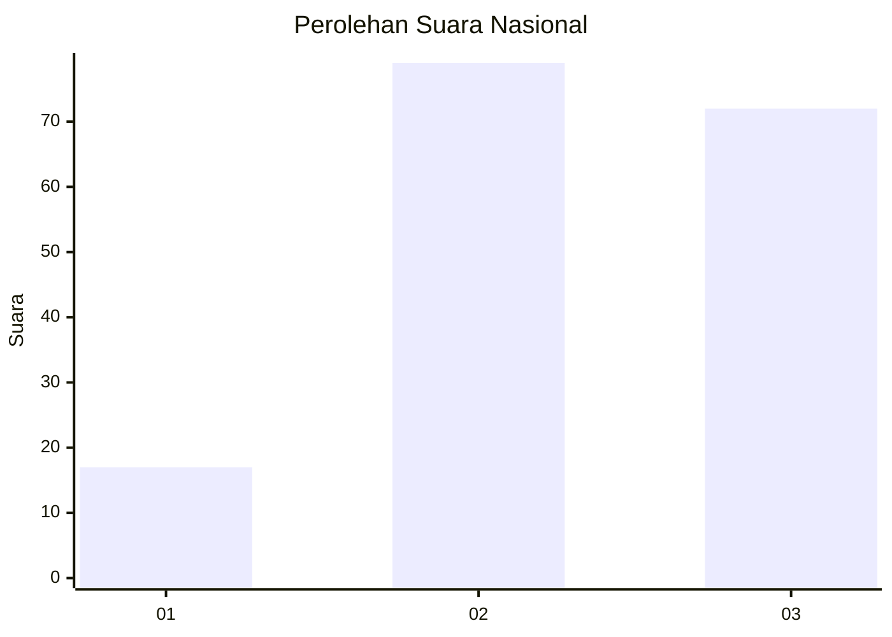
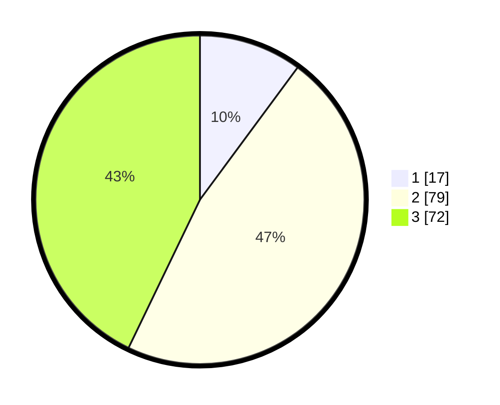

# Hasil

## Grafik

## Tabel

| No. | Nama Paslon    | Suara | Suara (raw) | Persentase |
|:--- |:-------------- | -----:| -----------:| ----------:|
| 1   | ANIES MUHAIMIN | 17    | [17][p-1]   | 10,12      |
| 2   | PRABOWO GIBRAN | 79    | [79][p-2]   | 47,02      |
| 3   | GANJAR MAHFUD  | 72    | [72][p-3]   | 42,86      |

[p-1]: https://github.com/gigit-pemilu/pemilu-2024/blob/main/pilpres/hitung-suara/sub/34-di-yogyakarta/sub/04-sleman/sub/06-mlati/sub/2005-sumberadi/sub/901-tps/sub/paslon-1.txt
[p-2]: https://github.com/gigit-pemilu/pemilu-2024/blob/main/pilpres/hitung-suara/sub/34-di-yogyakarta/sub/04-sleman/sub/06-mlati/sub/2005-sumberadi/sub/901-tps/sub/paslon-2.txt
[p-3]: https://github.com/gigit-pemilu/pemilu-2024/blob/main/pilpres/hitung-suara/sub/34-di-yogyakarta/sub/04-sleman/sub/06-mlati/sub/2005-sumberadi/sub/901-tps/sub/paslon-3.txt

## Foto C Plano

https://sirekap-obj-formc.kpu.go.id/c140/pemilu/ppwp/34/04/06/20/05/3404062005901-20240215-211433--9886d552-2f99-4b8b-ba22-89000d29bd0e.jpg

https://sirekap-obj-formc.kpu.go.id/c140/pemilu/ppwp/34/04/06/20/05/3404062005901-20240215-211437--98385e87-e734-4fba-b70e-38aa15f9599d.jpg

https://sirekap-obj-formc.kpu.go.id/c140/pemilu/ppwp/34/04/06/20/05/3404062005901-20240215-211436--5d833305-d13f-442f-a43a-9121c57a2183.jpg

## Metadata

| Key        | Value               |
| ---------- | ------------------- |
| Time Stamp | 2024-02-16 13:30:32 |

## DATA PEMILIH TETAP

Jumlah pemilih dalam DPT: **170**.
 * L: **167**.
 * P: **3**.

## DATA PENGGUNA HAK PILIH

Jumlah pengguna hak pilih dalam DPT: **69**.
 * L: **69**.
 * P: **0**.

Jumlah pengguna hak pilih dalam DPTb: **104**.
 * L: **103**.
 * P: **1**.

Jumlah pengguna hak pilih dalam DPK: **0**.
 * L: **0**.
 * P: **0**.

Jumlah pengguna hak pilih: **173**.
 * L: **172**.
 * P: **1**.

## JUMLAH SUARA SAH DAN TIDAK SAH

JUMLAH SELURUH SUARA SAH: **168**.

JUMLAH SUARA TIDAK SAH: **5**.

JUMLAH SELURUH SUARA SAH DAN SUARA TIDAK SAH: **173**.

