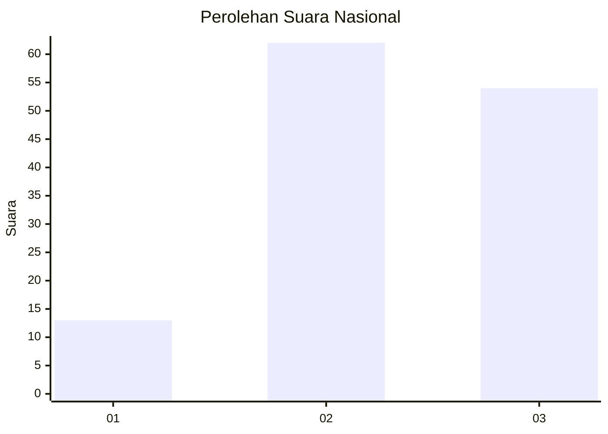
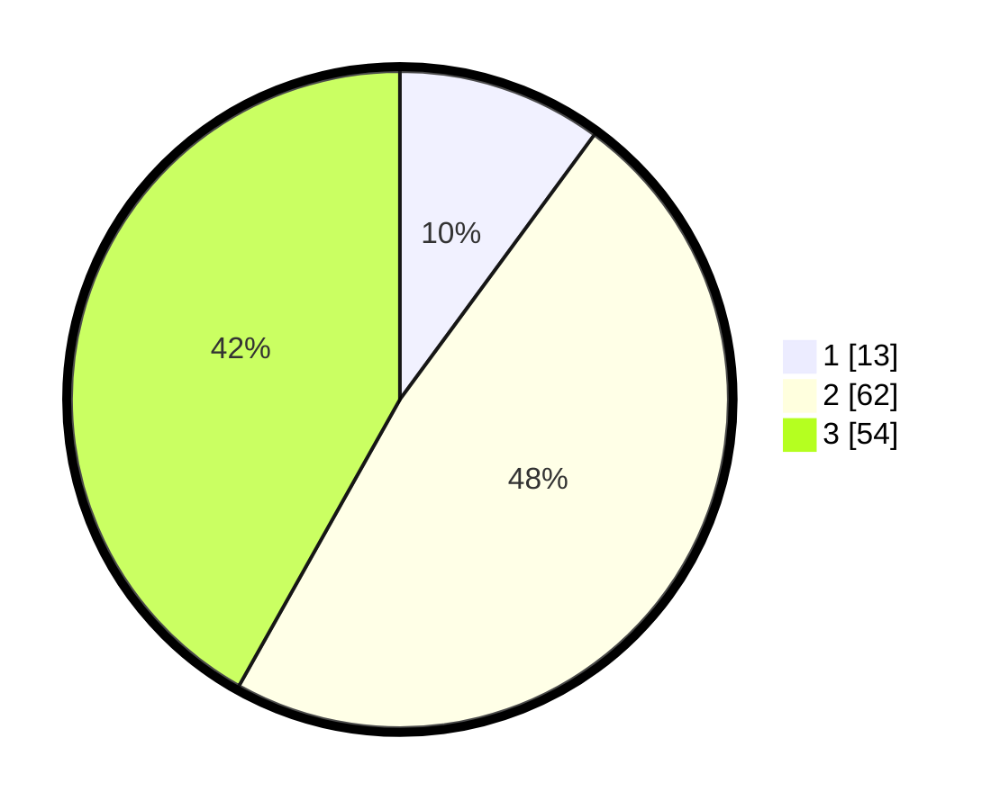

# Hasil

## Grafik

## Tabel

| No. | Nama Paslon    | Suara | Suara (raw) | Persentase |
|:--- |:-------------- | -----:| -----------:| ----------:|
| 1   | ANIES MUHAIMIN | 13    | [13][p-1]   | 10,08      |
| 2   | PRABOWO GIBRAN | 62    | [62][p-2]   | 48,06      |
| 3   | GANJAR MAHFUD  | 54    | [54][p-3]   | 41,86      |

[p-1]: https://github.com/gigit-pemilu/pemilu-2024/blob/main/pilpres/hitung-suara/sub/34-di-yogyakarta/sub/04-sleman/sub/06-mlati/sub/2005-sumberadi/sub/902-tps/sub/paslon-1.txt
[p-2]: https://github.com/gigit-pemilu/pemilu-2024/blob/main/pilpres/hitung-suara/sub/34-di-yogyakarta/sub/04-sleman/sub/06-mlati/sub/2005-sumberadi/sub/902-tps/sub/paslon-2.txt
[p-3]: https://github.com/gigit-pemilu/pemilu-2024/blob/main/pilpres/hitung-suara/sub/34-di-yogyakarta/sub/04-sleman/sub/06-mlati/sub/2005-sumberadi/sub/902-tps/sub/paslon-3.txt

## Foto C Plano

https://sirekap-obj-formc.kpu.go.id/e3c6/pemilu/ppwp/34/04/06/20/05/3404062005902-20240214-155634--8c82285a-42ae-4891-9f20-beea04fd07f8.jpg

https://sirekap-obj-formc.kpu.go.id/e3c6/pemilu/ppwp/34/04/06/20/05/3404062005902-20240214-155641--83f90204-114d-4f5a-a97a-ba1f17031cd6.jpg

https://sirekap-obj-formc.kpu.go.id/e3c6/pemilu/ppwp/34/04/06/20/05/3404062005902-20240214-155649--75043811-e1b4-4faa-9201-4c285cc33ba5.jpg

## Metadata

| Key        | Value               |
| ---------- | ------------------- |
| Time Stamp | 2024-02-14 21:46:01 |

## DATA PEMILIH TETAP

Jumlah pemilih dalam DPT: **130**.
 * L: **126**.
 * P: **4**.

## DATA PENGGUNA HAK PILIH

Jumlah pengguna hak pilih dalam DPT: **35**.
 * L: **33**.
 * P: **2**.

Jumlah pengguna hak pilih dalam DPTb: **92**.
 * L: **89**.
 * P: **3**.

Jumlah pengguna hak pilih dalam DPK: **4**.
 * L: **4**.
 * P: **0**.

Jumlah pengguna hak pilih: **131**.
 * L: **126**.
 * P: **5**.

## JUMLAH SUARA SAH DAN TIDAK SAH

JUMLAH SELURUH SUARA SAH: **129**.

JUMLAH SUARA TIDAK SAH: **2**.

JUMLAH SELURUH SUARA SAH DAN SUARA TIDAK SAH: **131**.

