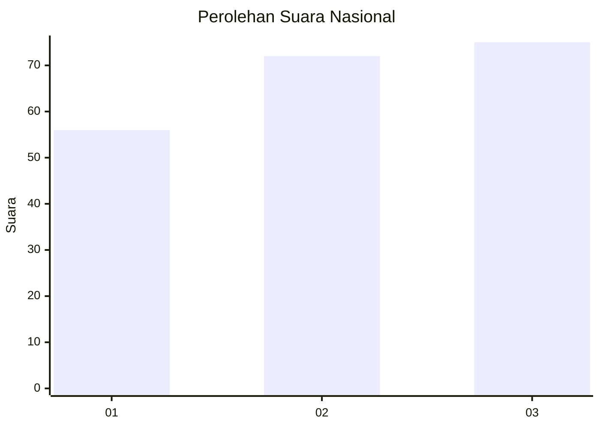
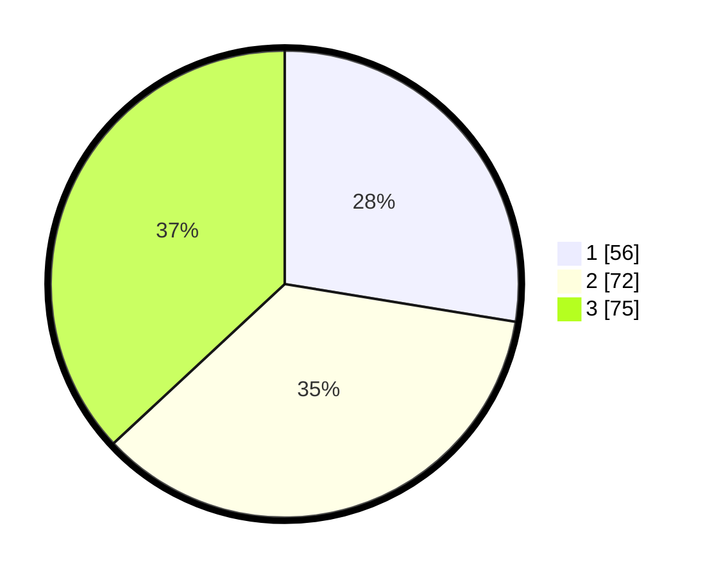

# Hasil

## Grafik

## Tabel

| No. | Nama Paslon    | Suara | Suara (raw) | Persentase |
|:--- |:-------------- | -----:| -----------:| ----------:|
| 1   | ANIES MUHAIMIN | 56    | [56][p-1]   | 27,59      |
| 2   | PRABOWO GIBRAN | 72    | [72][p-2]   | 35,47      |
| 3   | GANJAR MAHFUD  | 75    | [75][p-3]   | 36,95      |

[p-1]: https://github.com/gigit-pemilu/pemilu-2024/blob/main/pilpres/hitung-suara/sub/34-di-yogyakarta/sub/04-sleman/sub/07-depok/sub/2001-caturtunggal/sub/001-tps/sub/paslon-1.txt
[p-2]: https://github.com/gigit-pemilu/pemilu-2024/blob/main/pilpres/hitung-suara/sub/34-di-yogyakarta/sub/04-sleman/sub/07-depok/sub/2001-caturtunggal/sub/001-tps/sub/paslon-2.txt
[p-3]: https://github.com/gigit-pemilu/pemilu-2024/blob/main/pilpres/hitung-suara/sub/34-di-yogyakarta/sub/04-sleman/sub/07-depok/sub/2001-caturtunggal/sub/001-tps/sub/paslon-3.txt

## Foto C Plano

https://sirekap-obj-formc.kpu.go.id/0dfc/pemilu/ppwp/34/04/07/20/01/3404072001001-20240215-033935--4b4f99e2-4c20-418a-b257-e4c847a9aa35.jpg

https://sirekap-obj-formc.kpu.go.id/0dfc/pemilu/ppwp/34/04/07/20/01/3404072001001-20240215-033818--8ee5b676-0891-44a2-a1b2-147efbf703a1.jpg

https://sirekap-obj-formc.kpu.go.id/0dfc/pemilu/ppwp/34/04/07/20/01/3404072001001-20240216-102117--6530218d-84f2-48b6-98b4-32cb4de1b811.jpg

## Metadata

| Key        | Value               |
| ---------- | ------------------- |
| Time Stamp | 2024-02-17 12:00:00 |

